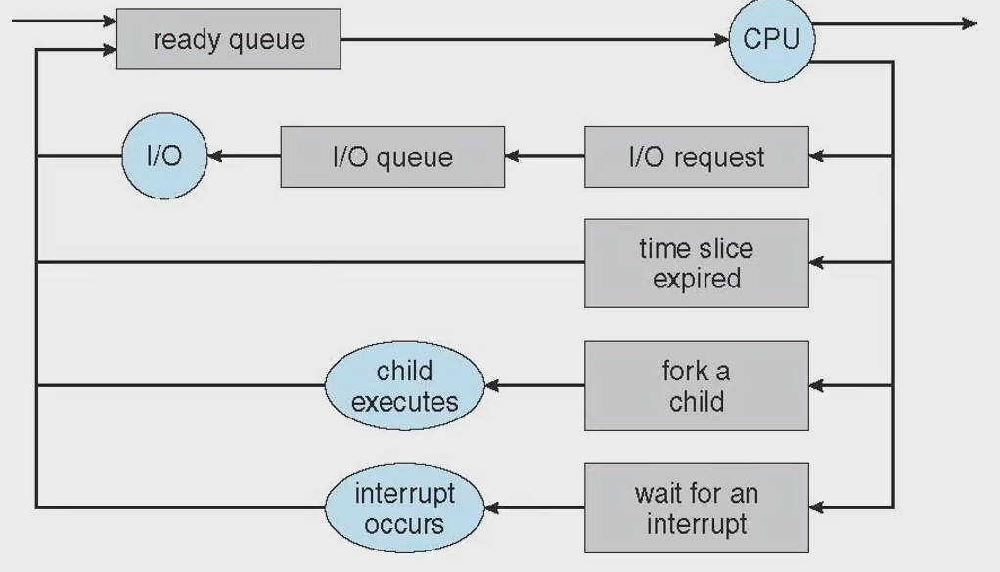

# Process
- define : Process is a program in execution : 실행중인 프로그램
- OS에서의 일의 단위
- Process will need certain resources to accompolish its task such as CPU time, memor, files, I/O devices.
#### Lay out of process memory
|||
|:---:|:---:|
|||
|Text Section|executable code|
|Data Section|global variables|
|Heap Section|memory that is dynamically  allocated during program run time e.g. new(Java), malloc, etc|
|Stack Section|temporary data storage  when invoking function function parameter, return address,  local variables|

$\rarr$ program : source code를 컴파일 
$\rarr$ process : load program

## Process Concept
### 생명주기
|||
|:--:|:--|
|New|the process is being created|
|Running|Instructions are being executed cpu를 프로세스가 점령해서 process의 명령어를 로드해서 실행시키는 상태|
|Waiting|the process is waiting for some event occur 일의 종료 전 Time sharing으로 인해 대기  such as an I/O completion or reception of a signal|
|Ready|waiting 후 ready queue에서 대기하는 상태(할당 대기 상태) the process is waiting to be assigned to a processor|
|Terminated|종료 상태 the process has finished execution|

#### process diagram image
 

$\rarr$ dispatch : ready에서 process로 보내는 것

### PCB(Process Control Block) / TCB(Task Control Block)
#### PCB가 가져야 하는 정보
- process state
- Program counter
    - 다음에 실행될 명령어의 주소를 가지고 있어 실행할 기계어 코드의 위치를 지정
    - 메모리에 있는 명령어를 fetch해야 하는데, 이 때 program counter에서 가져옴
- CPU register
    - program counter 역시 register의 일종
- CPU-scheduling information
- Memory-management information
- accounting information
- I/O status information
- structure picture 
 

#### Process
- a program that performs a ***single thread of execution***
- the single thread of control allows the process to perform only one task at a time
- Modern operating systems have sxtended the process concept
    - to allow a process to have multiple threads of execution
    - and thus to **perform more than one task at a time**
    - multitasking : 여러개를 동시에
#### Thread
- is a lightweight process
- multithreading
    - o/s 가 여러개의 pcb를 timesharing 하듯이 thread를 여러개 만듦
    - multiprocessing 보다 좋음
    - 특별한 경우 아니면 multithreading
## Process Scheduling
### The obejctive of multiprogramming
- to have some process running at all times
- so as to maximize CPU utilization
- 동시에 하는 것과 병렬처리는 다르다
### The obejctive of time sharing
- to switch a CPU core among process so frequently
- that users can interact with each program while it is running
### Scheduling Queues
 

- linked lists of PCBs 로 구현
- As processes enter the system, they ar put into a ready queue.
    - where they are ready and waiting to execute on a CPU's core
- Processes that are waiting for a certain event to occur
    - are placed in a wait queue

### Queueing Diagram
 

- state diagram 과 연결해서 생각할것
### Context Switch
 

- The context of a process is represented in the PCB
    - PCB 정보를 문맥이라고 보면 된다
- When an interrupt occurs
    - the system saves the current context of the running process
    - so that, later, it can restore that context when it should be resumed(이후, 재할당 되면 저장된 context를 restore)
- The context switch is a task that
    - switches the CPU core to another process
    - performs a state **save** of the current process(현재 프로세스 문맥 저장)
    - and a **restore** of a differnet process
    - 새로운 프로세스의 스테이트를, pcb를, 문맥을 복원
