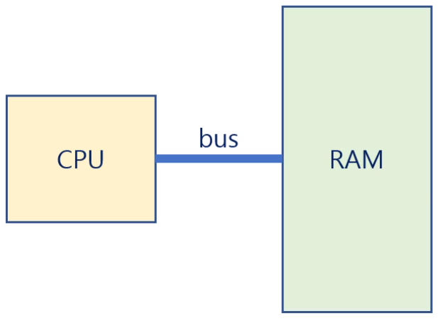
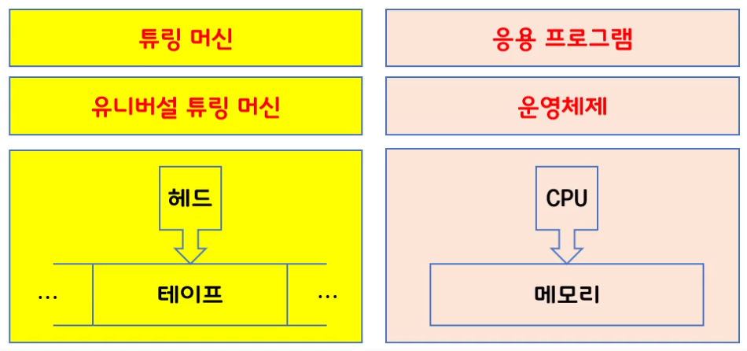

# Chapter 1. 운영체제
## 운영체제
### 운영체제(Operating System)란?
- a software that operates a computer system  
- 하드웨어를 제어하는, 사용자와 어플리케이션에 서비스를 제공하는 소프트웨어 

- **운영체제의 역할**
  1. H/W 디바이스 제어
  2. 운영체제를 통해 App들을 이용할 수 있도록 인터페이스를 저장
  3. 유저가 OS를 통해 저장된 인터페이스를 사용할 때 I/O 관리  
  &rarr;  H/W, S/W, USER 간의 중간 매개 역할을 함

### 컴퓨터란?
- a machine that processes the *information*  
  - 정보를 처리하는 기계    
  - 스마트폰은 컴퓨터인가? &rarr; O
  - 계산기는 컴퓨터인가? &rarr; X
- 컴퓨터는 "정보"를 처리하는 기계이다. 

### 정보란?
- quantitative representation that measures the uncertainty  
  - 불확실성을 측정하여 수치적으로 표현한 것
- $\ I(x) = - log_2 P(x)$
  -  I : 정보량, P : 확률   

- **컴퓨터가 정보를 처리하는 법**
  - 정보의 최소 단위 : bit(**b**inary dig**it**)
  - 8 bit = 2^8
    - 정보의 량이 8bit라면 이것은 1byte 이기도 하다.
  - 정보의 처리 : 정보의 상태 변환 (0에서 1로, 1에서 0으로)
    - Boolean Algebra(부울대수) : NOT, AND, OR
    - 논리 게이트 : NOT, AND, AND, OR, XOR, NAND, NOR
    - 트랜지스터를 이용하여 게이트(스위치) 만들 수 있음
    - 논리 회로 : IC, LSI, VSI, ULSI, SoC, 등
      - 무어의 법칙(chip의 집적도), 황의 법칙(메모리의 집적도)  
      - H/W의 경우 한계까지 발전해 왔음

  - 정보의 저장과 전송 : 플립 - 플롭, 데이터 버스, Radio Frequency

    - 덧셈 : 반가산기, 전가산기
    - 뺄셈 : 2의 보수 표현법
    - 곱셈과 나눗셈 : 덧셈과 뺄셈의 반복
    - 실수 연산 : 부동 소수점 표현법
    - 함수 : GOTO
    - 삼각함수, 미분, 적분, 사진촬영 동영상 재생 등 가능

- **컴퓨터가 만능?**
  - 범용성(universality)
      - NOT, AND, OR게이트만으로 모든 계산을 할 수 있다.
      - NAND 게이트만으로 모든 계산 가능
      - 범용 컴퓨터 : general-purpose computer
  - 계산 가능성(computability)
      - Turing-computable : 튜링 머신으로 계산 가능한 것
      - 정지문제(Halting Problem) : 튜링 머신으로 계산 불가한 것

### 컴퓨터를 만든 사람
#### 앨런 튜링(Alan Turing) - 컴퓨터의 할아버지
  

- Turing Machine(1936)
  - Turning 컴퓨터 : Head, Tape, Turing Machines, Universal Turing Machine
  - UTM: OS, 헤드 : CPU, 테이프 : 메모리

           
         
#### 폰 노이만(John von Neumann) -  컴퓨터의 아버지
  - stored-program 방식을 처음 도입했다
  - stored-program computer 는 메모리에 프로그램을 저장해두는 컴퓨터이다.
  - RAM 메모리 저장 장치에 program(s/w)를 저장하고, CPU는 RAM에서 프로그램의 명령어를 fetch 해와서 execute한다.: 폰 노이만 아키텍처 = ISA(Instruction set architecture , 명령어 중심)
    - program은 컴퓨터(H/w)애 특정 task를 실행시키는 명령어들의 집합이다. compile하면 기계어가 되는데 이걸 어셈블리어로 표현해서 읽을 수 있도록 표현해준다. 

  - ISA(Instruction Set Architecture, 명령어 중심) : 실제 작동하는 컴퓨터
  - 폰 노이만 아키텍처
  - RAM에 program(s/w)를 저장하고, CPU는 RAM에서 프로그램의 명령어를 fetch 해와서 execute한다
  - program : H/W에 특정 task를 실행시키는 명령어들의 집합
  - stored-program computer: 메모리에 프로그램을 저장해두는 컴퓨터
  - 내장형 프로그램(stored-program) 방식을 처음 도입
  
**cpu - bus &rarr; RAM**  
 

### 프로그램
- a set of instructions that tells a computer's hardware to perform a task
- 명령어들의 집합

- **운영체제도 프로그램**
  - OS는 컴퓨터에서 항상 실행되는 **프로그램**이다.
  - 시스템 서비스를 애플리케이션에게 지정해줌
  - **프로세스**(굉장히 중요!!), 리소스, UI, 를 관리하는 역할

# Chapter 2. Processes 1
## Process
### 운영체제가 하는 일
- 일반적인 정의 : 컴퓨터에서 항상 실행되고 있는 프로그램
- 보통 **"kernel(커널)"** 이라고 부른다.
- kernal은 OS의 핵심을 담당하고 다음 2가지 프로그램에 대한 인터페이스를 제공해 줌
    - system programs
    - application programs

  - 사용자와 하드웨어 사이의 중개 역할  
    - 컴퓨터에서 항상 실행중인 프로그램  
    - kernel  
        - system programs  
        - application programs  
    - CPU, 장치 컨트롤러들과 bus를 통해 연결

### Bootstrap program
- a first program to run on computer power-on 

- 부팅 프로그램 : 컴퓨터가 power on 되자마자 처음으로 동작되는 프로그램  
    &rarr; 하드디스크에 있는 O/S를 메모리로 로딩 시킴  

- EEPROM (Electrically Erasable Programmable Read-Only Memory, E2PROM) : 비휘발성 메모리(NVM)의 하나
  - CPU가 가장 먼저 로딩해야 할 명령어를 저장해 놓은 곳

### Interrupts
- I/O 디바이스에서 입력이 되면 cpu 에서 받아서 처리할 때 사용하는 통신장치
- Hardware may trigger an interrupt at any time by sending a signal to the CPU, usually by way of the system bus

### von Neumann architecture (폰 노이만 아키텍처)

- fetches하고 executed하는 사이클을 폰 노이만 아키텍처 라고 한다.
- instruction register - instruction을 메모리에서 하나씩 가져오는 register

- instruction-execution cycle
  - instructor register
  - 명령 레지스터
  - 데이터 레지스터
  - IR, ALU
  - fetch - execute cycle

### CS Organization (계층구조)
- storage system은 여러 계층구조 존재  
- 용량(storage capacity), 접근 속도(access time)에 따라 
  1. registers - 굉장히 빠름
  2. cache - ram보다는 작지만 빠른 cache, ram보다는 비쌈
  3. main memory - 주 기억장치
  4. solid-state disk(SSD) - 메모리 형태의 하드디스크 역할
  5. hard disk(HDD) - 마그네틱 카드 자기장을 이용한 하드디스크
  6. optical disk - HDD 용량마저 부족할 시 사용
  7. magnetic tapes - backup을 위한 용도로 보존을 위해 사용

### How a modern computer system works
  - CPU가 Thread of Execution을 가지고서 cache를 통해 RAM에 access
  - IO 디바이스가 Interrupt를 걸고 데이터를 주고 받음

## computer system architecture
### computer system component
  1. CPU : 명령을 처리
  2. processor
  3. core
  4. multicore
  5. multiprocessor

### Symmetric multiprocessing (SMP)
- 메모리가 한갠데 CPU가 여러개가 연결되어 있음
- CPU : memory = 1:1 구조를 초소형 임베디드를 제외하고 거의 사용하지 않음  
- 현재의 경우 SMP 탑재  
- 1개의 메모리에 여러개의 CPU(각각의 register, cache를 가지고 있음) 연결  

### Multi-core design
- 같은 프로세서 칩 하나에 register와 cache를 가지고 있는 CPU core만 여러개 붙여 따로 회로로 구성

### Multiprogramming
- 프로그램 : a set of instruction
- 프로그램 여러개를 동시에 올리는 것 : runs more than one program at a time.
- cpu 사용 효율이 오름

### Multitasking (Multiprocessing) 
- 하나의 cpu를 가지고 여러개의 작업이 가능
- a logical extension of multiprogramming
    - in which CPU switches jobs so frequently that
    - users can interact with each job while it is running
- CPU scheduling 
    - 여러개의 프로세스가 램에 존재할 때 cpu가 실행 시켜야 할 때 어떤 프로그램을 선택할 지 고르는 것

### CPU scheduling
- CPU 효율을 제일 좋게 만들기 위해 어떤 process를 선택할 지 선택방법을 찾는 것
- RAM에 존재하는 프로그램 중에서 CPU가 실행시켰다가 다시 종료시켰을 때 다시 실행 시키는 program을 찾음. 
- 이 때 효율이 제일 좋은 방법을 찾기 위해 CPU scheduling을 함

### Two separate mode of operations
- user mode and kernel mode
- 바이러스, 엉뚱한 작업을 실행했을 때 막아주는 역할도 운영체제가 해야할 역할
- to ensure that an incorrect program cannot cause other programs to execute incorrectly
- 커널 모드가 아니면 직접적으로 하드웨어를 제어하지 못하게

#### 사용자가 OS에 접근
- CLI(Command Line Interface)
    - 흔히 shell이라 불리는 개념
    - sh, bash, csh, tcsh, zsh 등
    - command(명령어)를 기반으로 interface하는 것 
- GUI(Graphical User Interface)
    - 마우스로 아이콘 클릭하는 것 등
    - Windows, Aqua for MacOS, KDE/GNOME for Linux 등
- Touch-Screen Interface
    - Android UI, iPhone UI 등

#### 컴퓨터가 OS에 접근
##### System Calls
- OS가 제공해 주는 서비스들을 system call을 통해 호출 
- 대표적으로
    - #include <unistd.h>
    - ssize_t **read** (int **fd**, void ***buf**, size_t count)
      - fd(file description)의 어떤 장치에 buf의 data를 count만큼 read하라는 뜻
      - 그 내용이 unity standard. header에 정의되어 있으면 함수를 호출

### Virtualization(가상화 기술)
- a technology that allow us
    - to abstract the hardware of single computer
    - into several different execution environment
- VMM : Virtual Machine Manager(Moniter)
    - H/W에서 여러 개의 운영체제를 동시에 돌리고자 함.
    - 이를 위해 필요 한 것이 VMM

    - process를 multitasking을 이용해 동시 실행 시킬 수 있음
  
### Computing Environment
- Traditional Computing 
    - 최근엔 거의 없음
- Mobile Computing 
    - 대부분의 핸드폰에서 사용
    - Android, iPhone 등등
- Client-Server Computing 
    - Web
    - 1:1 통신
- Peer-to-Peer Computing(P2P)
    - N:N 통신
    - 음악 파일 공유, 영화 공유 등
    - 파일을 공유할 때 굳이 server를 거치지 않고 파일을 서로 공유
    - P2P Network에 원장을 쓴 것이(?) Bitcoin
    - peer끼리 서로 직접 연결되어 통신
    - webRTC도 이거랑 같은건가?
- Cloud Computing
    - server안에 모든 컴퓨터 자원들이 구름처럼 가려져 있고 우리는 terminal을 통해 사용하는 개념이 cloud computing이다.
    - 서비스 할 때 웹서버 직접 구축하지 않고 cloud에서 가져다 사용
    - AWS, Azure, GCP, Naver, KAKAO 클라우드 등
    - 실제로 내가 사용하는 컴퓨터 자원은 네트워크를 통해 제공되는 UI이고 실질적인 저장은 cloud에 되어있음.

- Real-Time Embedded Systems(RTOS)
    - 화성 탐사 로봇
    - Vxworks 등

### User and Operating System Interface
- CLI : Commend Line Interface 
- GUI : Graphical User Interface
- Touch-Screen Interface

### System Calls
- provide an interface to the services made available by the OS.
- API : Application Programming Interface
- OS의 API가 System call 이라고 보면 댐
