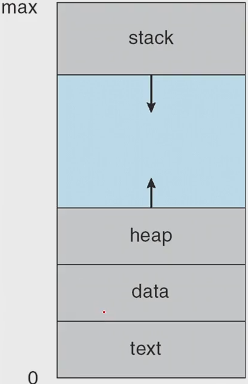
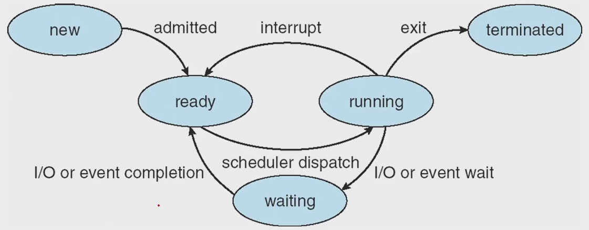
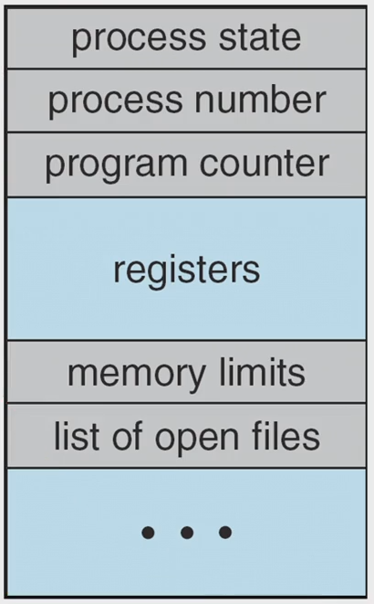
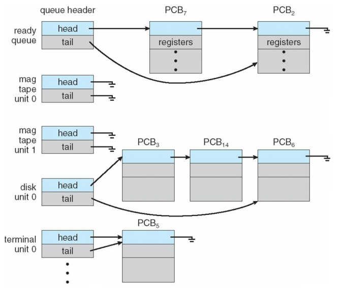
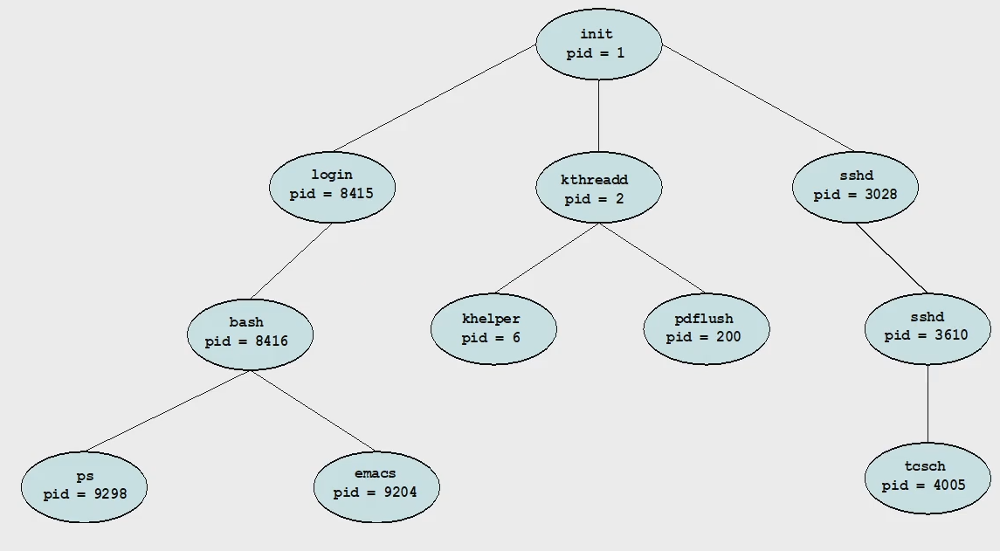

# Process
- define : Process is a program in execution : 실행중인 프로그램
- OS에서의 일의 단위
- Process will need certain resources to accompolish its task such as CPU time, memor, files, I/O devices.
#### Lay out of process memory
|||
|:---:|:---:|
|||
|Text Section|executable code|
|Data Section|global variables|
|Heap Section|memory that is dynamically<br> allocated during program run time<br>e.g. new(Java), malloc, etc|
|Stack Section|temporary data storage<br> when invoking function<br>function parameter, return address,<br> local variables|

&rarr; logical하게 어떤 프로그램이 시작하는 부분을 0, 최대 메모리 영역이 max라고 했을 때<br>
&rarr; program : source code를 컴파일<br>
&rarr; process : load program<br>
- malloc()(e.g. sizeof(int) * 4)<br>
    &rarr; 동적할당 : 프로그램 실행 중에 동적으로 메모리를 할당하는 것
    &rarr; 동적 할당한 메모리는 꼭 마지막에 해제해 주어야 함  
    &rarr; 메모리 릭, 메모리 누수가 발생하기 때문에  

## Process Concept
### 생명주기
|||
|:--:|:--|
|New|the process is being created|
|Running|Instructions are being executed<br>cpu를 프로세스가 점령해서 process의 명령어를 로드해서 실행시키는 상태|
|Waiting|the process is waiting for some event occur<br>일의 종료 전 Time sharing으로 인해 대기<br> such as an I/O completion or reception of a signal|
|Ready|waiting 후 ready queue에서 대기하는 상태(할당 대기 상태)<br>the process is waiting to be assigned to a processor|
|Terminated|종료 상태<br>the process has finished execution|

#### process diagram image
<br>

&rarr; dispatch : ready에서 process로 보내는 것

### PCB(Process Control Block) / TCB(Task Control Block)
#### PCB가 가져야 하는 정보
- process state
- Program counter
    - 다음에 실행될 명령어의 주소를 가지고 있어 실행할 기계어 코드의 위치를 지정
    - 메모리에 있는 명령어를 fetch해야 하는데, 이 때 program counter에서 가져옴
- CPU register
    - program counter 역시 register의 일종
- CPU-scheduling information
- Memory-management information
- accounting information
- I/O status information
- structure picture<br>
<br>

#### Process
- a program that performs a ***single thread of execution***
- the single thread of control allows the process to perform only one task at a time
- Modern operating systems have sxtended the process concept
    - to allow a process to have multiple threads of execution
    - and thus to **perform more than one task at a time**
    - multitasking : 여러개를 동시에
#### Thread
- is a lightweight process
- multithreading
    - o/s 가 여러개의 pcb를 timesharing 하듯이 thread를 여러개 만듦
    - multiprocessing 보다 좋음
    - 특별한 경우 아니면 multithreading
## Process Scheduling
### The objective of multiprogramming
- to have some process running at all times
- so as to maximize CPU utilization
- 동시에 하는 것과 병렬처리는 다르다
### The objective of time sharing
- to switch a CPU core among process so frequently
- that users can interact with each program while it is running
### Scheduling Queues
<br>

- linked lists of PCBs 로 구현
- As processes enter the system, they ar put into a ready queue.
    - where they are ready and waiting to execute on a CPU's core
- Processes that are waiting for a certain event to occur
    - are placed in a wait queue

### Queueing Diagram
<br>

- state diagram 과 연결해서 생각할것
### Context Switch
<br>

- The context of a process is represented in the PCB
    - PCB 정보를 문맥이라고 보면 된다
- When an interrupt occurs
    - the system saves the current context of the running process
    - so that, later, it can restore that context when it should be resumed(이후, 재할당 되면 저장된 context를 restore)
- The context switch is a task that
    - switches the CPU core to another process
    - performs a state **save** of the current process(현재 프로세스 문맥 저장)
    - and a **restore** of a differnet process
    - 새로운 프로세스의 스테이트를, pcb를, 문맥을 복원
## OS on Processses
- 운영체제는 process creation, and process termination에 대한 메커니즘 제공
- An OS must provide a mechanism for process creation and process termination
### Process create
- 프로세스는 새로운 프로세스 create 가능
- A process may create several new processes
    - the creating process : a parent process
    - aa newly created process : a child process
- A tree of Process using fork()<br>
    <br>
### Two possibilities for execution
- The parent continuse to **execute concurrently** with its children
- The parent **waits** until some or all of its children have terminated
### Two possibilities of address-space
- The child process is a **duplicate** of the parent process(똑같은 일을 하는 process인 경우 굳이 별도의 영역을 잡지 않고 PCB(PC)만 따로 존재하여 실행 위치만 다르면 됨)
- The child process has a **new program** loaded into it
    <br>
### Process Terminate
- when it finishes executing its final statement
- exit() system call : ask OS to delete it(중간 강제 종료)
- OS deallocates(할당 해제) and reclaims(회수) all the resources(allocated memories, open files, and I/O buffers, etc)
### Zombie and Orphan
- demon process, background process 를 만들 때 사용
#### zombie process
- a process that has a parent process but whose parent has not yet called wait()
- 부모는 남아있지만 신경쓰지 않는 것, wait 호출 하지 않고 부모는 부모 일을 계속 하는 것
- 부모가 죽진 않았지만 wait 하지 않음
#### orphan process
- a process that has a parent process who did not invoke wait() and instead terminated
- wait 없이 return 으로 종료 시 부모 없는 자식이 생김, 부모가 없음

```
정리
- ram 에 load 되어 있는 상태가 process
- process 의 state, resource 와 cpu의 register의 정보를 합친 것이 PCB
- 현재 PCB정보를 외부에 저장하고 새로운 PCB의 정보를 CPU에 로드 하는 것이 context-switch
- 문맥교환을 통해 concurrent 하게 제어, 동시성
```

### In Unix-like O/S
- A new process is created by the **fork()** system call
- The child process consists of a **copy of the address space** of the parent process
- Both process(child, parent) continue execution at the instructio(지시) after the fork() system call
- Difference
    - the return code for the fork() is zero for the child process
    - the nonzero pid(OS kernel 이 부여한) of the child is returned to the parent process
#### After a fork() system call
- the parent can continue its execution
- if it has nothing else to do while the child runs
    - it can issue a wait() system call
    - to move itself the ready queue until the termination of the child

## 실습
```c
// P0의 pid가 0802이고, P1의 pid가 1202일때

#include <stdio.h>
#include <unistd.h>
int main()
{
    pid_t pid;
    pid = fork(); // 1. fork 진행:parent(P0)의 메모리 공간 복사
                  // 이때, fork() 된 child process pid 받아서 저장

    printf("Hello, Process!\n", pid);
} // 2. parent는 return 0로 끝남 -> CPU release
// 3. ready queue에 대기 중인 child(P1)의 PC(Program Counter)는 fork 이후에 printf를 가르킴
// 4. child(P1)이 printf("Hello, Process!\n")진행

// 출력 결과
Hello, Process! 1202
Hello, Process! 0
```
 
 ### fork() system call
$\rarr$ After a fork() system call,
parents의 address space 복제하고, parent는 <b>continue its execution</b>  
또는,  
$\rarr$ <b>a wait() system call</b>을 진행하면, child가 끝날때까지 parents가 ready queue에서 wait queue로 이동  

```c
#include <stdio.h>
#include <unistd.h>
#include <wait.h>

int main()
{
    pid_t pid;
    pid = fork();
    if (pid > 0) // 1. parent 들어옴
        wait(NULL); // 2. parent는 wait queue로 이동
    printf("Hello, Process! %d\n", pid); // 3. child가 CPU 점령, if문에 해당하지 않아 바로 출력
    // 4. wait queue에 interrupt 검
    // 5. parent가 CPU 점령하여 출력 진행
}

// 출력 결과 
Hello, Process! 0
Hello, Process! 1202
```

## Exercise
### 3.1
``` c
int value = 5;
int main() 
{
    pid_t pid;
    pid = fork(); // 1. fork하는 시점에 parent와 child 모두 value = 5
                  // 하지만, P0와 P1에 각각 따로 저장

    if (pid == 0) { // 3. child process -> P1의 value = 20 주고, return 0
        value += 15;
        return 0;
    }
    else if (pid > 0) { // 2. parent process -> wait queue
        wait(NULL);
        printf("Parent: value = %d\n", value); // 4. P0의 vaule인 5 출력
    }
}
// 출력 결과
Parent: value = 5
```

### 3.2
```c
#include <stdio.h>
#include <unistd.h>
#include <wait.h>
/** How many processes are created? -> 8개*/
int main() 
{
    fork(); // fork a child process : P0 -> P1
    fork(); // fork another child process : P0, P1 -> P2, P3 
    fork(); // and fork another : P0, P1, P2, P3 -> P4, P5, P6, P7
    return 0;
}
```

### 3.11
```c
#include <stdio.h>
#include <unistd.h>
/** How many processes are created? -> 16개*/
int main() 
{
    int i;
    
    for (i = 0; i < 4; i++)
        fork(); // fork() 4번 진행 -> 2**4 = 16개
    return 0;
}
```

### 3.12
```c
int main() 
{
    pid_t pid;
    pid = fork();

    if (pid == 0) { // child process
        execlp("/bin/ls", "ls", NULL); // parent에서 복사된 프로세스가 ls로 덮어씌워졌기 때문에 
        printf ("LINE J\n"); // LINE J는 출력되지 않음 -> execlp 뒤에 문장은 의미가 없어짐
    }
    else if (pid > 0) { // parent process
        wait(NULL);
        printf ("Child Complete\n");
    }

    return 0;
}
```

### 3.13
```c
int main() 
{
    pid_t pid, pid1;
    pid = fork();

    if (pid == 0) { // child process
        pid1 = getpid();
        printf("child: pid = %d\n", pid); // A : 0
        printf("child: pid1 = %d\n", pid1); // B : child pid
    }

    else if (pid > 0) { // parent process
        pid1 = getpid();
        printf("parent: pid = %d\n", pid); // C : child pid
        printf("parent: pid1 = %d\n", pid1); // D : parent pid
        wait(NULL);
    }

    return 0;
} // 즉, B와 C가 같아야함
// 출력 순서 : C -> D -> A -> B
// A -> B -> C -> D의 순으로 출력을 원할경우 wait를 2줄 위로 옮겨주어 
// parent가 들어온 즉시 wait 걸고 child 실행해야 함
```

### 3.16
```c
#define SIZE 5
int nums[SIZE] = {0, 1, 2, 3, 4};

int main()
{
    pid_t pid;
    int i;
    pid = fork();

    if (pid == 0) { // child process
        for (i = 0; i < SIZE; i++) {
            nums[i] *= i;
            printf("CHILD: %d \n", nums[i]); // LINE X
        }
    }

    else if (pid > 0) { // parent process
        wait(NULL);
            for (i = 0; i < SIZE; i++) {
            printf("PARENT: %d \n", nums[i]); // LINE X
        }
    }

    return 0;
}
// 출력 결과
CHILD: 0
CHILD: 1
CHILD: 4
CHILD: 9
CHILD: 16
PARENT: 0
PARENT: 1
PARENT: 2
PARENT: 3
PARENT: 4
```
