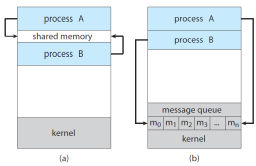

## Interprocess Communication (IPC)
- concurrently executed process 는 2가지 경우가 있다.
  - independent processes
    - 다른 프로세서와의 데이터 공유하지 않음
  - cooperating processes
    - 다른 프로세서와 데이터 공유하여 영향을 주거나 받음
    - 데이터를 공유하거나 메세지를 주고받는 경우

    - 해결 방법 : Interprocess Communication (IPC)

## IPC(Inter-Process Communication : 프로세서 간 통신)
Cooperating processes은 IPC mechanism이 필요  
- exchange data 허용 : 프로세서 간의 send data, receive data  

### IPC의 기본 모델  
<br> 

- **shared memory** : 저장소 공유
- **message passing** : 운영체제에 맡기는 방법, 메시지 큐를 이용해 주고 받음

## IPC in Shared-Memory Systems 
### Producer-Consumer Problem
cooperating processes 개념의 가장 기본 문제, 공통 패러다임  
- producer : produces information  
- consumer : consume information  

- producer는 정보를 생산하고 consumer는 정보를 소비하는 모델

- ex
  - compiler &rarr; assembly code 생산, assembler &rarr; 소비
  - web server &rarr; HTML file 생산, browser &rarr; 소비


### A solution using shared-memory
producer와 consumer는 concurrently하게 실행
- CPU를 context switch를 통해 time sharing  

#### buffer 사용
buffer를 shared-memory로 만듦  
- a producer can fill(data를 채움) the buffer,  
- a consumer can empty(data를 비움) the buffer   

buffer를 무한대로 사용할 수 없음(unbounded buffer : buffer size 정해져있음)   
- buffer가 가득 채워져 있으면 producer가 wait  
- buffer가 비어있으면 consumer가 wait  

<b>shared memory</b> : producer와 consumer processes가 공유하고 있는 메모리 영역  
- 직접 processes 서로의 memory 영역에 접근하면 안됨(바이러스 등의 문제 발생 가능성 증가)  
- 공유하는 별도의 영역 필요  

#### buffer 사용 코드
producer와 consumer processes code가 context switch하면서 concurrent하게 실행됨  
```c
# define BUFFER_SIZE 10

typedef struct {
  ...
} item; // 1. typedef struct을 통해 item 구조체 생성

item buffer[BUFFER_SIZE] // 2. item에 배열 buffer 만듦(프로세서 내의 영역이라서 원래는 이렇게 구현하면 안됨 -> 외부의 공뮤 메모리 영역이라 가정하고 진행 필요)   
int in = 0;
int out = 0;

=====================================================

item next_produced;

while (true) {
  /* produce an item in next_produced */
  while (((in + 1) % BUFFER_SIZE) == out) // 1. buffer가 가득 차 있는 경우
    ; // do nothing -> 2. 아무것도 하지 않으면서 대기
  buffer[in] = next_produced; // 3. 가득 차있지 않다면, 하나 넣고
  in = (in + 1) % BUFFER_SIZE; // 4. in 증가시킴

}

=====================================================

item next_consumed;

while (true) {

  while (in == out) // 1. buffer가 비어있는 경우
    ; // do nothing -> 2. 아무것도 하지 않으면서 대기
  next_consumed = buffer[out]; // 3. 비어있지 않다면, 하나 소비하고 
  out = (out + 1) % BUFFER_SIZE; // 4. out 증가시킴
  // consume the item in next_consumed

}
```

## IPC in Message-Passing Systems
shared-memory의 단점  
- processes 간의 메모리 영역 공유가 요구됨  
- shared memory에 접근 및 조작하기 위한 코드를 프로그래머가 명시적으로 작성해줘야 함  

### Message-Passing
O/S가 cooperating processes에게 수단(API)를 제공  
- communicate 시 message-passing을 통해 쉽게 진행  
- 근본적 개념은 shared-memory이지만, 관리를 O/S에게 맡기고 message만 던지는 방식  

- message-passing의 facility
  - send(message)
    - send(next-produced)
  - receive(message)
    - receive(next_consumed)

```c
message next_produced;

while (true) {
  /* produce an item in next_produced */
  send(next_produced); // 세부 내용은 O/S가 알아서 처리
}

=====================================================

message next_consumed;

while (true) {
  receive(next_consumed); // 세부 내용은 O/S가 알아서 처리
  // consume the item in next_consumed
}
```

### Communication Links
producer와 consumer processes를 직접 이어주는 link  
- P와 Q 2가지 process가 통신할 때 send와 message 2가지 통신만 하면 됨

#### communication link의 구현방식
- <b>direct</b> or <b>indirect</b> communication  
- <b>synchronous</b> and <b>asynchronous</b> communication  
- <b>automatic(자동)</b> or <b>explicit(명시적)</b> buffering  

<b>Direct communication</b>  

- 각 process가 communication하는 상대를 알고 있음
- recipient와 sender에 명시적으로 이름을 붙임
- send(𝑃, message) : send a message to process 𝑃  
- receive(𝑄, message) : receive a message from process 𝑄  

> 특징  
- Links are established <b>automatically</b>  
- A link is associated with <b>exactly two processes</b>  
- There exists <b>exactly one link</b> between each pair of processes   


<b>Indirect communication</b>  
P와 Q사이에 매개체 필요  
- the messages are sent to and received from <b>mailboxes, or ports</b>  

mailbox (ports) :  
- messages를 보내는 저장소(into which messages can be placed by processes)  
- messages를 받는 저장소(from which messages can be removed)  

즉, 특정 누군가에게 보내는 것이 아닌 mailbox에 보내는 형식  
- send(𝐴, message) – send a message to mailbox 𝐴  
- receive(𝐴, message) – receive a message from mailbox 𝐴  

> 특징  
- 두 개의 processes가 공유하는 mailbox(port)가 존재 할 때, 두 processes 사이의 link가 생성됨  
▪ The properties of communication links in this scheme:
• Links are established between a pair of processes
- only if both members of the pair have a shared mailbox.
• A link may be associated with more than two processes.
• A number of different links may exist, between each pair of processes
- with each link corresponding to one mailbox.

▪ OS provides a mechanism that allows a process to do:
• Create a new mailbox.
• Send and Receive messages through the mailbox.
• Delete a mailbox.

▪ Different design options for implementation:
• blocking or non-blocking: synchronous or asynchronous
• Blocking send: the sender is blocked until the message is received.
• Non-blocking send: the sender is sends the message and continue.
• Blocking receive: the receiver blocks until a message is available.
• Non-blocking receive: the receiver retrieves either a valid message or 
a null message.

### IPC system의 예시
- Shared Memory : POSIX Shared Memory
  - POSIX(Portable Operating System Interface) for uniX
    - O/S 의 표준화
- Message Passing : Pipes
  - UNIX에서는 주로 pipes를 사용

#### POSIX shared memory
- memory-mapped files를 이용해서 buffer를 잡음
  - shared memory file을 memory에 mapping 시켜서 memory를 만듬

- shared memory 만드는 방법
  ```c
  fd = shm_open(name, O_CREAT | ORDWR, 0666);
  ftruncate(fd, 4096);
  mmap(0, SIZE, PROT_READ | PROT_WIRTE, MAP_SHARED, fd, 0);
  ```
  1. shared-memory object를 만듬
  2. object의 사이즈를 byte 기준으로 설정
  3. memory-mapped file을 shared-memory에 mapping 시켜줌

```c
// producer
  #include <stdio.h> 
  #include <stdlib.h> 
  #include <string.h> 
  #include <fcntl.h> 
  #include <sys/shm.h> 
  #include <sys/stat.h> 
  #include <sys/mman.h>
int main()
{
  const int SIZE = 4096;                        // the size of shared memory
  const char *name = "OS";                      // the name of shared memory
  
  const char *message_0 = "Hello, "; 
  const char *message_1 = "Shared Memory!\n";

  int shm_fd;                                   // the file descriptor of shared memory
  char *ptr;                                    // pointer to shared memory

  /* create the shared memory object */ 
  shm_fd= shm_open (name, O_CREAT | O_RDWR, 0666);
  /* configure the size of the shared memory */ 
  ftruncate (shm_fd, SIZE);
  /* map the shared memory object */
  ptr = (char *)mmap(0, SIZE, PROT_READ|PROT_WRITE, MAP_SHARED, shm_fd, 0);
  /* write to the shared memory */ 
  sprintf(ptr, "%s", message_0); 
  ptr += strlen(message_0); 
  sprintf(ptr, "%s", message_1); 
  ptr += strlen(message_1);
                                  $gcc 3.16_shm_producer.c -lrt
  return 0;
}
```

```c
// consumer
  #include <stdio.h> 
  #include <stdlib.h> 
  #include <string.h> 
  #include <fcntl.h> 
  #include <sys/shm.h> 
  #include <sys/stat.h> 
  #include <sys/mman.h>
int main()
{
  const int SIZE = 4096;                        // the size of shared memory
  const char *name = "OS";                      // the name of shared memory

  int shm_fd;                                   // the file descriptor of shared memory
  char *ptr;                                    // pointer to shared memory

  /* create the shared memory object */ 
  shm_fd= shm_open(name, O_RDONLY, 0666);
  /* map the shared memory object */
  ptr = (char *)mmap(0, SIZE, PROT_READ|PROT_WRITE, MAP_SHARED, shm_fd, 0);
  /* read from the shared memory object */
  printf("%s", (char *)ptr);

  /* remove the shared memory */
  shm_unlink(name);
                                  $gcc 3.16_shm_consumer.c -lrt
  return 0;
}
```

### Pipes
- UNIX에서 초창기에 사용하던 IPC 매커니즘
- 2개의 process가 communication하는 도구 처럼 행동함

- unidirectional
- bidirectional

- half-duplex
- full-duplex

- relationship O
- relationship X

- network에서 동작할 수 있는가
  - pipe는 보통 network에서는 잘 안씀
  - network에서 쓸 수 있는 pipe를 *socket*이라 부름

- 2개의 pipe type
  - ordinary pipes
    - Parent가 pipe를 create하면 child하고 communication하는데 사용함
    - 2개의 process가 producer-consumer fashion으로 만들어짐
      - producer가 write
      - consumer가 read
      - unidirectional : one-way communication이 가능
      - two-way communication을 하려면 2개의 pipe를 사용
    - UNIX system
      - pipe라는 system call 사용

```c
  #include <stdio.h> 
  #include <string.h> 
  #include <unistd.h> 
  #include <sys/types.h>

  #define BUFFER_SIZE 25 
  #define READ_END
  #define WRITE_END 1
  int main()
  {
    char write_msg[BUFFER_SIZE] = "Greetings"; 
    char read_msg[BUFFER_SIZE];
    int fd[2];
    pid_t pid;

    /* create the pipe */ 
    pipe(fd);
    
    pid = fork(); // fork a new process

    if (pid > 0) { // parent process 
      close(fd[READ_END]);
      /* write to the pipe */
      write(fd[WRITE_END], write_msg, strlen(write_msg) + 1);
      close (fd[WRITE_END]);
    }
    else if (pid == 0) { // child process
      close(fd[WRITE_END]);
      /* read to the pipe */
      read(fd[READ_END], read_msg, BUFFER_SIZE);
      printf("read %s\n", read_msg);
      close(fd[READ_END]);
    }
    return 0;
  }
```
  - Named pipes
    - pipe에 이름을 붙여줄 수 있는 것
    - parent-child relationship이 없어도 사용 가능

### Two other strategies in client-server systems
- Sockets
  - 통신하기 위한 양종단을 얘기함
  - 2개의 원격에 있는 컴퓨터끼리의 연결을 의미하는 pipe 형태의 connection
    - 양쪽의 computer를 특정 &rarr; ip address
    - 각 computer끼리 연결된 pipe를 특정 &rarr; port
    - ip address + port = socket

  - 양쪽의 bit나 방식이 다르면 문제가 많이 생김
    - 그 때문에 생긴 것이 RPCs

  - 예시
    - https://www.google.co.kr:8000
    - 앞에 있는게 ip address
    - 8000이 port
    - 둘을 합쳐놓은 것이 socket

#### RPCs(Remote Procedure Calls)
- 원격에 있는 network된 process들 간의 원격호출을 저장
- 라이브러리 개념이랑 비슷...?

#### Java provides
- java가 소켓을 편하게 사용하게 하기 위해 제공한 library
  - socket class : connection-oriented (TCP)
  - DatagramSocket class : connectionless(UDP)
  - MulticastSocket class : multiple recipients 

```java
import java.net.*;
import java.io.*;

// Data server
public class DateServer { 

  public static void main(String[] args) throws Exception {
    ServerSocket server = new ServerSocket(6013);

    /* Now listen for connections */
    while (true) {
        Socket client = server.accept();
        PrintWriter pout = new PrintWriter(client.getOutputStream(), true);
        
        /* write the Date to the socket */            
        pout.println(new java.util.Date().tostring());

        /* close the socket and resume listening for connections */
        client.close();
    }
  }
}

// Data client
public class DateClient { 
  
  public static void main(String[] args) throws Exception {
    /* make connection to server socket */
    Socket socket = new Socket("127.0.0.1", 6013);

    InputStream in = socket.getInputStream();
    BufferedReader br = new BufferedReader(new InputStreamReader(in));

    /* read date from the socket */
    String line = null;
    while ((line = br.readLine()) != null) 
        System.out.println(line);

    /* close the socket connections */
    socket.close();
  } 
}
```

### RPC(Remote Procedure Call)
- 예제 만들기도 복잡함
- 현업에 가서 전문가가 되면 되게 많이 씀
  - Java에서는 RMI로 구분
  - Microsoft 에서는 COM, DCOM, CORBA, EJB로 구분

- IPC의 확장 개념
  - IPC는 컴퓨터 내부에서 2개의 process가 서로 통신하는 것
  - RPC는 굳이 내부에서 2개의 process가 있을 필요 없이 원격으로 연결되어 있는 컴퓨터끼리 통신할 수 있는 것
- remote service의 공통적인 형태
- procedure를 원격 지원하는 함수를 호출하는 것을 RPC라 함

- marshaling
  - 원격 서비스를 이용하는 2개의 api끼리 주고받는 데이터를 정렬하는 것