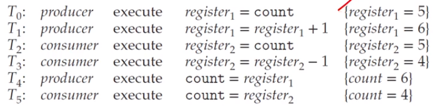
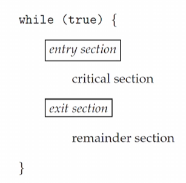

# Chapter 6-1. Synchronization Tools

## Background

### Cooperating process
- 서로 영향을 주고받는 관계
- can share a logical address space or be allowed to share data
- However, **concurrent access** to shared data may result in ***data inconsistency***
- process들이 동시 접근할 때 순서를 보장해줘야 공유된 데이터들이 data consistency를 유지할 수 있음

### The inegritty of data shared by several processes(or thread)
- **concurrent 실행**
  - 프로세스가 instruction stream의 임의의 지점에서 중단될 수 있음
  - 다음 프로세스가 들어와서 자기 프로세스를 실행시킬 때 공유 데이터에서 실행하기 때문에 문제가 발생할 수 있음

- **parallel 실행**
  - 여러 개의 프로세스가 분리된 CPU에서 동시에 실행되면 문제가 발생

### 데이터를 공유할 때 문제 예시
- producer-consumer problem
  - where two processes _share data_ and are _running asynchronously_

  - buffer의 item 개수 계산
    - initialized : 0,
    - add a new item : increment,
    - remove one item : decrement

    ```C
    // item increment
    while (true) {
        /* produce an item in next_produced */

        while (count == BUFFER_SIZE); /* do nothing */
        
        buffer[in] = next_produced; 
        in = (in + 1) % BUFFER_SIZE; 
        count++;
    }


    // item decrement
    while (true) {

        while (count == 0); /* do nothing */

        next_consumed = buffer[out];
        out = (out + 1) % BUFFER_SIZE;
        count--;

        /* consume the item in next_consumed */
    }

### Data inconsistency
- 2개의 process가 분리되어 실행되고 있으니 정상적으로 동작할거라 생각하는데 생각한 대로 정상적으로 동작하지 않음
  - 두 가지 상황 ( count++; & count--; )에서 producer and consumer가 concurrently execute 할 떄, count는 5라고 예상
  - 하지만, count 값은 4, 5, 6 다양하게 나옴

    ```C
    // Case 1
    #include <stdio.h> 
    #include <pthread.h>

    int sum;

    void *run(void *param)
    {
        int i;
        for (i = 0; i < 10000; i++)
            sum++; 
        pthread_exit(0);
    }

    int main() 
    {
        pthread_t tidl, tid2;
        pthread_create(&tid1, NULL, run, NULL);
        pthread_create(&tid2, NULL, run, NULL); 
        pthread_join(tid1, NULL);
        pthread_join(tid2, NULL);
        printf("%d\n", sum);
        // 생각대로라면 tid1, tid2가 10000씩 증가시키기 때문에 20000이 나올것이다.
        // 실제 출력값 : 19099, 19385, 20000, 20000, ...
    }

    // Case 2

    int sum;

    void *run1(void *param)
    {
        int i;
        for (i = 0; i < 10000; i++)
            sum++; 
        pthread_exit(0);
    }

    void *run2(void *param)
    {
        int i;
        for (i = 0; i < 10000; i++)
            sum--; 
        pthread_exit(0);
    }

    int main() 
    {
        pthread_t tidl, tid2;
        pthread_create(&tid1, NULL, run1, NULL);  // 이번에는 run을 1과 2로 분리
        pthread_create(&tid2, NULL, run2, NULL); 
        pthread_join(tid1, NULL);
        pthread_join(tid2, NULL);
        printf("%d\n", sum);
    }
    ```
  #### 왜 이런일이 발생할까?
  - 한 문장으로 생각되었던 _count++, count--_ 은 사실 기계어로 3문장으로 나뉘어 있음
    ```c
        register = count
        register = register + 1
        count = register

        register = count
        register = register - 1
        count = register
    ```
  - 위의 register는 physical 적으로는 같은 register지만, <br>
    concurrent하게 실행되면 interrupt handler(scheduler)가 register 정보를 ***save***하고 ***restore***하는 context switch 과정에서 꼬일 수 있음 
  - The concurrent execution of count++ and count--
    - is equivalent to a sequential execution
    - in which the lower-level statements presented previously
    - are _interleaved_ in some _arbitrary order_<br>
    <br>

### **_Race Condition_** (경쟁상황, 경쟁상태)
- A situation 
    - where several processes (or threads) 
    - access and manipulate the _same_ (or _shared_) _data concurrently_
    - and the outcome of the execution 
    - depends on the _particular order_ in which the access takes place
- 즉, 공유 데이터를 concurrent하게 실행 시킬 때, 순서에 따라 outcome이 달라지는 현상

### To guard against the race condition
- We need to ensure that
  - only one process at a time can manipulate the shared data(e.g. the variable cnt)
- To make such a guarantee
  - we require that the processes are _synchronized_ in some way
  - to say, _process_(or _thread_) _synchronization_
- 경쟁상황을 막기 위해 특정 시간에 1개의 프로세스만 shared data를 다루게 하는 것

```Java
// Race condition 해결
public class RaceCondition1 {

  public static void main(String[] args) throws Exception {
  RunnableOne run1 = new RunnableOne();
  RunnableOne run2 = new RunnableOne();
  Thread t1 = new Thread (run1); 
  Thread t2 = new Thread (run2);
  t1.start(); t2.start();
  t1.join(); t2.join();
  System.out.printIn("Result: " + run1.count + ", "+ run2.count);
  }
}

class RunnableOne implements Runnable {

  int count = 0;

  @Override
  public void run() {
    for (int i = 0; i < 10000; i++)
      count++;
  }
}

// Race condition 발생
public class RaceCondition2 {

  public static void main(String[] args) throws Exception {
  RunnableTwo run1 = new RunnableTwo();
  RunnableTwo run2 = new RunnableTwo();
  Thread t1 = new Thread (run1); 
  Thread t2 = new Thread (run2);
  t1.start(); t2.start();
  t1.join(); t2.join();
  System.out.printIn("Result: " + RunnableTwo.count);
  }
}

class RunnableTwo implements Runnable {

  static int count = 0; // static 변수 사용

  @Override
  public void run() {
    for (int i = 0; i < 10000; i++)
      count++;
  }
}
```

#### Race condition 예시
- 계좌 이체 (입금과 출금이 동시에 일어남)
  - 내가 출금을 하고 아들한테 입금이 된다고 하면 2개가 동시에 일어난다고 해야 의미가 있음
  - 이런 경우에도 race condition으로 다뤄야 함

- push/pop
  - push/pop하는 과정에서도 race condition이 일어남

## The Critical Section Problem

### The Critical Section Problem : 임계 영역 문제
- Consider a system consisting of 𝑛 processes {𝑃0,𝑃1,⋯,𝑃𝑛−1}
    - Each process has _a segment of code_, called a ***critical section***
    - in which the process may be _accessing_ and _updating_ data
    - that is **_shared with_** at least one other process
- The important feature of the system is that,
    - when one process is executing in its critical section,
    - no other process is allowed to execute in its critical section.

### The **_critical-section prob_**
- 어떤 2개의 process가 같은 시간에 실행하지 않는다 가정 시
- To design a protocol that
  - the processes can use to **_synchronize_** their activity
  - so as to _cooperatively share_ data

### Sections of codes
- source code 영역을 4가지로 나눌 수 있음<br>
<br>

- The **_entry-section_** the section of code
  - to request permission to enter its critical section
- The _critical-section_ follows the entry-sectino
    - 임계영역 -> e.g.) count ++ 하는 영역
- the **_exit-section_** follows the critical-section
    - return permission and exit after execution in critical
- The _remainder-section_ is the section of remaining code
    - non-critical section -> e.g.) count -- 하는 영역

### Three requirements for the solutions

- **_Mutual Exclusion_** 상호배재
  - If process 𝑃𝑖 is executing in its critical section
  - then no other processes can be executing in their critical section

- _Progress_ : aviod _deadlock_
  - If no process is executingg in its critical section and some processes wish to enter their critical section
  - 교차로에서 사방에서 차가 다가와 꽉 막혀 움직일 수 없는 상황
  - then the selection of next process will enter its critical section next cannot be postponed indefinitely

- _Bounded waiting_ : aviod _starvation_
  - A bound (or limit) on the number of times that other processes are allowed to enter their ciritcal sections
  - after a procces has made a request to enter its critical section and before that request is granted
  - 우선순위에서 밀려 계속 critical section에 들어가지 못하는 상황

### E.g. of race condition

<br>

### A simple solution in a single-core environment
- _Prevent interrupts_ from occurring
  - while a shared variable was being modified
  - critical section 문제를 해결하기 위해 가장 좋은 방법(단순 무식한 방법)
- We could be sure that
  - the current sequence of instructions
  - would be allowed to execute in order without preemption
- No other instructions would be run
  - so no unexpected modifications could be made to the shared data
- Unfortunately, _not feasible_ in a _multiprocessor_ environment
  - core가 여러 개 있다면 하나씩 다 막아버려야 하기 때문에 비효율적
### Two general approaches
- preemptive kernels and non-preemptive kernels

- preemptive kernel (선점형)
  - 동기화 문제가 반드시 발생하고 다루기 어려움
  - 대신 더 responsive 하기 때문에 자주 사용함(race condition 문제를 해결하고 사용할 만큼 가치 존재)
- non-preemptive kernel (비선점형)
  - 어떤 kernel 모드가 진입하면 다시 내려놓기 전까지 CPU를 쓰기 때문에 context switch가 발생하지 않음
  - 때문에, race conditions 문제가 발생하지 않음
  - 하지만, 성능이 좋지 않기 때문에 요즘엔 거의 사용하지 않음