# Chapter 6-2. Synchronization Tools

### Higher-level software tools to solve the CPS:
- Software solution : Peterson's algorithm
- Hardware solution : Atomic variable (test and set / compare and swap)  
&rarr; but, 둘 다 실전에서는 사용하기 어려움
- **_Mutex Locks_** : the simplest tools for synchronization
    - 임계영역에 접근 시 열쇠가 필요하게 만듦, 나올 때 반납 구조
    - 두 개만 있다고 생각했을 때 가장 간단한 synchronization 방법
- **_Semaphore_** : more robust, convenient, and effective tool
    - n개 제어 가능(Mutex locks의 경우 2개 제어)
- **_Monitor_**: overcomes the demerits of mutex and semaphore
    - 현재 가장 많이 사용하는 방법
    - Java에서 사용하는 modify 등이 monitor 도구
- **_Liveness_** : ensures for processes to make progress
    - deadlock 문제까지 해결(위의 3가지 방법은 상호 배제 문제만 해결 가능)

## Mutex Locks
- *mutex* : **mu**tal **ex**clusion(상호 배제)
- critical section(임계영역)을 보호, race condition을 방지
- a progress must _acquire_ the ***lock*** before _entering_ a critical section : 열쇠 획득
- _release_ the ***lock*** when it exits the critical section : 열쇠 반납

<br>

### Two functions and one variable for the Mutex Locks:
- acquire() and release()
    - 열쇠를 얻고, 반납하는 기능
    - 반드시 atomically하게 수행되어야 함
    - compare_and_swap operation을 통해 구현 가능
- availabe
    - a Bollean variable whose value indicates 
    - if the lock is available or not

### The definition of acquire() and release():<br>
<br>


### Busy waiting : 바쁜대기
- Any other process trying to enter its critical section
    - must _loop continuously_ in the call to acquire()
- busy waiting is clearly a _problem_ in a real multiprogramming system,
    - where a single CPU core is shared among many processes
    - _waste CPU cycles_ for some other processes to use productively

### Spinlock
- the type of mutex lock using the method of _busy waiting_
- the process _spins_ while waiting for the lock become available
- However, spinlocks do have an _advantage_
    - in that _no context switch_ is required waiting on a lock
    - a context switch may take considerable time
- Incertain circumstances _on multicore systems_
    - spinlocks are the _preferable_ choice for locking
    - One thread can _spin_ on one _processing core_
    - while another thread performs its critical section _on another core_
- 즉, single CPU 코어에서 ready queue에 들어갔을 때 쓸데없이 무한로프를 돌아서 CPU가 낭비되어 막는게 중요하지만
- multi CPU 코어에서는 busy waiting하고 있으면, wait queue에서 ready queue 로 context switch 할 필요없어지기 때문에 시간을 오히려 save 할 수 있어 Spinlock이 더 유용

```c
void *counter (void *param)
{
    int k;
    for (k = 0; k < 10000; k++) {
      /* entry section */ 
      pthread_mutex_lock(&mutex);
      /* critical section */
      sum++;
      /* exit section */
      pthread_mutex_unlock(&mutex);

      /* remainder section */
    }
    pthread_exit(0);
}

#include <stdio.h> 
#include <pthread.h>

int sum = 0; // a shared variable

pthread_mutex_t mutex;

int main()
{
  pthread_t tid1, tid2;
  pthread_mutex_init(&mutex, NULL);
  pthread_create(&tid1, NULL, counter, NULL);
  pthread_create(&tid2, NULL, counter, NULL);
  pthread_join(tid1, NULL);
  pthread_join(tid2, NULL);
  printf("sum = %d\n", sum);
}
```
- 실행값 : 20000, 20000, 20000, 20000, ...
- 간단하지만 정확하게 동작

## Semaphores
### Semaphore 
- 의미 : **신호장치, 신호기**
- 정의
    - A _semaphore_ S is
        - an integer variable that, apart from initialization
        - is accessed only through _two standard atomic operations_
        - **wait()** and **signal()**, or sometimes **P()** and **V()** 
    - P() and V() are introduced by Edsger Dijkstra
        - Proberen(to test) and Verhogen(to increment)
- 특징
    - All _modifications_ to the integer value of the semaphore
        - in the wait() and signal() operations must be executed _atomically_

### Definition of wait() and signal()
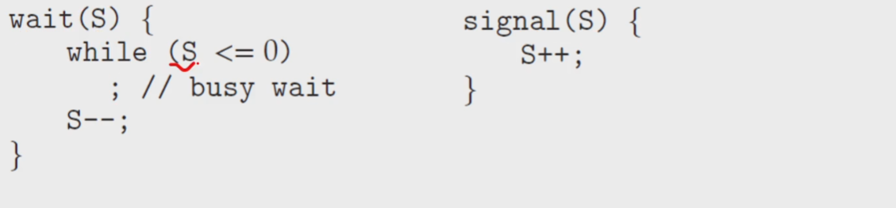<br>  

- S를 n으로 설정하고 n을 쭉 감소시키다가 S=0 이 되면 진입을 막음
- n 개의 instance를 가진 자원을 서로 공유할 때 사용
    - n개의 열쇠꾸러미에서 락커에 맞는 열쇠를 찾아 사용하는 것
    - 다 사용하면 진입 못하게 막고 밖에서 대기하게 만듦

### Binary and Counting Semaphores
- _Binary_ semaphore
    - range only between 0 and 1 : similar to _mutex_lock_
- _Counting_ Semaphore
    - range over an unrestricted domain
    - can be used to resources with _a finite number of instances_

### Using the counting semaphore
- _Initialize_ a semaphore to _the number of resources available_
- resource를 사용할 때 : wait()를 해서 count 감소
- resource를 release 할 때 : signal()을 호출해 count 증가
- resource를 다 사용하여 0일 때 : processes that wish to use a resource will block _unitl_ the count becomes _greater than 0_

### Using the semaphore to solve synchronization problem
- Consider two processes $P_1$ and $P_2$ running concurrently
    - $P_1$ with a statement $S_1$, and $P_2$ with a statement $S_2$
- Suppose that $S_2$ should be _executed only after_ $S_1$ has completed
    - Let $P_1$ and $P_2$ share a _semaphore_ **synch**, initialized to 0.
- 2개가 synchronization 되어있을 때 초기화를 0으로 해서 순서대로 진행 됨

### Semaphore Implementation
- busy waiting 문제가 발생할 수 밖에 없음
- modify the definition of P() and V()으로 극복
- When a process executes the **wait()** operation
    - and finds that the semaphore _is not positive_, it must wait
    - rather tahn busy waiting, suspend itself and goes to the _waiting queue_
- When other process executes the **signal()** operation
    - waiting processes can be _restarted(wake up)_ and placed into the _ready queue_

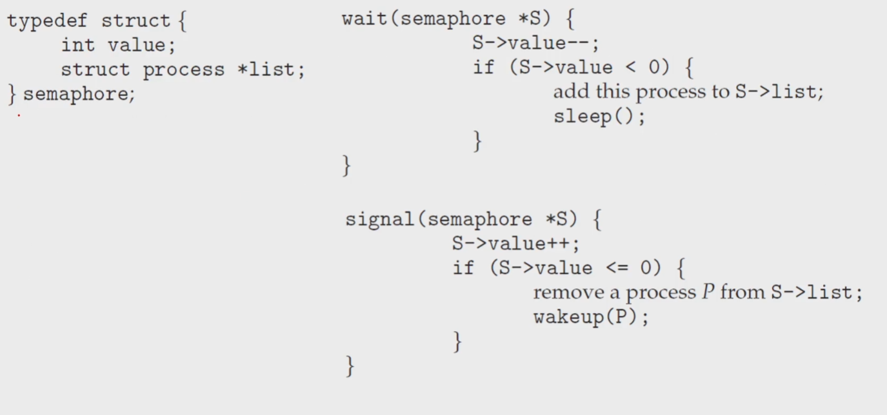<br>

```c
void *counter (void *param)
{
int k;
for (k = 0; k < 10000; k++) { 
    /* entry section */
    sem_wait(&sem);

    /* critical section */
    sum++;

    /* exit section */
    sem_post(&sem);

    /* remainder section */
  }
  pthread_exit(0);
}

#include <stdio.h> 
#include <pthread.h>
#include <semaphore.h>

int sum = 0; // a shared variable

sem_t sem;

int main()
{
  pthread_t tid1, tid2;
  sem_init(&sem, 0, 1);
  pthread_create(&tid1, NULL, counter, NULL);
  pthread_create(&tid2, NULL, counter, NULL);
  pthread_join(tid1, NULL);
  pthread_join(tid2, NULL);
  printf("sum = %d\n", sum);
}
```
- binary
- 정상적으로 작동

```c
int main()
{
  pthread_t tid[5]; int i;
  sem_init(&sem, 0, 5);
  for (i = 0; i < 5; i++)
    pthread_create(&tid[i], NULL, counter, NULL);
  for (i = 0; i < 5; i++)
    pthread_join(tid[i], NULL);
  printf("sum = %d\n", sum);
}
```
- 출력 : 47618, 46041, 45954, 44408, ...
- semaphore에 열쇠가 5개 &rarr; 5개의 thread가 진입하다보니 race condition이 발생
- instance 개수는 S(열쇠의 개수)와 같아야함
- n개의 instance 가 없어서 문제 발생

#### Binary Semaphore 와 Counting Semaphore는 모두 locking에 기반


## Monitors
### The _difficulty_ of using semaphores
- The semaphore is _convenient_ and _Effective_ for synchronization
- However, _timing errors_ can happen
    - if particular execution sequences take place
    - these sequence _do not always occur_
    - and it is _hard to detect_
- 편리하고 효과적이지만 timing error(programming error)가 자주 발생

### An illustrative example of semaphore's problem
- 모든 프로세스는 1로 초기화된 binary semaphore mutex를 공유
    - 모든 process는 반드시 critical section에 들어가기 전에 **wait(mutex)** 진행 후 **signal(mutex)** 진행
- 만약 순서가 지켜지지 않으면, 두 process 모두 simultaneously하게 critical sections에 진입  
&rarr; race condition 발생  
&rarr; wait를 두번하거나 해서 signal을 호출하지 않았을 때도 마찬가지

### Situation 1
```c
signal(mutex);
    ...
    ciritcal section
    ...
wait(mutex);
```

- single process가 제대로 작동하지 않을 떄더라도 어려움 발생
- Suppose that a program _interchanges the order_
    - in which **wait()** and **signal()** on the semaphore **mutex** are executed

### Situation 2 & 3
- Suppose that a program replaces _signal()_ with _wait()_
```c
wait(mutex);
    ...
    critical section
    ...
wait(mutex);
```
- Suppose that a process omitss the **wait()**, or the **signal()**, or both of them

### How to deal with these kinds of difficulties?
- Various types of errors can be generated easily
    - when programmers use semaphores (or mutex locks) incorrectly
- high-level language constructs의 가장 simple한 synchronization tool을 사용  
&rarr; monitor : one fundamental high-level synchronization construct 

### A monitor type is
- an ADT(Abstract Data Types) that includes a set of _programer-defined operations_
    - that provided with mutual exclusion within the _monitor_
- declare the variables
    - whose values define the _state of an instatnce_ of that type
    - along with the bodies of _function_ that operate on those _variables_<br>

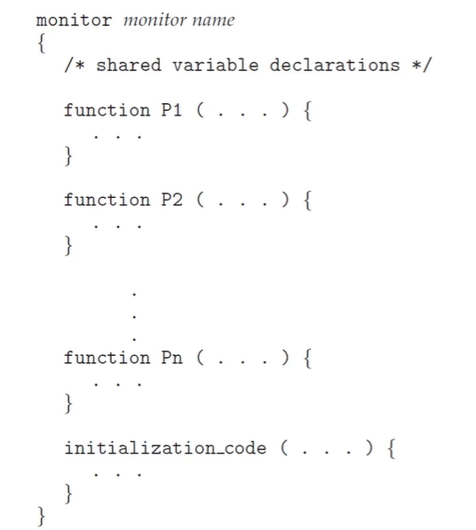<br>
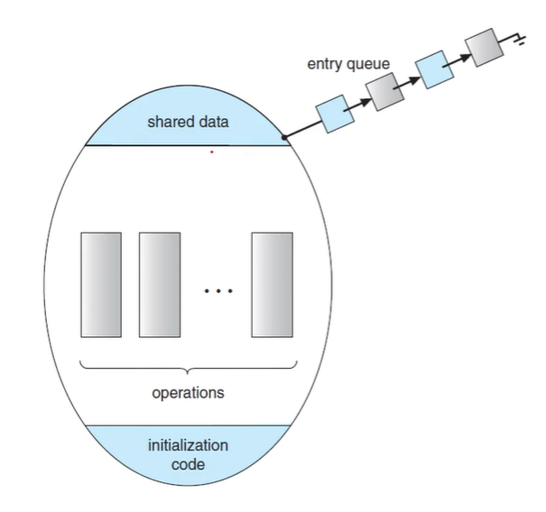<br>

- 구조
    - Monitor
        - shared data
        - initialization code : 초기화 위해
        - operations : 동기화 위해
    - Monitor로 만들어진 thread들은 entry queue(wait queue)가 만들어짐

### Conditional Variables
- 모니터가 자체적으로 synchronization을 풀기에는 부족한 점이 있음
- 때문에, condition이라는 variable을 도입

### Using conditional variables:
```
condition x, y;
x.wait();
x.signal();
```
- One can define one or more variables of type condition
- **condition variable**에서 호출할 수 있는 작업은 **wait() and signal()** 뿐

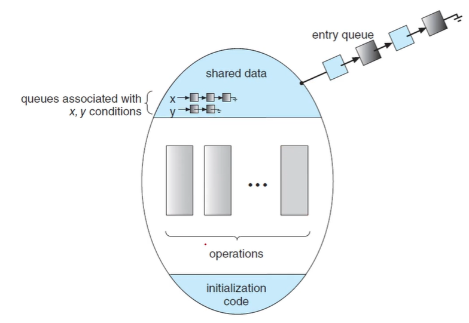<br>

### Java Monitors
- Java provides a _monitor-like_
    - concurrency mechanism for thread synchronization
    - called as monitor-lock or intrinsic-lock
- Basic language constructs for Java Synchronization
    - ***synchronized*** keyword
    - ***wait()*** and ***notify()*** method

### synchronized keyword
- 임계영역에 해당하는 코드 블록을 선언할 떄 사용하는 자바 키워드
- 해당 코드 블럭(임계영역)에는 모니터락을 획득해야 진입 가능
  - 열쇠를 받아야 진입, 나올때는 반납
- 모니터락을 가진 객체 인스턴스를 지정할 수 있음
- 메소드에 선언하면 메소드 코드 블록 전체가 임계영역으로 지정됨
  - 이 때, 모니터락을 가진 객체 인스턴스는 this 객체 인스턴스
```java
synchronized (object){
  // critical section
}

public synchronized void add(){
  // critical section
}
```

### wait() and notify() methods
- java.lang.Object 클래스에 선언됨: 모든 자바 객체가 가진 메소드임

- 쓰레드가 어떤 객체의 wait() 메소드를 호출하면
  - 해당 객체의 모니터락을 획득하기 위해 대기 상태로 진입함.

- 쓰레드가 어떤 객체의 notify() 메소드를 호출하면
  - 해당 객체 모니터에 대기중인 쓰레드 하나를 깨움

- notify() 대신에 notifyAll() 메소드를 호출하면
  - 해당 객체 모니터에 대기중인 쓰레드 전부를 깨움

### Java Synchronization e.g. 1
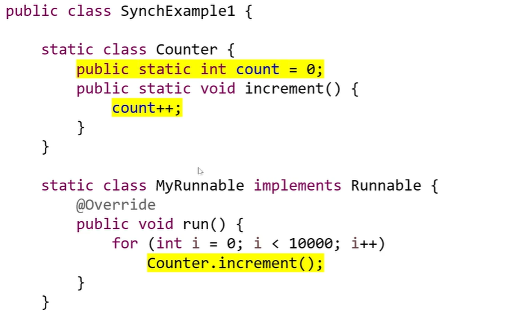<br>
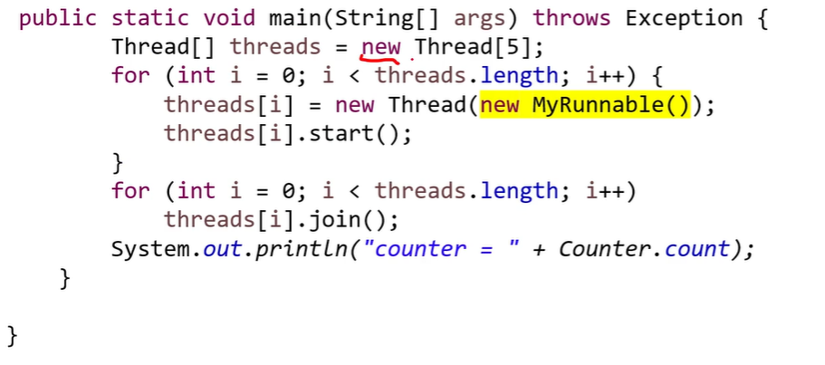<br>

- 심각한 동기화 문제, race condition 발생
    - 모니터 락으로 해결

### Java Synchronization e.g. 2
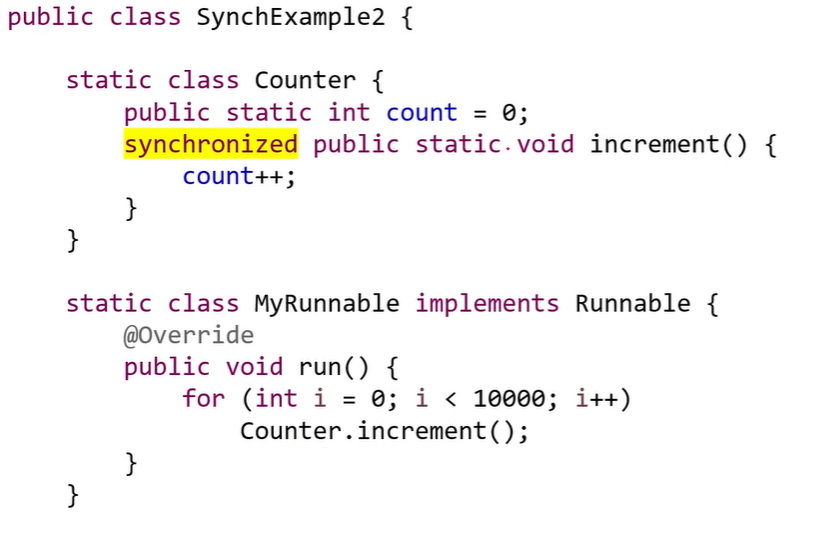<br>
<br>

- 원하는 대로 작동
- critical section만 synchronized 로 묶어 버림
- 전체를 묶으면 장점이 사라짐

### Java Synchronization e.g. 3
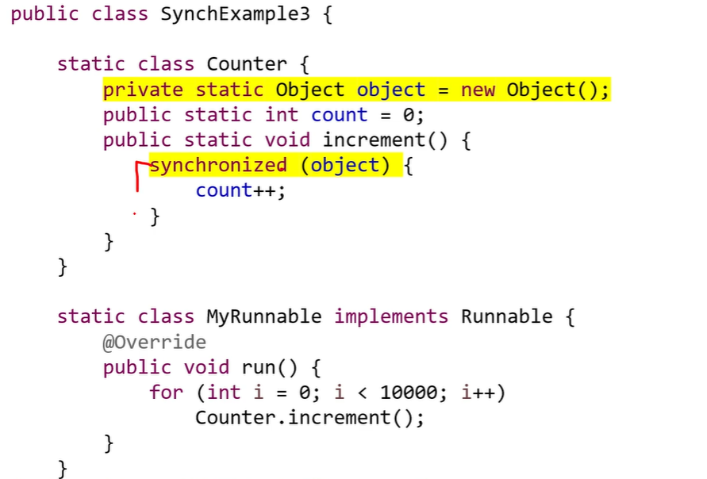<br>
<br>

### Java Synchronization e.g. 4
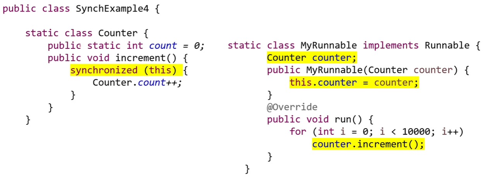<br>
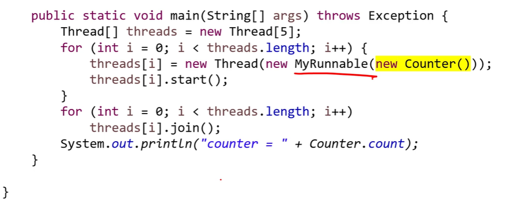<br>

- counter 를 공유해야지만 동기화 문제가 발생하니까 static 변수로 사용
- 동기화 문제 발생
- synchronized 블락은 this를 통해 자기참조
    - 5개의 Thread는 각 instance를 가짐
- 객체가 달라지면 monitor가 달라지는 거임
- 자기 혼자만 동기화 되니까 동기화 안댐

### Java Synchronization e.g. 5
<br>
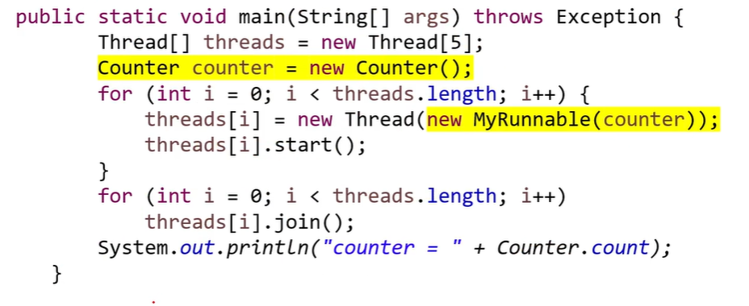<br>

- this 를 모두 공유

## Liveness
### Liveness
- Semaphores and monitors는 상호배제만 해결 가능
    - starvation, deadlock은 해결 안됨
- _Liveness_ refers to
    - a set of properties that a sysytem must satisfy
    - to ensure that processes make progress during their execution cycle
- Two situations that can lead to liveness failures 
    - _deadlock_ and _priority inversion_

### Deadlock
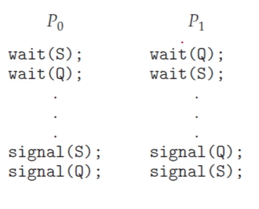<br>

- a situation where two or more processes are _Waiting indefinitely_
    - for an event that _can be caused only by_ one of the _waiting process_

### Priority Inversion : 우선순위 역전
- A situation where a higher-priority processes have to wait
    - for a lower-priority one to finish ther resource
- It can arise when a _higher_-priority process
    - need to _read or modify kernel data_
    - that are currently being accessed by a _lowre-priority_ process
- Typically, priority inversion is avoided
    - by implementing a _priority-inheritance_ protocal
- All processes accessing resources needed by a higher-priority process
    - inherit the higher priority
    - until they release that resources
    