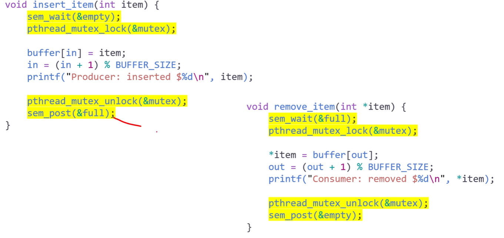
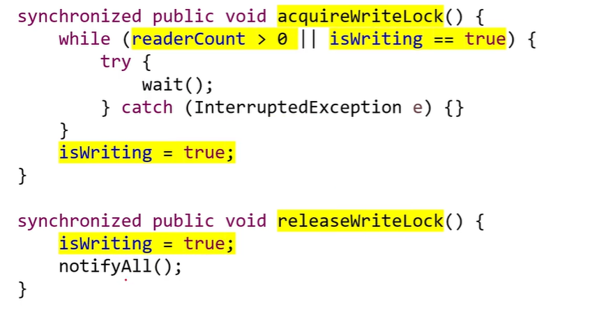

# Synchronization Examples

## Classic Problems of Synchronization
### Examples of a large class of Concurrency-Control Problems
- The **_Bounded-Buffer_** Problem
    - The Producer-Consumer Problem
    - 가장 대표적인 문제
- The **_Readers-Writers_** Problem
- The **_Dining-Philosophers_** Problem

### Bounded-Buffer Problem
- Recall the Producer-Consumer Problem
    - with a pool consisting of _n buffers_, each capable of holding _one item_
- producer : 버퍼를 가득 채우는 것이 목표
- consumer : 버퍼를 계속 비워주는 것이 목표 

#### Shared Data Structers
```c
int n;
semaphore mutex = 1;
semaphore empty = n;
semaphore full = 0;
```
- A binary semaphore **mutex**
    - provides _mutual exclusion_ for accesses to the buffer pool
    - and is _initialized_ to the value 1
- 2 _counting semaphores_ **empty** and **full**
    - are used to _count_ the number of _empty_ and _full_ buffers
    - empty : n으로 설정하고 감소시킴
    - full : 0으로 설정하고 증가시킴

- The structure of the **producer process**
    ```c
    while(true) {
        /* produce an item in next_produced */
        wait(empty);    // buffer가 empty까지 wait
        wait(mutex);    // race condition 방지를 위해 mutex
        /* add next_produced to the buffer */
        signal(mutex);  // mutex 반납
        signal(full);   // full로 변경하여 consumer에게 알려줌
    }
    ```

- The structure of the **consumer process**
    ```c
    while(true) {
        wait(full);     // buffer가 full까지 wait
        wait(mutex);    // race condition 방지를 위해 mutex
        /* remove an item from buffer to next_consumed */
        signal(mutex);  // mutex 반납
        signal(empty);  // empty로 변경하여 producer에게 알려줌
        /* consume the item in next_consumed */
    }
    ```

&rarr; 완벽히 대칭구조가 맞춰져 있어야 사용 가능  
    &rarr; 맞춰서 사용하기 어려워서 사용하지 않음


### The Readers-Writers Problem
- 프로세스가 동시에 실행되는 경우, **reader** 또는 **writers**일 경우 공유 데이터는 어떻게 될까?
    - e.g., _database_ 는 several concurrent processes에 의해 공유되고 있음
- **Reader** : only to read the database
- **Writer** : to update (that is, read and write) the database
- Note that, obvisouly, _no adverse effects_ will result,
    - if _two or more readers_ access the shared data simultaneously  
    &rarr; 2개 이상의 reader가 동시에 접근한다고 했을 때는 데이타가 깨지지 않으므로 문제 되지 않음
- However, _chaos_ may ensue,
    - if _a writer_ and some other process(either a _reader or a writer_)
    - access the database simultaneously  
    &rarr; 2개 이상의 writer 혹은 writer와 reader가 동시에 접근하면 문제 발생

#### Some Variations of the Readers-Writers Problem
- **_Priorities_** are involved with all the variations
- The _first_ readers-writers problem
    - _No reader_ should _wait_ for other readers to finish
    - simply beacuse a _writer_ is _waiting_
    - reader 와 writer에게 공평한 권한을 줘서 access 하게 해 줌
- The _second_ readers-writers problem
    - If a _writer_ is waiting to access the object
    - _no new readers_ may start _reading_
    - writer에게 우선순위 부여 (reader들의 진입을 막음)
- Note that _starvation_ may occur in these two cases
    - 위의 두 방법은 starvation이 일어나기 쉬움
    - writer에게 모든 우선순위를 줘버리면 읽지를 못함
    - reader가 너무 많은데 writer 우선순위를 똑같게 줘버리면 write를 못하는 문제 발생

#### Solution to the _first_ readers-writers problem
- The reader processes share the following data structures
    ```c
    semaphore rw_mutex = 1;     // reader, writer 공유 사이에서의 보호
    semaphore mutex = 1;        // critical section 보호
    int read_count = 0;     // reader의 갯수가 0이 되면 진입
    ```
    - **rw_mutex** : _common_ to both readers and writers
    - **mutex** : is used to ensure _mutual exclusion_
        - when the variable **read_count** is updated
    - **read_count** keeps track of
        - how many processes are currently reading the object

- The structure of a writer process
    ```c
    while(true) {
        wait(rw_mutex);
        /* writing is performed */
        signal(rw_mutex);
    }
    ```
- The structure of a reader process
    ```c
    while(true) {
        wait(mutex);
        read_count++;
        if (read_count == 1)
            wait(rw_mutex);
        signal(mutex);

        /* reading is performed */

        wait(mutex);
        read_count--;
        if (read_count == 0)
            signal(rw_mutex);
        signal(mutex);
    }
    ```

#### Solution to the Readers-Writers Problem
- Note that, if _a writer_ is in the _critical section_, and _n_ readers are waiting
    - then _one reader_ is queued on **rw_mutex**
    - and $n - 1$ _readers_ are queued on **mutex**
- Also observe that, when a writer executes **signal(rw_mutex)**,
    - we may resume the execution of
    - either the _waiting readers_ or _a single waiting writer_
    - The selection is made by the _scheduler_
    - scheduler가 reader와 writer 중 누가 들어갈 지 결정
        - 공평하게 주면 1번 solution
        - writer한테 주면 2번 solution

#### The Reader-Writers Locks
- The readers-writers problem and its solutions
    - have been _generalized_ to provide _reader-writer locks_
- Acquiring a reader-writer lock
    - requires specifying the mode of the lock: either _read_ or _write_
- Note that
    - _multiple processes_ may acquire _a reader-writer lock_ in the read mode,
    - but _only one process_ may acquire the _lock for writing_
    - as exclusive access is required for writers

#### PThread solution to the Bounded-Buffer Problem
- empty는 n으로 초기화
- full은 0으로 초기화

<br>
<br>
<br>

- producer와 consumer가 한 번씩 반복되는 것이 아닌 연속 두 번 나오는 경우 존재
- buffer, consumer, producer를 모두 1로 지정하면 발생하지 않음
- n개 일때 나올 수 있는 상황

#### Java solution to the Bounded-Buffer Prob
<br>
<br>
<br>
<br>
<br>
<br>

- instance가 monitor lock 을 획득해서 따로 실행, 동기화 문제도 일어나지 않음
- notify는 signal 역할
- 용돈 박스 1개, 외아들에게 용돈을 주는 구조
- producer 와 cosumer가 하나씩이라 문제가 없음
- consumer가 여럿이여도 문제는 없음
- producer 5, cash box 5, consumer 5 이면
    - producer가 연속으로 나오거나, consumer가 연속으로 나오는 경우 발생
    - 하지만, 충돌이 일어나는 것은 아님
    - producer와 consumer가 각각 다른 것이기 떄문

#### Java solution to the first Readers-Writers Problem
<br>
<br>
<br>

- notifyAll 은 가장 앞에있는거 하나만 readyqueue에 넣는 것이 아닌, 전부 경쟁해서 들어가게 하는 방법
    - 공평하게 들어가게 하기 위함

## Classic Problems of Synchronization
### The _DIning-Philosophers_ Problem
<br>

- 다섯명의 철학자들이 _five single chopsticks_ 를 공유하며, _thinking_ 과 _eating_ 상태로 존재
- 배고픈 상태가 되면, 가까운 두 개의 chopsticks을 잡으려 시도
- 동시에 두 젓가락을 가지고 있으면 먹는 상태로 전환 가능

**The Dining-Philosophers Problem** : need to allocate _several resources_ among several processes  
    &rarr; in a ***deadlock-free*** and ***starvation-free*** manner

### Semaphore Solution
<br>

- One simple solution is to represent each chopstick with a semaphore
    - A philosopher _acquires_ a chopstick by executing a _wait()_ operation
    - She _realease_ her chopsticks by executing a _signal()_ operation<br>
    ```c
    semaphore chopstick[5];

    while(true) {
        wait(chopstick[i]);
        wait(chopstick[(i + 1) % 5]);

        /* eat for a while */

        signal(chopstick[i]);
        signal(chopstick[(i + 1) % 5]);

        /* think for awhile */
    }
    ```

### The problem of _deadlock_ and _starvation_
- Simple semaphore solution guarantees mutual exclusion
- However, how about deadlock or starvation?
    - Suppose that all five philosophers become hungry at the same time
    - and each grabs her left chopstick, trying to grab her right chopstick

### Possible remedies to the deadlock problem
- Allow _at most four philosophers_ to be sitting simultaneously at the table
    - But, 철학자의 수를 제한할 수 없는 경우 사용할 수 없음
- Allow a philosopher to pick up her chopsticks 
    - only if _both chopsticks_ are available
- Use an _asymmetric_ solution:
    - an _odd-numbered_ philosopher picks up first her left chopstick and then her right chopstick,
    - whereas an _even-numbered_ philosopher picks up her right chopstick and the her left chopstick
    - 동시에 잡는 것은 아님(상호배제)
    - 따라서 식사 가능
- Note that a deadlock-free solution 
    - does not necessarily eliminate the possibility of _starvation_
    - deadlock 방지 비용이 너무 크기 때문에 발생했을 때 해결하는 방법 사용

### Monitor Solution
- 양쪽 모두 사용 가능 할 때만 사용할 수 있도록 하는 방법
- Let a philosopher to pick up her chopsticks
    - only if _both_ of them are _available_
- We need to distinguish among _three states_ of the philosophers:
    - thinking, hungry, and eating. 
- A philosopher can set her state to be eating, 
    - only if her _two neighbors_ are not in the state of eating.
- We also need a _condition variable_ which
    - allows a philosopher to delay herself when she is hungry
    - but is unable to obtain the chopsticks she needs

### Solution to the Dining-Philosophers Problem
- The distribution of the chopsticks 
    - is controlled by the monitor, ***DiningPhilosopher***
- Each philosopher must to invoke the operation _pickup()_,
    - before starting to eat, suspending the philosopher process
- After the successful completion of pickup(),
    - the philosopher may eat, and invokes the operation _putdown()_
- Note that 
    - _mutual exclusion_ is guaranteed and _no deadlocks_ will occur,
    - however, _starvation_ is still _possible_

<br>

### Pthread solution to the Dining-Philosophers Problem
<br>
<br>
<br>
<br>
<br>
<br>
<br>

##  Alternative Approaches
### Thread-Safe Concurrent Applications
- Concurrent applications have good performance on multicore systems,
    - using techniques such as mutex locks, semaphores, and monitors
- However, they present an increased risk of 
    - ***race conditions*** and ***liveness hazards*** such as _deadlock_
- There are alternative approaches
    - for the design of ***thread-safe*** _concurrent_ applications
 1. Transactional Memory
    - atomic operation, 입 / 출금, 메모리 영역 자체를 트랜젝션하게 만드는 것
 2. OpenMP
    - #pragma omp critical 하면 critical section 으로 만들어버림
 3. Functional Programming Language
    - 함수형 프로그래밍하면 이런 일이 발생하지 않음