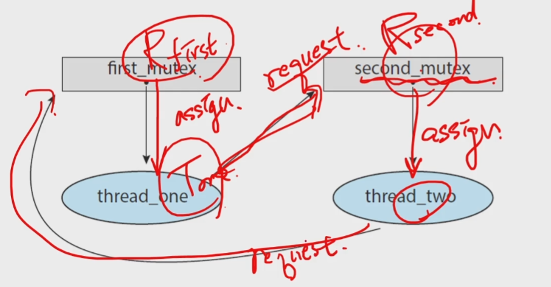
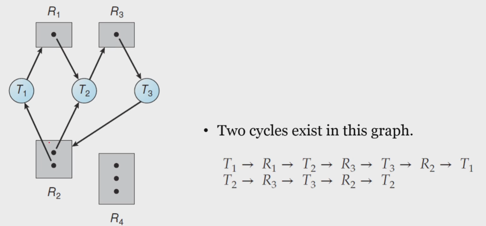

# 데드락(교착상태)의 이해

## 8.1 System Model
### A ***deadlock*** is
- a situation in which
    - every process in _a set of processes_ is waiting for
    - an event that can be caused only _by another process in the set_
    - 다른 프로세스가 interrupt를 걸어줘야 하지만, wait 상태에서 못빠져나오고 갇혀있는 상태
- a situation in which
    - a _waiting thread_ (or _process_) can _never again change state_
    - because the _resources_ it has requested
    - are held _by other waiting threads_(or processes)
    - 필요한 resource가 다른 wait하는 thread에 의해 점유되어 있는 상태

### Let us consider a system
- consisting of a _finite number of resources_
    - to be distributed among a number of _competing threads_
- _Resource types_ consist of
    - some number of _identical instances_
    - e.g., CPU cycles, files, and I/O devices(such as printers, drives, etc.)
- If a thread requests an _instance_ of a _resource type_
    - the allocation of _any instance_ should _satisfy_ the request
- A thread may utilize a resource as follows:
    - _Request - Use - Release_

## Deadlock in Multithreaded Applications
### How can a deadlock occur?
```c
pthread_mutex_t first_mutex;
pthread_mutex_t second_mutex;

pthread_mutex_init(&first_mutex, NULL);
pthread_mutex_init(&second_mutex, NULL);

/* thread_one runs in this function */
void *do_work_one(void *param)
{   
    // mutex 두개를 획득해서 critical section에 진입
    pthread_mutex_lock(&first_mutex);
    pthread_mutex_lock(&second_mutex);
    /**
     * Do some work
     */

    // critical section 후 release
    pthread_mutex_unlock(&second_mutex);
    pthread_mutex_unlock(&first_mutex);

    pthread_exit(0);
}

/* thread_two runs in this function */
void *do_work_two(void *param)
{
    // mutex 두개를 획득해서 critical section에 진입
    // second 부터 진행
    pthread_mutex_lock(&second_mutex);
    pthread_mutex_lock(&first_mutex);
    /**
     * Do some work
     */
    pthread_mutex_unlock(&first_mutex);
    pthread_mutex_unlock(&second_mutex);

    pthread_exit(0);
}
```
- request와 release 순서가 반대
- 각각 다른 mutex를 request하여 가지고 있는 상태
- 따라서, first mutex를 점유하고 second mutex를 점유하려는 시점에 다른 함수가 second mutex를 획득해버리면 둘다 아무것도 못하는 상태
- 즉, deadlock이 발생하기 쉬운 코드

## Deadlock Characterization
### Four Necessary Conditions
1. Mutual Exclusion(상호배제 조건)
    - _At least_ one resource _is held_ in a _non-sharable_ mode
    - e.g. 파일 하나를 전부 read만 하면 sharable하여 deadlock 걱정이 없음
    - but, 적어도 한 개 이상의 writer가 있어야 발생
    - 즉, 상호배제가 필요하지 않으면 데드락이 일어나지 않음
2. Hold and Wait(점유 대기)
    - A thread _holds at least_ one resource and _waiting to acquire_ additional resources _held by_ other threads
3. No preemption(선점 불가)
    - Resources _cannot_ be _preempted_
    - e.g. 스케쥴러가 CPU라는 자원을 뺏어버리면(선점) 문제가 발생하지 않음
    - 강제적으로 빼앗기 때문에 deadlock이 걸릴 수 없음
4. Circular Wait(원형 대기)
    - _A set of waiting threads_ exist such that the _dependency graph_ of waiting is _circular_
    - 여러 개의 thread가 원형으로 서로를 기다리는 형태에서 발생

- 이 4개가 동시에 만족해야 데드락 성립(필수조건)
    - 때문에, 억지로 만들지 않는 이상 deadlock이 발생이 어려움

    
### Resource-Allocation graph(자원 할당 그래프)
- is a _directed graph_ to describe deadlocks more precisely
- consists of a set of vertices $V$ and a set of Edges $E$
- Two different node types of V:
    - $T = {T_1, T_2, ..., T_n}$ : the set of all the _active threads_ in the system
    - $R = {R_1, R_2, ..., T_m}$ : the set of all the _resource types_ in the system 
- A directed edge : $T_i$ &rarr; $R_j$ (**request edge**) 요구엣지
    - signifies that a thread $T_i$ has _requested_ an instance of $R_j$
- A directed edge : $R_j$ &rarr; $T_i$ (**assignment edge**) 할당엣지
    - signifies that an instance of $R_j$ has been _allocated to_ a thread $T_i$
    - $R_j$의 edge가 존재하면 $T_i$에 이미 할당되어 있는 것<br>
- cycle 존재
- 데드락의 전형적인 모습<br>
<br>

<br>
<br>


- deadlock이 발생하지 않음
- R2가 쓰다가 T4에게 반납을 할 수 있기 때문
<br>


### An important observation
- _resource-allocation graph_ 에 
    - cycle이 존재하지 않으면 &rarr; deadlock이 절대로 발생하지 않음
    - cycle이 존재한다면 &rarr; deadlock이 발생할 할 수도 있고, 발생하지 않을 수도 있음

### Three ways of dealing with the Deadlock Problem
- _Ignore_ the problem altogether
    - and pretend that deadlocks never occur in the system
    - 무시하는 방법
- Use a protocol to _prevent_ or _avoid_ deadlocks
    - ensuring that the system will _never enter_ a deldocked state
    - Deadlock Prevention
      - 거의 불가능
      - 만약 가능한다고 해도 위성급에 사용하는 매우 비싼 시스템에 사용
    - _Deadlock Avoidance_ : _Banker's Algorithm_
        - 비싼지만 사용하는 경우 존재
        - but, 어려움, 유명함
- Allow the system to enter a deadlocked state
    - then _detect_ it, and _recover_ it
    - Deadlock Detection
    - Recovery from Deadlock
    - deadlock이 발생해서 wait 상태에서 빠져나가지 못하는 걸 확인하면 빨리 recovery
    - 실질적으로 많이 사용되는 방식

## Deadlock Prevention
### Deadlock Prevention
- For a deadlock to occur
    - each of the _four necessary conditions_ must hold
- Hence, we can _prevent_ the occurrence of a deadlock
    - by ensuring that _at least one_ of these conditions cannot hold
1. Mutual Exclusion
2. Hold and Wait
3. No Preemption
4. Circular Wait

### Mutual Exclusion 상호배제
- At least one resource must be non-sharable
    - 모든 리소스가 공유가능하면 발생하지 않음
    - 적어도 한 개 이상의 resource가 non-sharable하다면 발생
- _In general_, it _cannot be applied to_ most applications
    - some resources are _intrinsically_ non-sharable
    - e.g., a mutex lock cannot be shared by several threads
    - mutex lock은 공유될 수 없기 떄문에 불가능
### Hold and Wait
- We can guarantee that, whenever a thread requests a resource,
    - it does not hold any other resources
    - 파일 10개를 열어놓고 한개를 더 열기 위해선 열어놨던거 다 닫고 하나 열고, 다시 다 열어야함
- It is _impractical_ for most applications
    - 비실용적
### No Preemption 선점 불가
- We can use a protocol to ensure that there should be _preemption_
- If a thread is holding some resources and requests another resources
    - that cannot be immediately allocated to it
    - then, all resources the thread is currently holding are _preempted_
- The preempted resources are added to the list of resources 
    - for which the threads are waiting
- The thread will be restarted
    - only when it can regain its _old resources_ as well as _new ones_
- _cannot generally be applied_ to most applications
### Circular Wait: sometimes _practical_
- 4가지 조건 중 가장 사용할만한 조건
- Impose a _total ordering_ of all resource types
    - and to _require_ that each thread requests
    - resources in an _increasing order_ of enumeration
    - resource type에 순서 부여
    - 점유된 resources보다 번호가 높은 것만 요청
    - deadlock은 줄일수가 있지만 그만큼 starvation 증가
- It is _provable_ that these two protocols are used,
    - then the circular-wait condition _cannot hold_
- Note that, however
    - imposing a lock ordering does not guarantee deadlock prevention
    - if locks can be acquired dynamically
    - ock ordering 조차도 deadlock prevention을 보장할 수는 없음

## Deadlock Avoidance
```c
// 아빠와 아들 계좌
// transaction은 원자성이 보장되어야 함, 하나라도 실행되지 않으면 안댐
void transaction(Account from, Account to, double amount)
{
    // 뮤텍스락 두개
    mutex lock1, lock2

    lock1 = get_lock(from);
    lock2 = get_lock(to);    

    // 계좌 둘다 잠금
    // 자신의 계좌에 lock
    acquire(lock1);
        // 아들 계좌에 lock
        acquire(lock2);
            
            // 출금과 입금이 두개의 락을 획득했을 때만 발생
            // 아빠 계좌에서 돈을 빼서 아들 계좌에 입금
            withdraw(from, amount);
            deposit(to, amount);
        
        release(lock2);
    release(lock1);
}


transaction(checking_amount, savings_account, 25.0) // T-1
transaction(savings_account, checking_amount, 50.0) // T-2
```
- transaction 2개가 동시에 호출되면 문제가 발생하지 않을 것 같은데 문제 발생
- acquire lock 1 한 상태에서 acquire lock 2를 하고 있으면 문제 발생
- 그랜드 락 또는 모니터 락을 걸어 해결
- deadlock prevention은 잘 안되니까 prevent하지말고 avoid하자
    - &rarr; 뱅커 알고리즘

# 데드락과 뱅커 알고리즘
## Deadlock Avoidance
### The _Demerits_ of the Deadlock Prevention
- It prevents deadlocks by limiting how requests can made,
    - ensuring that _at least one of the necessary conditions_ cannot occur
- However, possible side effects of preventing deadlocks are
    - _low device utilization_ and _reduced system throughput_
