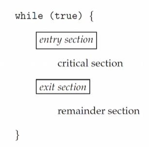
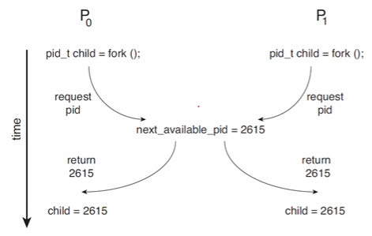
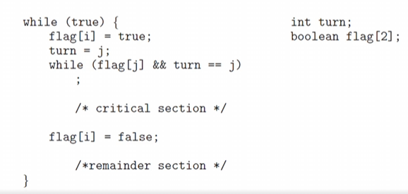

# Chapter 6-1. Synchronization Tools
## Background
### Cooperating process
- 서로 영향을 주고받는 프로세스들간의 관계
  - 주로 쓰레드나 공유 데이터

  - concurrent한 데이터가 접근할 때 데이터가 깨지는걸 염두

  - process들이 동시 접근할 때 순서를 보장해줘야 공유된 데이터들이 data consistency를 유지할 수 있음

### 여러 개의 프로세스들이 데이터의 통일성을 공유하고 있을 때
- concurrent 실행
  - 프로세스가 언제 어디서나 interrupt가 발생하면 instruction stream이 언제 어디서 끊길지 모름
  - 다음 프로세스가 들어와서 자기 프로세스를 실행시킬 때 공유 데이터에서 실행하기 때문에 문제가 발생할 수 있음

- parallel 실행
  - 여러 개의 프로세스가 분리된 CPU에서 동시에 실행되면 문제가 발생함

#### 데이터를 공유할 때 문제 예시
- 두개의 프로세스가 공유 데이터를 통해서 데이터를 공유할 때 asynchronous하게 동작함. (쓰고싶을 때 쓰고 읽고싶을 때 읽고)

- buffer의 item 개수를 세어보자.
  - 처음엔 item이 없으니 0으로 두고
  - item을 추가할 때는 increment 
  - item을 제거할 때는 decrement

```C
// item increment
while (true) {
  /* produce an item in next_produced */
  while (count == BUFFER_SIZE); 
    /* do nothing */
  
  buffer[in] = next_produced; 
  in = (in + 1) % BUFFER_SIZE; 
  count++;
}


// item decrement
while (true) {

  while (count == 0)
  ; /* do nothing */

  next_consumed = buffer[out];
  out = (out + 1) % BUFFER_SIZE;
  count--;
/* consume the item in next_consumed */
}
```

  - 예를 들어 p와 q의 process가 하나의 shared data를 공유한다고 했을 때 parallel하게 실행된다면 당연히 문제될 것 이다.
  - 그러면 concurrent하면 동시 시간 대 실행이 아닌데 왜 문제가 될까

### Data inconsistency
- 2개의 process가 분리되어 실행되고 있으니 정상적으로 동작할거라 생각하는데 생각한 대로 정상적으로 동작하지 않는다.

- count가 5라고 생각했을 때 count가 ++되고 count가 - 된다고 했을 때 생각해보면 5가 나올 것 같지만 4, 5, 6 이 랜덤하게 나온다.

```C
// Case 1
#include <stdio.h> 
#include <pthread.h>

int sum;

void *run(void *param)
{
  int i;
  for (i = 0; i < 10000; i++)
    sum++; 
  pthread_exit(0);
}

int main() 
{
  pthread_t tidl, tid2;
  pthread_create(&tid1, NULL, run, NULL);
  pthread_create(&tid2, NULL, run, NULL); 
  pthread_join(tid1, NULL);
  pthread_join(tid2, NULL);
  printf("%d\n", sum);
  // 생각대로라면 tid1, tid2가 10000씩 증가시키기 때문에 20000이 나올것이다.
  // 실제 출력값 : 19099, 19385, 20000, 20000, ...

// Case 2
#include <stdio.h> 
#include <pthread.h>

int sum;

void *run(void *param)
{
  int i;
  for (i = 0; i < 10000; i++)
    sum++; 
  pthread_exit(0);
}

int main() 
{
  pthread_t tidl, tid2;
  pthread_create(&tid1, NULL, run1, NULL);  // 이번에는 run을 1과 2로 분리
  pthread_create(&tid2, NULL, run2, NULL); 
  pthread_join(tid1, NULL);
  pthread_join(tid2, NULL);
  printf("%d\n", sum);
}
```
- 왜 이런일이 벌어질까
  - 'count++', 'count--'가 두 개의 register에서 실행될 때를 예로 들었을 때
    - count++
      1. register1에 count값을 등록
      2. register1 값을 1 증가
      3. 다시 count 값에 register1을 할당
    - count--
      1. register2에 count값을 등록
      2. register2 값을 1 감소
      3. 다시 count 값에 register2를 할당
  - 이 중에서 1, 2, 3 어디에서도 context switch가 발생할 수 있음
  - 두 개의 register는 physical 적으로는 같은 register지만 concurrent하게 실행되면 interrupt handler(scheduler)가 register 정보를 save하고 restore하는 context switch 과정에서 꼬일 수 있음 
- 즉, producer, consumer 두 개의 instruction이 어떤 순서로 sequential하게 실행되냐에 따라서 임의적인 순서로 나올 수 있다.

### **Race Condition(경쟁 상황)**
- 여러 개의 프로세스/쓰레드가 어떤 데이터를 공유하고 있을 때 이 데이터를 concurrent하게 실행시키려 할 때 어떤 순서로 일어나냐에 따라 outcome이 달라진다는 것

#### Race condition 해결법
- 어떠한 특정 시간에 1개의 프로세스만 shared data를 다루게 한다
  - process/thread synchronization이라고 함.

```Java
// Race condition 해결
public class RaceCondition1 {

  public static void main(String[] args) throws Exception {
  RunnableOne run1 = new RunnableOne();
  RunnableOne run2 = new RunnableOne();
  Thread t1 = new Thread (run1); 
  Thread t2 = new Thread (run2);
  t1.start(); t2.start();
  t1.join(); t2.join();
  System.out.printIn("Result: " + run1.count + ", "+ run2.count);
  }
}

class RunnableOne implements Runnable {

  int count = 0;

  @Override
  public void run() {
    for (int i = 0; i < 10000; i++)
      count++;
  }
}

// Race condition 발생
public class RaceCondition2 {

  public static void main(String[] args) throws Exception {
  RunnableTwo run1 = new RunnableTwo();
  RunnableTwo run2 = new RunnableTwo();
  Thread t1 = new Thread (run1); 
  Thread t2 = new Thread (run2);
  t1.start(); t2.start();
  t1.join(); t2.join();
  System.out.printIn("Result: " + RunnableTwo.count);
  }
}

class RunnableTwo implements Runnable {

  static int count = 0; // static 변수 사용

  @Override
  public void run() {
    for (int i = 0; i < 10000; i++)
      count++;
  }
}
```

#### Race condition 연습문제
- 계좌 이체 (입금과 출금이 동시에 일어남)
  - 내가 출금을 하고 아들한테 입금이 된다고 하면 2개가 동시에 일어난다고 해야 의미가 있음
  - 이런 경우에도 race condition으로 다뤄야 함.
  - 나중에 가서 deadlock에서 다시 다룰 예정

- push/pop
  - push/pop하는 과정에서도 race condition이 일어난다.
  - 어떤 data가 race condition을 가지고 있는가 고민하보셈

## The Critical Section Problem
### The Critical Section Problem(임계 영역 문제)
- 임계 영역
  - n개의 process가 있을 때, 어떠한 코드 영역을 **critical section** 이라고 부름
  - 어떤 process에서 shared data를 update or access 한다고 할 때 이것이 다른 프로세스랑 공유가 되어있다면 critical section이라 부른다.
  - 하나의 process가 critical section을 이용하고 있을 때 다른 process가 진입, 실행할 수 없게 만들면 race condition이 안 일어나지 않을까 (말과 개념은 쉬움)

### The critical-section problem
- 어떤 2개의 process가 같은 시간에 실행하지 않는다 가정하면 process들의 synchronization이 자연스럽게 일어난다.
- 그렇게 공용 데이터를 처리하게 됨

### Sections of codes
source code 영역을 4가지로 나눌 수 있음<br>
<br>
- entry-section
  - critical section에 진입하는 section
  - 허가를 얻어서 진입
- critical-section
  - 인계영역
  - 예시) count ++ 하는 영역
- exit-section
  - critical에서 실행 후 허가를 반납하고 exit
- remainder-section
  - non-critical section
  - 예시) count -- 하는 영역

### Critical section 문제를 풀 때의 요구사항 3가지
***굉장히 중요함***
- **Mutual Exclusion(상호배제)**
  - default 값으로 실행해야함.
  - Pi process가 실행중일 때 다른 process 들은 critical section에 진입할 수 없다.

- Mutual Exclusion을 실행하게 되면 문제점
  - **deadlock이 발생함**
    - 교차로에서 사방에서 차가 다가와 꽉 막혀 움직일 수 없는 상황
    - critical에 들어가기 위해 대기하는 process들이 꽉 막혀 critical section에 아무도 못들어가는 현상이 생김

  - **starvation(기아)이 발생함**
    - critical section에 진입하기 위해 대기하는 process들이 우선순위 별로 진입
    - 들어가지 못하는 process가 생김 (starvation 발생)

### Example of race condition
<br>

process들이 fork한 pid가 같으면 process child끼리 충돌이 남
다음 pid값을 얻고나서 context switch가 일어나고 다시 pid값을 얻으면 값이 계속 같아짐

### A simple solution in a single-core environment
- critical section 문제를 해결하기 위해 가장 좋은 방법
  - interrupt를 막아버리기(disable)
  - 너무 간단해서 복잡해지면 쓸 수가 없음.
  - core가 여러 개 있다면 하나씩 다 막아버려야 하기 때문에 비효율적

### Two general approaches
- preemptive kernel (선점형)
  - 동기화 문제가 반드시 발생하고 다루기 어려움
  - 대신 더 responsive 하기 때문에 자주 사용함
- non-preemptive kernel (비선점형)
  - 어떤 kernel 모드가 진입하면 다시 내려놓기 전까지 CPU를 쓰기 때문에 context switch가 발생하지 않음
  - 그래서 문제가 생기지 않음
  - 근데 요즘엔 거의 안씀

## Peterson's Solution
### Software Solutions
- Dekker의 알고리즘
- Eisenberg and McGuire's 알고리즘
- Bakery 알고리즘
  - 레슬리 램포트가 제안한 알고리즘
  - 궁금하면 알아서 찾아모기
- **Peterson 알고리즘**
  - 클래식 Software 솔루션이고 critical 인계영역 문제를 가장 완결하게 해결한 알고리즘
  - 이번 수업에서 주로 다룰 내용
  - 대신 load and store에서 발생하는 문제라서 게런티가 없음

### Peterson's solution
<br>
- 2개의 process가 critical과 remainder section을 왔다갔다하는 상태에서 생기는 문제
- entry section 과 exit section을 만들면 문제를 해결할 수 있음(race condition 방지)

```java 
int turn; 
boolean flag[2];
```
산책을 시키려하는데 2마리의 개가 자꾸 싸우니까 flag를 꽂아서 내가 산책 나간다고 표시<br>
상대방이 산책중이면 기다렸다가 끝나면 내가 산책

### simple implementation of Peterson's solution
```c
#include <stdio.h>
#include <pthread.h>
#define true 1
#define false 0

int sum = 0;
int turn;
int flag[2];

void *producer(void *param) {
  int k;
  for (k=0; k < 10000; k++) {
    /* entry section */
    flag[0] = true;
    turn = 1;
    while (flag[1] && turn == 1)
      ;
    
    /* critical section */
    sum++;

    /* exit section */
    flag[0] = false;

    /* remainder section*/
  }
  pthread_exit(0);
}

void *consumer(void *param) {
  int k;
  for (k=0; k<10000; k++) {
    /* entry section */
    flag[1] = true;
    turn = 0;
    while (flag[0] && turn == 1)
      ;
    /* critical section */
    sum--;

    /* exit section */
    flag[1] = false;

    /* remainder section*/
  }
  pthread_exit(0);
}

int main() {
  pthread_t tid, tid2;
  pthread_create(&tid1, NULL, producer, NULL);
  pthread_create(&tid2, NULL, consumer, NULL);
  pthread_join(tid1, NULL);
  pthread_join(tid2, NULL);
  printf("sum= %d\n", sum);
}
```

- 0,0,0,-13,-9 ...
- 100000번 실행 중 6번 정도 실패

### What happen?
- 기계어 레벨로 생각하지 않으면 구조를 이해할 수가 없음
- load and store을 할 때 context switch가 일어나면 permission을 얻는 과정이 제대로 진행되지 않아 실행이 안됨

- peterson 알고리즘을 공부하는 이유는 알고리즘이 description이 짱임&rarr; 이해하기가 쉬움
  - 턴을 주고받고 하는 개념적으로 완벽함
  - mutual exclusion, progress, bounded waiting도 되는 것이 증명 가능함  

## Hardware Support for Synchronization
### Hardware-based Solutions
- 하드웨어의 지원이 없으면 어려움
- 그래서 하드웨어 지원을 csp(critical-section problem)를 푸는데 지원해주자.
  - 만약 instruction이 제공되었을 때 그걸 가지고 바로 synchronization 해버리면 가장 좋음
  - 다른 더 좋은 방법의 도구로 사용할 수도 있음 (뒤에서 배울 것)

- Three primitive operations
  - memory barriers or fences
  - hardware instructions
  - atomic variables

### Atomicity(원자성)
- Atom - 더이상 쪼갤 수 없는 물리적 성분
- Atomic operation - 더 이상 쪼갤 수 없는 operation의 단위

- instruction 자체를 atomic한 instruction으로 만들자
  - 클락을 쪼개지 말고 하나로 만들어 버리자

-atomic instructions을 개념적으로 본 2가지 형태
  - test_and_set
  - compare_and_swap

### test_and_set() instruction:
```c
boolean test_and_Set(boolean *target) {
  boolean rv = *target;
  *target = true;
  return rv;
}
```
- target 값을 true / false로 바꾸는 hardware instruction를 만들었다고 생각
- 그럼 코드의 중간에서 interrupt가 안됨

- Boolean 전역변수를 false로 lock 시킴
  ```c
  do {
    while (test_and_set(&lock)) // 실행 중 context switch가 안 일어남 
      ; /* do nothing */

      /* critical section */
    
    lock = false;

      /* remainder section */
  } while (true);
  ```
- mutual exclusion은 확실하게 보장됨
- critical section에 동시 진입하는 일은 사라짐
- deadlock이나 starvation은 앞으로도 해결되는 solution은 없음 (힘들음)

### The compare_and_swap() instruction:
```c
int compare_and_swap(int *value, int expected, int new_value) {
  int temp = *value;
  if (*value == expected) 
    *value = new_value;

  return temp;
}
```

-Integer lock을 0으로 초기화
```c
while (true) {
  while (compare_and_swap(&lock, 0, 1) != 0)
    ; /* do nothing */

    /* critical section */

  lock = 0;

    /* remainder section */
}
```

### Atomic Variable
- compare_and_swap instruction을 atomic variable을 만드는 도구로 사용할 수 있음.
- single variable에 race condition이 발생하면 mutual exclusion할 수 있는 atomic variable을 만드는 것은 쉽다.

### Java implementation of Peterson's solution
```java
public class Peterson1 {

  static int count = 0;
  
  static int turn = 0;
  static boolean[] flag = new boolean[2];

  public static void main(String[] args) throws Exception {
    Thread t1 = new Thread(new Producer());
    Thread t2 = new Thread(new Consumer());
    t1.start(); t2.start();
    t1.join(); t2.join();
    System.out.printIn(Peterson1.count);
  }
}

static class Producer implements Runnable {
  @Override
  public void run() {
    for (int k = 0; k < 10000; k++) {
      /* entry section */
      flag[0] = true;
      turn = 1;
      while (flag[1] && turn == 1)
        ;

      /* critical section */
      count++;
      
      /* exit section */
      flag[0] = false;

      /* remainder section */
      }
    }
  }

static class Consumer implements Runnable {
  @Override
  public void run() {
    for (int k = 0; k < 10000; k++) {
      /* entry section */
      flag[1] = true;
      turn = 0;
      while (flag[0] && turn == 0)
        ;

      /* critical section */
      count--;
      
      /* exit section */
      flag[1] = false;

      /* remainder section */
    }
  }
}
```
- -1,-1,-1,2,2,2,0,0 ...
- entry section에서 context switch가 일어날 때 race condition이 같이 발생해서 오류가 발생함.

- 그래서 java에서 제공하는 AtomicBoolean 함수를 써보자
```java
import java.util.concurrent.atomic.AtomicBoolean;

public class Peterson2 {

  static int count = 0;
  
  static int turn = 0;
  static AtomicBoolean[] flag;
  static {
    flag = new AtomicBoolean[2];
    for (int i = 0; i < flag.length; i++)
      flag[i] = new AtomicBoolean();
  }

}

static class Producer implements Runnable {
  @Override
  public void run() {
    for (int k = 0; k < 10000; k++) {
      /* entry section */
      flag[0].set(true);
      turn = 1;
      while (flag[1].get() && turn == 1)
        ;
        
      /* critical section */
      count++;
      
      /* exit section */
      flag[0].set(false);

      /* remainder section */
    }
  }
}

static class Consumer implements Runnable {
  @Override
  public void run() {
    for (int k=0; k< 10000; k++) {
      /* entry section */
      flag[1].set(true);
      turn = 0;
      while (flag.get() && turn == 0)
        ;
      /* critical section */
      count--;
      
      /* exit section */
      flag[1].set(false);

      /* remainder section */
    }
  }
}
```
- 이건 deadlock이 안걸려서 빨리 나옴
- 0, 0, 0, 0, 0, 0, ...
- 오류가 안나고 거의 같은 값이 나옴

### Any Questions
- 상호 배재를 쉽고 간단하게 해결하는 방법
  1. 뮤택스
  2. 세마도어
  3. 모니터