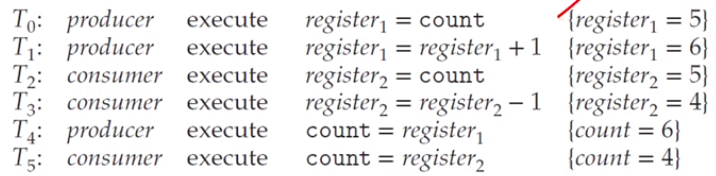
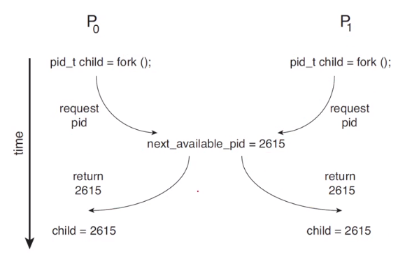

# Ch 6. Synchronization Tools

# 11 프로세스 동기화

## Backgound

### Cooperating processes

- cna either affect or be affected by each other
- can share a logical address space or be allowed to share data
- However, concurrent access to shared data
  - may result in data inconsistency
- Hence, we need to ensure
  - the orderly execution of cooperating processes
  - that share a logical address space to maintain data consistancy

### The inegritty of data shared by several processes(or thread)

- Concurrent execution
  - a process may be interrupted at any point in its instruction stream
  - the processing core may be assigned to another process
- Parallel execution
  - two or more instruction streams(representing diff processes)
  - execute _simulataneously_ on separate _processing_ cores

### Consoder an e.g. of how this is happen

- Let us revisit the procducer-consumer prob
  - where two processes _share data_ and are _running asynchronously_
- To count items in the buffer, and an integer variable count:
  - init to 0
  - incremented every time we add a new item to the buffer
  - decremented every time we remove a item from the buffer

### Data inconsistency

- although two processes are correct separately
  - they may not function correctly when executed concurrently
- Suppose that the value of count is currently 5
  - the producer and consumer concurrently execute
  - two statement: cnt++; and cnt--;
- Then, value possible
  - 4 or 5 or 6

### How these res can happen?

- Note that two statement _cnt++_ and _cnt--_
  - may be implemented in _machine language_ as follows
  ```
  register_1 = cnt
  register_1 = register_1 + 1
  cnt = register_1
  ```
- Even though _register_1_ and _register_2_ may be the same physical register
  - the contents of these registers will be
  - **_saved_** and **_resotred_** by the _interrupt handler_(or scheduler)
- The concurrent execution of cnt++ and cnt--
  - is equivalent to a sequential execution
  - in which the lower-level statements presented previously
  - are _interleaved_ in some _arbitrary order_<br>
    <br>

### **_Race Condition_** (경쟁상황 경쟁상태)

- A situation
  - where several processes (or threads)
  - access and manipulate the _same_(or _shared_) _data concurrently_
  - and the outcome of the execution
  - depends on the _particular oredr_ in which the access takes place

### To guard against the race condition

- We need to ensure that
  - only one process at a time can manipulate the shared data(e.g. the variable cnt)
- To make such a guarantee
  - we require that the processes are _synchronized_ in some way
  - to say, _process_(or _thread_) _synchronization_
- 경쟁상황을 막기 위해 데이터 에세스 하는 부분을 순차적으로 실행될 수 있도록 하는 것

## The Critical Section Prob

### The Critical Section Problem 임계영역 문제

- Consider a system consisting of n processes {p_0 ~ P_n-1}
  - Each process has a segment of code, alled a critical section
  - -in which the process may be accessing - and updating - data
  - that is shared with at least one ohter process
- The important feature of the system is that,
  - when one process is executing in its critical section
  - no other process is allowed to execute in its critical section

### The **_critical-section prob_**

- No two processes are executing in their critical sections at the same time
- To design a protocol that
  - the processes can use to **_synchronize_** their activity
  - so as to _cooperatively share_ data

### Sections of codes

- The **_entry-section_** the section of code
  - to request permission to enter its critical section
- The _critical-section_ follows the entry-sectino
- the **_exit-section_** follows the critical-section
- The _remainder-section_ is the section of remaining code

### Three requirements for the solutions

- **_Mutual Exclusion_** 상호배재
  - If process P_i is executing in its critical sectino
  - then no other processes can be executing in their critical section
- _Progress_ aviod _deadlock_
  - If no process is executingg in its critical section and some processes wish to enter their critical section
  - then the selection of next process will enter its critical section next cannot be postponed indefinitely
- _Bounded waiting_ aviod _starvation_
  - A bound (or limit) on the number of times that other processes are allowed to enter their ciritcal sections
  - after a procces has made a request to enter its critical section and before that request is granted
- 위 3가지 요건이 다 만족되어야 함, 사실 다 풀긴 어려움 그래서 안씀
- 아래 두개는 발생하면 처리하는 식으로 해결함 보통

### E.g. of race condition

<br>

### A simple solution in a _single-core_ env

- _Prevent interrupts_ from occurring
  - while a shared variable was being modified
  - 단순 무식한 방법이네
- We could be sure that
  - the current sequence of instructions
  - would be allowed to execute in order without preemption
- No other instructions would be run
  - so no unexpected modifications could be made to the shared data
- Unfortunately, _not feasible_ in a _multiprocessor_ env

### Two general approaches

- preemptive kernels and non-preemptive kernels

- _Non-preemptive kernel_
  - a kernel-mode process will run
  - until it exits kernel mode, blocks, or voluntarily yields the CPU
  - essentially free from race conditions on kernel data structures
- Preemptive kernel
  - allows a process to be preemptive when it is running in kernel mode
  - essentially diifuclt to design
  - but favorable since it may be more responsive


# 12. 동기화 문제의 해결책
## Peterson's Sol
### Software Sols to the Critical-Section Prob:
- Dekker's Algo
  - for two processes 
- Eisnberg and McGuire's Algo
  - for n processes with a lower bound on waiting of n - 1 turns
- Bakery Algo
  - 책에서 안다룸
- Peterson's Algo  &rarr; 이거 쓸거임
  - a classic software sol to the critial-section prob
  - no guarantees that Peterson's sol will work correctly,
  - since modern computers perform baisc machine-language instructions such as *load* and *store*
### Peterson's solution
- restricted to two processes that alternate execution
  - between their critical sections and remainder sections
  ```c
  int turn;
  bool flag[2];

  while (ture) {
    flag[i] = true;
    turn = j;
    while (flag[j] && turn == j)
      ;
      /* critical section */
    flag[i] = false;
      /* remainder section */
  }
  ```
  - 두가지의 일이 충돌이 일어날 것으로 예상될 때, 한쪽을 먼저 처리하고 다른쪽을 하는 것인듯
    - 두가지 일의 처리 상태를 flag로 관리함
### A simple impl of Peterson's solution
```c
#include <stdio.h>
#include <pthread.h>
#define true 1
#define flase 0

int sum = 0;
int turn;
int flag[2];

void *producer(void *param) {
  int k;
  for (k=0; k<10000; k++) {
    /* entry section */
    flag[0] = true;
    turn = 1;
    while (flag[1] && turn == 1)
      ;
    /* critical section */
    sum++;

    /* exit section */
    flag[0] = false;

    /* remainder section*/
  }
  pthread_exit(0);
}

void *consumer(void *param) {
  int k;
  for (k=0; k<10000; k++) {
    /* entry section */
    flag[1] = true;
    turn = 0;
    while (flag[0] && turn == 1)
      ;
    /* critical section */
    sum--;

    /* exit section */
    flag[1] = false;

    /* remainder section*/
  }
  pthread_exit(0);
}

int main() {
  pthread_t tid, tid2;
  pthread_create(&tid1, NULL, producer, NULL);
  pthread_create(&tid2, NULL, consumer, NULL);
  pthread_join(tid1, NULL);
  pthread_join(tid2, NULL);
  printf("sum= %d\n", sum);
}

```
- -13, -9로 값이 튀었음 10000번일때
- 100000번으로 할때는 값이 더 튐 0으로 안나옴
- 동기화가 높은확률로 이루어짐
### What happen?
- Threre are *no guarantees* that
  - Peterson's solution _will work correctly_
  - if the architecture perform basic machine-language instructions,
  - such as **load** and **store**
- However, Peterson's solution provides
  - a good algorithmic description of solving the CSP
  - illustrates some of the complexities involved in
  - the requirements of _mutual exclusion_, _progress_, and _bounded waiting_

- while 문의 조건을 확인하는 단계에서 context switch가 일어날 때 오류가 발생할 것으로 예상됨
### Peterson's sol is provably correct
- **Mutual exclusion** in preserved
  - Note that each $P_i$ enters its critical section
  - only if either flag[j] == flase or turn == i
  - 동시에 크리티컬 섹션에 들어가지 않는 것을 보장
  - The *progress* requiremet is satisfied(**No deadlock**)
  - The *bounded-waiting* requirement is met(**No starvation**)
- 상호배제, 데드락, 기아를 해결할 수 있는 솔루션
## Hardware Support for Synchronization
### Hardware-based Solutions
- Hardware instructions that provide
  - support for solving the critical-section problem
  - can be used _directly_ as _synchronization_ tools
  - can be used to form the foundation of more abstract mechanisms
- Three primitive operations
  - ***memory barriers or fences***
  - ***hardware instructions***
  - ***atomic variables***
### Atomicity(원자성):
- An _atomic operation_ is one _uninterruptible unit_ of operation
- Modern computer system provide _special hardware instructions_
  - e.g. _atomic instructions_
  - that allow us either to _test and modify_ the content of a word
  - or to _test and swap_ the contents of two words
  - 한방에 해결되도록 회로를 짜라
### Two types of coceptual atomic instructions:
- **test_and_set()** and **compare_and_swap()**
### test_and_set() instrction:
```c
bollean test_and_Set(boolean *target) {
  boolean rv = *target;
  *target = true;
  return rv;
}
```

- A global Boolean varialbe _lock_
  - is declared and initialized to _false_
  ```c
  do {
    while (test_and_set(&lock)) // 이거 쓰면 상호배제 가능
      ; /* do nothing */
      /* critical section */
    
    lock = false;

      /* remainder section */
  } while (true);
  ```
- 데드락이랑 기아는 해결 못해요 ㅎㅎ

### The compare_and_swap() instruction:
```c
int compare_and_swap(int *value, int expected, int new_value) {
  int temp = *value;
  if (*value == expected) 
    *value = new_value;

  return temp;
}
```
- A global Inteager variable _lock_
  - is declared and initialized to 0
```c
while (true) {
  while (compare_and_swap(&lock, 0, 1) != 0)
    ; /* do nothing */
    /* critical section */
  lock = 0;
    /* remainder section */
}
```
### Atomic Variable
- Typically, to compare_swap() instruction
  - is used for construction other tools such as an _atomic variable_
- An _atomic variable_ provides
  - atomic operations on basic data types such as integers and Booleans
  - can be used to ensure mutual execlusion in situations
  - where there may be a _single variable_ with _race condition_
### Java impl of Peterson's solution
```java
public class Peterson1 {
  static int count = 0;
  
  static int turn = 0;
  static boolean[] flag = new boolean[2];

  public static void main(String[] args) throws Exception {
    Thread t1 = new Thread(new Producer());
    Thread t2 = new Thread(new Consumer());
    t1.start(); t2.start();
    t1.join(); t2.join();
    System.out.println(Peterson1.count);
  }

  static class Producer implements Runnable {
    @Override
    public void run() {
      for (int k=0; k< 10000; k++) {
        /* entry section */
        flag[0] = true;
        turn = 1;
        while (flag[1] && turn == 1)
          ;
        /* critical section */
        count++;
        
        /* exit section */
        flag[0] = false;

        /* remainder section */
      }
    }
  }

  static class Consumer implements Runnable {
    @Override
    public void run() {
      for (int k=0; k< 10000; k++) {
        /* entry section */
        flag[1] = true;
        turn = 0;
        while (flag[0] && turn == 0)
          ;
        /* critical section */
        count--;
        
        /* exit section */
        flag[1] = false;

        /* remainder section */
      }
    }
  }
}
```
- 10만번 했을때, 데드락 걸려서 출력아 안나온듯

- 버그 해결
```java
import java.util.concurrent.atomic.AtomicBoolean;
public class Peterson2 {
  static int count = 0;
  
  static int turn = 0;
  static AtomicBoolean[] flag;
  static {
    flag = new AtomicBoolean[2];
    for (int i=0; i< flag.length; i++)
      flag[i] = new AtomicBoolean();
  }

  public static void main(String[] args) throws Exception {
    Thread t1 = new Thread(new Producer());
    Thread t2 = new Thread(new Consumer());
    t1.start(); t2.start();
    t1.join(); t2.join();
    System.out.println(Peterson1.count);
  }

  static class Producer implements Runnable {
    @Override
    public void run() {
      for (int k=0; k< 10000; k++) {
        /* entry section */
        flag[0].set(true);
        turn = 1;
        while (flag[1].get() && turn == 1)
          ;
        /* critical section */
        count++;
        
        /* exit section */
        flag[0].set(false);

        /* remainder section */
      }
    }
  }

  static class Consumer implements Runnable {
    @Override
    public void run() {
      for (int k=0; k< 10000; k++) {
        /* entry section */
        flag[1].set(true);
        turn = 0;
        while (flag.get() && turn == 0)
          ;
        /* critical section */
        count--;
        
        /* exit section */
        flag[1].set(false);

        /* remainder section */
      }
    }
  }

}
```

### 마무리
- race condition : 공유된 자원(shared data)에 여러 프로세스가 엑세스 하려할 때
  - 이 공유된 자원의 영역이 크리티컬 섹션
  - 이걸 보호하기 위한게 싱크로나이제이션 problem
  - 이곳에 진입하기 위한 entry section
  - 나오기 위한 exit, remaind section
- 이를 해결하기 위한 가장 기본적인 문제
  - 상호배제
  - progress, 데드락 방지
  - bounded waiting 한정적 대기, 기아 방지
- 피터슨 솔루션은 
  - 왔다갔다 하면서 함
  - 다른것도 있는데, 다른걸 왜하누 ㅋㅋ 이거 하는게 더 좋음
  - 상호배제 :
    - 뮤텍스
    - 세마토어
    - 모니터