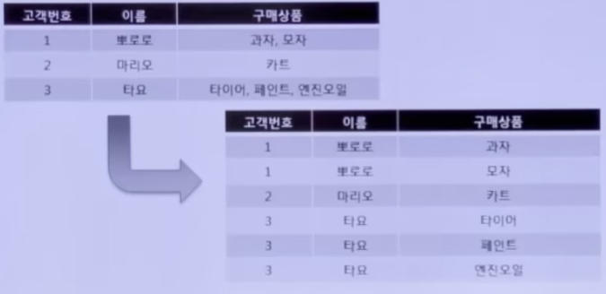
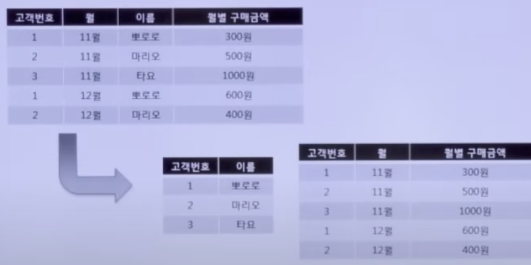
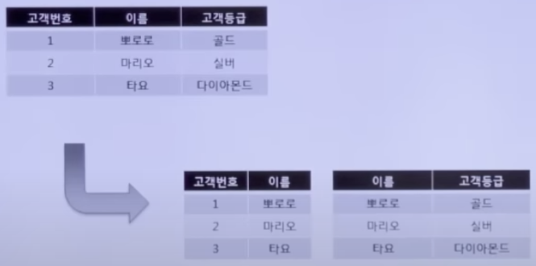

# 1-2 데이터 모델과 성능
## 데이터 모델과 성능의 개요
### 성능 데이터 모델링의 개념
- 분석 및 설계 단계부터 데이터베이스(이하 DB) 성능을 고려한 데이터 모델링을 수행하는 기법
- 데이터 모델을 중심으로 성능에 대한 데이터 모델링을 수행
### 성능 데이터 모델링의 수행 절차
- 데이터 모델링을 할 때 정규화를 정확하게 수행한다.
- DB 용량을 현재와 예상 증가량을 고려하여 조사한다.
- DB에 발생하는 트랜잭션의 유형을 파악한다.
- 용량과 트랜잭션의 유형에 따라 반정규화를 수행한다.
- 이력모델의 조성, PK/FK 조정, 슈퍼타입/서브타입 조정 등을 수행한다.
- 성능관점에서 데이터 모델을 검증한다.
## 정규화와 성능
### 정규화의 개념
- 데이터의 일관성, 최소한의 중복, 최대한의 데이터 유연성을 위한 방법
- 데이터를 분해하는 과정
- 정해진 규칙을 따라 데이터를 이용하기 쉽게 만드는 일
- 데이터의 중복을 제거한다.
- 데이터 모델의 독립성을 확보한다.
- 데이터 이상현상(Abnormality)을 줄이기 위한 설계 기법
- 엔터티를 상세화 하는 과정이며 논리 데이터 모델링 수행 시점에서 고려
### 이상현상 *Abnomality*
| | |
|:--:|:--|
|삽입이상|행(Row) 삽입 시 지정되지 않은 속성 값이 NULL을 가지는 경우|
|갱신이상|데이터 갱신 시 일부분의 데이터만 갱신되어 일관성 유지가 안되는 경우|
|삭제이상|행(Row) 삭제 시 원하지 않는 연쇄 삭제가 발생하는 현상|
- 외울 것 도 없음, 정규화를 제대로 안하면 발생
### 정규화의 단계
| | |
|:--:|:--|
|제1정규화|- 테이블 내 속성의 원자성을 확보하는 단계   - 기본키를 설정|
|제2정규화|기본 키가 2개 이상의 속성으로 이루어진 경우 부분 함수중 종속성을 제거|
|제3정규화|- 기본키를 제외한 컬럼간 종속성을 제거   - 이행 함수 종속성 제거|
|BCNF   (Boyce-Codd Normal Form)|- 기본키를 제외하고 후보키가 있는 경우, 후보키가 기본키를 종속 시키면 분해   - 결정자 함수 종속성을 제거하는 단계   - 강한 제 3정규화|
|제4정규화|여러 컬럼들이 하나의 컬럼을 종속 시키는 경우 분해하여 다중값 종속성을 제거|
|제5정규화|조인에 의한 종속성이 발생되는 경우 분해|
- 1,2정규화 까지 많이 나오고 3가끔 나옴
- 부분함수 종속성&rarr;2정규화, 이행 함수 종속성&rarr;3정규화
### 1 정규화 예제
- 테이블 내 속성의 원자성을 확보하는 단계
- pk를 잡는 것도 1정규화  
 

### 2 정규화 예제
- 기본키가 2개 이상의 속성(복합키)으로 이루어진 경우 부분 함수 종속성을 제거 
 

### 3 정규화 예제
- 기본키를 제외한 컬럼 간 종속성을 제거, 이행 함수 종속성 제거 
 

### 정규화 주의사항
- 모든 정규화는 이전 정규화를 만족해야 한다.
- 정규화시 이상현상은 제거 되지만 테이블의 분해로 데이터 조인의 발생이 많아지고, 이는 조회 성능 저하로 이어질 수 있다. (I/O증가 및 조인 연산 증가)&rarr;성능얘기 나오면 반정규화
- 단일 테이블 조회시엔 데이터 중복이 제거되어 조회 성능이 향상 될 여지가 있다.
## 반정규화와 성능
### 반정규화의 개념
- DB 성능 향상을 위해 데이터 중복을 허용하고 조인을 줄이는 방법
- 시스템의 성능 향상 및 개발 운영의 단순화를 위해 정규화된 데이터 모델을 중복, 통합, 분리하는 데이터 모델링 기법
- 조회속도를 향상 시킬 수 있지만 데이터 모델의 유연성은 낮아진다.
- 비정규화를 수행하지 않음을 의미 하며, 반정규화는 역정규화라고 표현하기도 한다.
- [강의 자료](https://www.youtube.com/watch?v=gmMaH5mMJ9M) 40:29