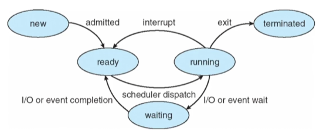
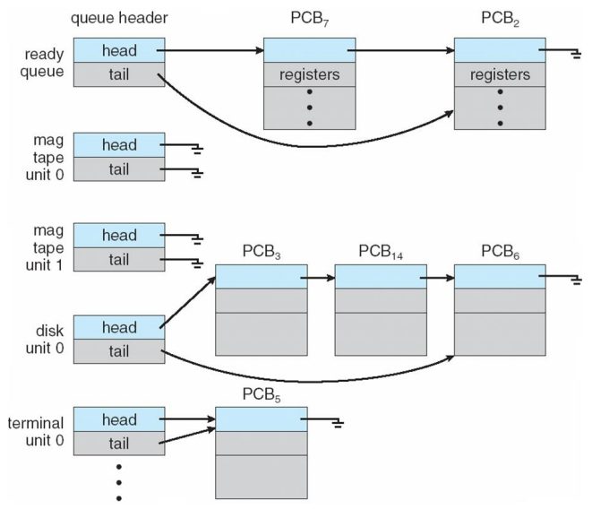
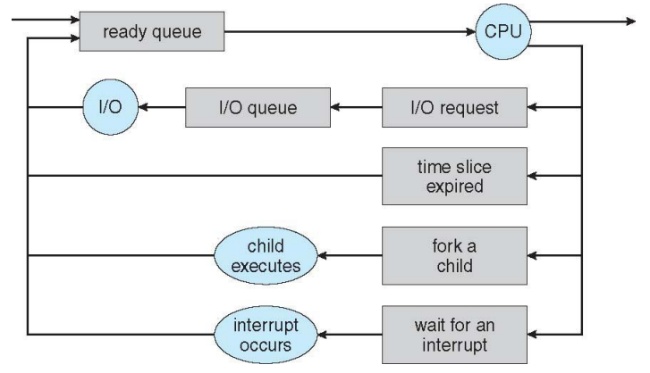

## Process
### 실행중인 프로그램  
$\rarr$ 프로세스는 OS에서 일의 단위  
$\rarr$ 즉, 스토리지에 있는 프로그램을 메모리로 로드한 상태  
$\rarr$ 일을 성취하기 위해 자원들(CPU time, memory, files, I/O devices)이 필요함   

### 프로세스의 메모리 layout  
  

$\rarr$ Text section : executable code(명령어)  
$\rarr$ Data section : global variables(전역변수)  
$\rarr$ Heap section : memory that is dynamically allocated during program run time(ex. Java의 new)  
$\rarr$ Stack section : temporary data storage when invoking functions(함수 실행 시 : function parameters, return addresses, local variables)  

$\rarr$ source code를 컴파일 : 프로그램  
$\rarr$ 프로그램 로드 : 프로세스  

## Process Concept 
### 5개의 state 존재


$\rarr$ New : the process is being created(탄생 상태)  
$\rarr$ Running : Instructions are being executed(CPU 점유하여 로드 상태)  
$\rarr$ Waiting : the process is waiting for some event to occur  
(일의 종료 전 Time sharing으로 인해 대기 such as an I/O completion or receptin of a signal)  
$\rarr$ Ready : the process is waiting to be assigned to a processor(할당 대기 상태)  
$\rarr$ Terminated : the process has finished execution(종료 상태)  

### PCB(Process Control Block) or TCB(Task Control Block)
$\rarr$ 구조체 하나에 프로세스가 가져야 하는 모든 정보 저장  
#### PCB가 가져야하는 정보
$\rarr$ Process state  
$\rarr$ Program counter(다음에 실행될 명령어의 주소를 가지고 있어 실행할 기계어 코드의 위치를 지정)   
$\rarr$ CPU registers  
$\rarr$ CPU-scheduling information  
$\rarr$ Memory-management information  
$\rarr$ Accounting information  
$\rarr$ I/O status information  

### Process
$\rarr$ a program that performs <b>a single thread of execution</b>  
$\rarr$ only one task at a time  
+) multitasking, multiprocessing 차이  
$\rarr$ Mordern operating systems have extended the process concept  
to allow a process to have multiple threads of execution  
and thus to <b>perform more than one task at a time</b>   

### Thread
lightweight process  
$\rarr$ 프로세스를 여러개 하는 것보다 tread를 여러개로 작업하는 것이 장점이 훨씬 많음  
+) (어떤거지?)  

## Process Scheduling
#### multiprogramming의 목적
$\rarr$ to have some process running at all times(is not parallel)  
$\rarr$ so as to maximize CPU utilization
#### Time sharing 목적
$\rarr$ to switch a CPU core among processes so frequently  
$\rarr$ that users can interact with each program while it is running  

### Scheduling Queues


linked lists of PCBs로 구현  
#### ready queue  
As processes enter the system, they are put into a ready queue,  
where they are ready and waiting to execute on a CPU's core
#### wait queue
Processes that are waiting for a certain event to occur  
are placed in a wait queue  
(wait queue가 끝나면 running으로 가는 것이 아닌 ready로 가서 기다린다.)  

### Queueing Diagram


### Context Switch(문맥 교환)
$\rarr$ The context of a process is represented in the PCB  
$\rarr$ Interrupt 발생 시  
실행중인 프로세스의 현재 context 저장(이때, 어디까지 실행되었는지 PC(Program counter) 저장 중요)  
이후, 재할당 되면 저장된 context를 restore  
#### context switch


$\rarr$ switches the CPU core to another process  
$\rarr$ performs a state <b>save</b> of the current process  
$\rarr$ and a state <b>restore</b> of a different process  

## Operations on Processes
운영체제는 process creation, and process termination에 대한 메커니즘 제공  
### Process Create
#### 프로세스는 새로운 프로세스 create 가능  
the creating process: a parent process  
a newly created process: a child process  
+++++++++++++이 밑에 사진 이해 잘 안됨 중요하다 했는데...  


#### Two possibilities for execution
$\rarr$ The parent continues to <b>execute concurrently </b>with its children(부모도 동시에 계속 실행)  
$\rarr$ The parent <b>waits</b> until some or all of its children have terminated(부모는 잠시 wait)

#### Two possibilities of address-space
$\rarr$ The child process is a <b>duplicate</b> of the parent process  
(똑같은 일을 하는 process인 경우 굳이 별도의 영역을 잡지 않고 PCB(PC)만 따로 존재하여 실행 위치만 다르면 됨)  
$\rarr$ The child process has a <b>new program</b> loaded into it

### Process Terminate
$\rarr$ final statement 실행  
$\rarr$ exit() system call: asks OS to delete it(중간 강제 종료)  
$\rarr$ OS deallocates(할당 해제) and reclaims(회수) all the resources(allocated memories, open files, and I/O buffers, etc)  

### Zombie and Orphan
#### zombie process
$\rarr$ a process that has terminated, but whose parent has not yet called wait()
(부모가 죽진 않았지만, wait하지 않음)
#### orphan process
$\rarr$ a process that has a parent process who did not invoke wait() and instead terminated
(wait없이 return으로 종료 시 부모없는 자식 생김)

### UNIX-like O/S
$\rarr$ A new process is created by the <b>fork()</b> system call  
$\rarr$ The child process consists of a <strong>copy of the address space</strong> of the parent process
$\rarr$ 두 프로세스(parent process, child process) 모두 fork() system call 이후 지시에 따라 계속 실행  
$\rarr$ Difference:  
child process : the return code for the fork() is zero  
parent process : the nonzero pid(운영체제가 부여한 pid) of the child  

```c
// P0의 pid가 0802이고, P1의 pid가 1202일때

#include <stdio.h>
#include <unistd.h>
int main()
{
    pid_t pid;
    pid = fork(); // 1. fork 진행:parent(P0)의 메모리 공간 복사
                  // 이때, fork() 된 child process pid 받아서 저장

    printf("Hello, Process!\n", pid);
} // 2. parent는 return 0로 끝남 -> CPU release
// 3. ready queue에 대기 중인 child(P1)의 PC(Program Counter)는 fork 이후에 printf를 가르킴
// 4. child(P1)이 printf("Hello, Process!\n")진행

// 출력 결과
Hello, Process! 1202
Hello, Process! 0
```
 
 ### fork() system call
$\rarr$ After a fork() system call,
parents의 address space 복제하고, parent는 <b>continue its execution</b>  
또는,  
$\rarr$ <b>a wait() system call</b>을 진행하면, child가 끝날때까지 parents가 ready queue에서 wait queue로 이동  

```c
#include <stdio.h>
#include <unistd.h>
#include <wait.h>

int main()
{
    pid_t pid;
    pid = fork();
    if (pid > 0) // 1. parent 들어옴
        wait(NULL); // 2. parent는 wait queue로 이동
    printf("Hello, Process! %d\n", pid); // 3. child가 CPU 점령, if문에 해당하지 않아 바로 출력
    // 4. wait queue에 interrupt 검
    // 5. parent가 CPU 점령하여 출력 진행
}

// 출력 결과 
Hello, Process! 0
Hello, Process! 1202
```

## Exercise
### 3.1
``` c
int value = 5;
int main() 
{
    pid_t pid;
    pid = fork(); // 1. fork하는 시점에 parent와 child 모두 value = 5
                  // 하지만, P0와 P1에 각각 따로 저장

    if (pid == 0) { // 3. child process -> P1의 value = 20 주고, return 0
        value += 15;
        return 0;
    }
    else if (pid > 0) { // 2. parent process -> wait queue
        wait(NULL);
        printf("Parent: value = %d\n", value); // 4. P0의 vaule인 5 출력
    }
}
// 출력 결과
Parent: value = 5
```

### 3.2
```c
#include <stdio.h>
#include <unistd.h>
#include <wait.h>
/** How many processes are created? -> 8개*/
int main() 
{
    fork(); // fork a child process : P0 -> P1
    fork(); // fork another child process : P0, P1 -> P2, P3 
    fork(); // and fork another : P0, P1, P2, P3 -> P4, P5, P6, P7
    return 0;
}
```

### 3.11
```c
#include <stdio.h>
#include <unistd.h>
/** How many processes are created? -> 16개*/
int main() 
{
    int i;
    
    for (i = 0; i < 4; i++)
        fork(); // fork() 4번 진행 -> 2**4 = 16개
    return 0;
}
```

### 3.12
```c
int main() 
{
    pid_t pid;
    pid = fork();

    if (pid == 0) { // child process
        execlp("/bin/ls", "ls", NULL);
        printf ("LINE J\n");
    }
    else if (pid > 0) { // parent process
        wait(NULL);
        printf ("Child Complete\n");
    }

    return 0;
}
```