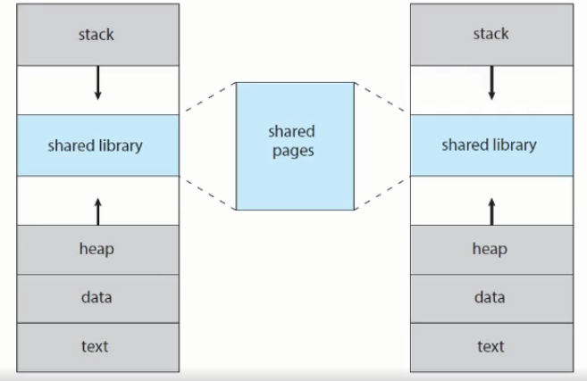
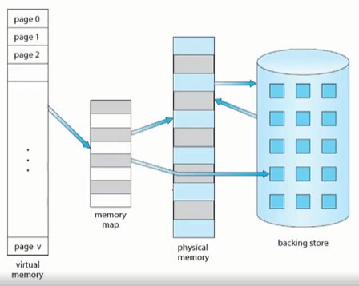
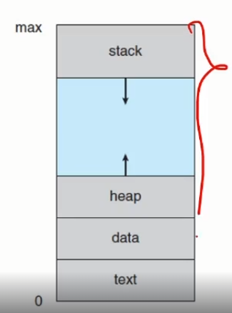
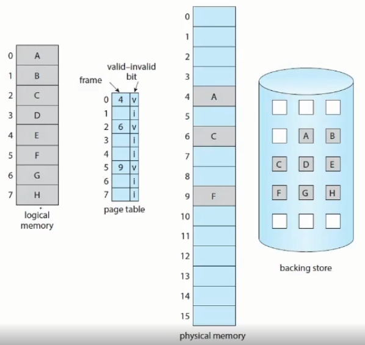
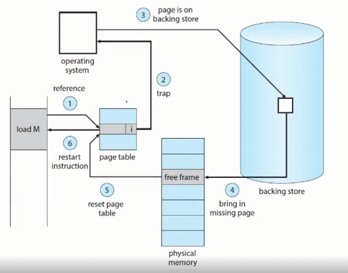
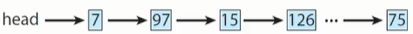
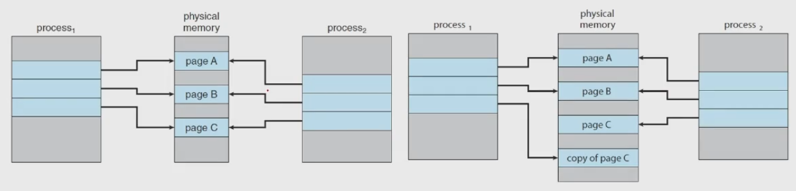

# Chapter10. 가상 메모리와 디맨드 페이징
## Background
### Virtual Memory
- process의 execution을 memory에 다 올리지 않아도 (실제로 physical보다 커도) 실행할 수 있도록 해줌
- 말 그대로 가상의 메모리로 logical과 physical을 완전히 분리할 수 있다.
- 파일, 라이브러리 프로세스를 공유할 때 유용하게 사용 <br>


  - 각 공유하는 process가 shared library의 내용을 shared pages에 저장
  - heap ~ text까지가 접근할 때 문제가 없어짐
  - 뒤에 [demand paging](#demand-paging)까지 배우고 나면 더 잘 이해가 될듯 <br>


### Virtual Address Space
- logical한 process의 memory 구조



- 다음 storage할 때 다시 다룰 거
- contiguous 한 memory를 다룰 때 아주 편리해 질 것

## Demand Paging
### Consider how an executable program
- SSD나 HDD같은 secondary memory에서 loading하는 작업을 먼저 해줘야 함. 
- 한꺼번에 다 loading할 필요없음(현대적인 거에서는 안함)
  - 라즈베리파이나 아두이노 같은 원시적인 거에서는 함.
  - 실제 응용하는 거에서는 다 할 필요가 없음
- 각 memory를 잘라놓은 것들을 언제 올릴거냐
  - 저번에 배운 paging의 개념에서 더 나아가 demand paging이라는 개념이 필요
  - 요청할 때만 올려주자
  - 이렇게 하면 많은 문제가 생김
  - 유용하긴 하지만 고려할게 많아서

### Basic Concepts of the Demand Paging
- 어떤 프로세스가 실행 중 = page가 memory에 있음
- memory에 있음 / secondary memory에 있음
- 표시해 줘야하는데 H/W의 지원이 필요함
  - 저번에 배웠던 valid-invalid bit
  - valid
    - page가 memory에 있음
  - invalid
    - page가 없음
    - page가 secondary memory에 있음
  - dirty bit


- 위 사진에서 logical memory에서 loading했는데 invalid할 때
  - physical memory에 할당이 안되어 있음
  - page fault가 일어남
  - backing store에 있는 것과 swap 해줘야 함.

### The procedure for handling the Page Fault
- memory loading이 안된 page에 access(page fault)했을 때 어떻게 처리해 줄까
1. internal page 확인 후 valid인지 invalid인지 확인
2. valid면 처리해 주면 되고 page fault면 page in 해줘야 함.
3. free frame에다가 H/W 에 있는 page 영역을 page in 해줌
  - free frame list를 OS가 관리해주고 있어야 댐
4. second storage에 가서 page를 읽어서 새로운 frame에 할당해 줌.
5. 이후에 invalid 를 load했다고 처리해줌( valid로 바꿔줌)
6. 다시 instruction을 실행


- 이거 시험에 자주 나옴

### Pure Demand Paging
- 딱 요청할 때만 page를 가져오는 것
- 처음에 하나의 page도 loading할 필요가 없음
- 그때그때 page를 loading해야 하기 때문에 나쁨
  - page를 여러 개 loading할 때 page 하나하나마다 page fault가 일어나서
  - 시간이 3분의 1...?
  - 3배를 잘못 말한게 아닌가

### Locality of Reference
참조 국부성 = 참조 지역성
- 1개의 페이지를 실행하기 위해서 나머지 페이지에서 page fault가 일어남
- 하지만 running중인 process에서 이런일은 거의 없음
- Locality of Reference memory access 측면에서 봤을때는 국부성이 있음
- reasonable한 performance를 낼 수 있음
- 예제를 보면 이해가 쉬움

### An example of Program Structure
```c
int i, j;
int[128][128] data;
for (j=0; j<128; j++) {
    for (i=0; i<128; i++) {
        data[i][j] = 0;
    }
}
```
```c
int i, j;
int[128][128] data;
for (i=0; i<128; i++) {
    for (j=0; j<128; j++) {
        data[i][j] = 0;
    }
}
```
- 페이지 여러 번 접근하는 걸로 인한 문제가 안생김
  - 실제로 재현하기 힘듬
  - 아두이노, 라즈베리파이는 가능할지도
- 굉장히 중요한 개념인건 맞음
  - 코드 전체가 실행되는게 아닌 코드의 일부분만 반복적으로 실행

### H/W Support to Demand Paging
- Page table
    - page in / page out 상태를 알아야함
    - 그걸 위해 valid invalid 등을 사용
- Secondary memory(=swap space)
  - SSD, HDD

### Instruction Restart
- page fault가 일어났을 때 trap이 걸림
- process별로 page table을 잘 관리해줘야 함
- instruction이 다시 패치해서 restart 시키거나 operand를 패치할 때 발생
  - instruction을 가지고 와서 operand를 다시 패치

- 이거 무슨 얘기하는건지 모르겠네

### As a worst-case example
- ADD A, B, C; three address instruction, adding A and B into C. 
- 어셈블리 명령어 중 하나
    1. Fetch and decode the instruction(ADD)
      - register ALU가 더해서 fetch
    2. Fetch A
    3. Fetch B
    4. ADD A and B
    5. Store the sum in C

### Free Frame List
- free frames의 pool이다 = linked list다
- free frame들은 반드시 어떤 스택이나 keep segment를 가지고 관리해줘야 함 <br>


### Performance of Demand Paging
- demand paging에 영향을 미치는 요소들을 보려면 effective access time을 계산해주면 됨

- EAT = (1 - p) x ma + p * (page fault time) 
  - page fault time을 곱해주는데 TLB 같이 2배가 아니라 수백배, 수만배가 됨
  - context switch가 일어나고 wait queue에서 기다리다가 swap하고 하드디스크에서 access해서 page in 한 다음에 trap 해가지고 다시 되돌아오니까
- 그러면 이 시간이 걸리는 이유가 뭘까?
  - 한 16가지 있는데 그 중에서 중요한 3가지만 보자면
    1. Service the page-fault interrupt
      - page fault 때문에 trap 걸어주는 시간
    2. Read in the page
      - page를 읽어들이는 시간
      - 여기서 대부분의 시간이 걸리고 나머지는 다 미미함
    3. Restart the process
      - process를 재시작하는 시간

### Consider a system
- Average page port service time을 대충 그려서 8ms(8백만 ns)
- memory access time은 200ns
- EAT = (1 - p) x 200 + p x 8,000,000 <br>
  = 200 + 7,999,800 x p
- 만약 p가 0.001이라면
  - 1000번 access할 때 1000번에 한 번 page fault가 일어난다면
  - EAT = 200 + 7999.8 = 8199.8 nanoseconds != 8.2 microseconds

## Copy-on-Write
### Copy-on-Write
- write 할 때 copy를 하자
  - shared page를 굳이 나눌 필요가 없다
  - write만 안하고 read만 하면 어차피 똑같아서 
  - write를 하면 그 때 copy를 하자 <br>


- process 1(virtual) &rarr; physical memory &rarr; process(logical)
  - fork한 다음에 exe하는 구조
  - value = "O", value += "O"
  - 이럴 때 copy on write를 한다.

# Chapter 10-2. 페이지 교체 알고리즘
## Page Replacement
### What happens if there is no free frames?
- 우리가 page out을 하고 page in 을 하려할 때 free frame이 없다면?
  - 하나의 메모리에 동시에 load되는 process의 숫자를 늘려나가면 메모리에 over-allocating이 발생
  - physical memory를 전부 다 사용하는 경우가 발생
- 예를 들어 40개의 frame이 있는 memory가 있을 때
  - 6개의 process가 돌고 있다면