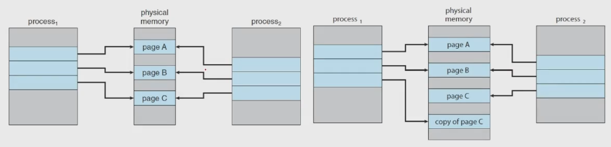

# 가상 메모리와 디맨드 페이징
## Background
### _Virtual Memory
- a technique to allow the execution of processes
    - that are not completely in memory
    - so, programs can be larger than physical memory
- abstracts main memory into an extremely large array of storage
    - separating logical memory from physical memory
- provides an efficient mechanism
    - for sharing files and libraries and process creation<br>
<br>

- 그때 그때 필요할 때 마다 매핑해서 실행
### _Virtual Address Space_
- the logical(or virtual) view of how a process is stored in memory
- Typically, begins a certain logical address, to say, address 0,
- and exists in contiguous memory
### Virtual Memory
- allows _files_ and _memory_ to be shared by two or more processes
    - through _page sharing_<br>
<br>

## Demand Paging
### Consider how an executable program
- might be loaded from secondary storage into memory
    - ssd or hdd 로부터 로딩
- One option is to load the entire program in physical memory
    - 요즘엔 안함, 아두이노 같은건 아직 함 교육용이니까
- The _demand paging_ is an alternative strategy
    - to load pages only as they are needed
    - commonly used in virtual memory systems
- With _demand-paged virtual memory_,
    - pages are loaded only when they are _demanded_ during execution

### Basic Concepts of **the Demand Paging**
- While a process is executing
    - some pages will be _in memory_ and some will be _in secondary storage_
- To _distinguish_ between two situations
    - the _valid-invalid bit_ scheme can be used
    - _valid_ : the page is both legal and in memory
    - _invalid_ : the either is not valid or currently in secondary storage
    - dirty bit : 위 두개를 구분<br>
<br>

- invalid 비트를 가지고 나중에 실제로 로딩되어있는지 판단, 안되어있으면 swapping

### The procedure for handling the _Page Fault_
1. _Check an internal table_ for the process to determine
    - whether the reference was _valid_ or _invalid_ memory access
2. If the reference was valid, terminate the process
    - or valid but page fault, we now _page_ it _in_
3. Find a _free frame_(by taking one from the free-frame list)
4. Schedule a secondary storage operation
    - to _read the desired page_ into the newly allocated frame
5. When the storage read is complete, _modify the internal table and_
    - _the page table_ to indicate that the page is now in memory
6. _Restart the insturction_ that was interrupted by the trap<br>
<br>

### _Pure_ Demand Paging
- _never bring a page_ into memory _until it is required_
- With the scheme of pure demanding paging
    - we can start executing a process with _no pages_ in memory
- 진짜 백지로 만들고, 필요할 때 마다 꺼내와서 사용하는 것.
- When the OS sets the instruction pointer
    - to the _first instruction_ of the process with a _page fault_
    - the page of the process would be paged in
### _Locality of Reference_ 참조 국부성
- If a program accesses _several new pages_ with _each insturction_
    - to say, _one page_ for the _instruction_ and _many pages for data_
    - possibly causes _multiple page faults per instruction_
- Fortunately, analysis running processes
    - show that this behavior is exceedingly unlikely
- Programs tend to have _the locality of reference_,
    - which results in _reasonable performance_ from _demand paging_
### An e.g. of Program Structure
- Let the _page size_ to be 128 and an _array_ to be $128$ x $128$
    - then compare the following tow codes
    ```c
    int i, j;
    int[128][128] data;
    for (j=0; j<128; j++) {
        for (i=0; i<128; i++) {
            data[i][j] = 0;
        }
    } // 계속 페이지 fault 남
    ```
    ```c
    int i, j;
    int[128][128] data;
    for (i=0; i<128; i++) {
        for (j=0; j<128; j++) {
            data[i][j] = 0;
        }
    } // 이미 기로딩 되어있는 페이지를 사용하기 때문에 위 코드보다 이론적으로 뛰어남
    // 1번이라는데 아마 128번일거고 위에는 이거에 제곱일듯 아님말고
    ```
- Careful selection of data structures and programming structures
    - can increase _the locality of code or data_
    - hence, _lower the page-fault_ rate and _enhance the system performance_
    - 특정한 부분만 엑섹스를 계속 함, 공평하게 엑세스 하는게 아님
### Hw Support to Demand Paging
- _Page talbe_ :
    - has the ability to mark valid or invalid. (with a valid-invalid bit)
- _Secondary memory_(=_swap space_) :
    - holds thoses pages that are not present in main memory
    - usually a high-speed disk or NVM device
    - 운영체제에서 속도가 느려지면 swap space를 늘려라 라는데,,
    - swap in-out 하는 영역을 늘려라
    - 그래서 ssd 쓰면 빠른거였누, swap이 빨라지니까 lane swap
### Insturction Restart
- A crucial requirement for demand paging
    - the ability to restart any instruction after page fault
- When the page fault occurs,
    - the state of interrupted process (registers, condition code, instruction counter, etc.) is saved
    - 또 또 waiting queue 너야
    - 문 맥 교 환
- Therefore, _restart_ the process in _exactly the same place and state_
    - 프로세스 별로 페이지 테이블을 잘 관리 해야함
- If a _page fault_ occurs _on the instruction fetch_,
    - restart by fetching the insturction again
- If a _page fault_ occurs while we are _fetching an operand_,
    - fetch and decode the instruction again and then fetch the operand
### As a worst-case ex
- ADD A, B, C; three address insturction, adding A and B into C. 어셈블리어 명령어임
    1. Fetch and decode the instruction(ADD)
    2. Fetch A
    3. Fetch B
    4. ADD A and B
    5. Store the sum in C
    - 어디서 아웃 되든 첨부터
### Free Frame List
- Whem a page fault occurs
    - OS must bring the desired page from secondary storage into memory
- To resolve page faults, OS maintains the _free frame list_:
    - a pool of free frames for satisfying such requests
- Free frames must also be allocated
    - when the stack or heap segments from a process expand<br>
<br>

### Performance of Demand Paging
- How to compute the _effective access time_ for a _demand-paged_ memory?
- Let _ma_ to denote the _memory-access time_
- Let _p_ be the _probability_ of a _page fault_
    - EAT = $(1-p)$ x $ma + p * (page-fault-time) $
- How much time is needed to service a page fault?
    - three major activities
    - Service the page-fault interrupt
    - Read in the page 얘가 젤 큼
    - Restart the process
### Consider a system
- with an average page-fault service time of _8 milliseconds_
    - and a memory access time of _200 nanoseconds_,
    - EAT = $(1-p)$ x $200 + p * 8,000,000 $<br>
          = $200 + 7,999,800$ x $p$
    - If one access out of 1,000 causes a page fault $(p = 0.001)$,
        - EAT = $200 + 7999.8 = 8199.8$ *nanoseconds* $\simeq 8.2$ *microseconds*

## Copy-on-Write
### Copy-on-Write:
- _copy_ a shared page _only when_ a process _writes_ to a shared page
- Recall the process creation with **fork()** and **exec()**<br>
<br>

# 페이지교체 알고리즘
## Page Replacement
### What happens if there is _no free frames_?
- If we increase our degree of multiprogramming,
    - we are over-allocating memory
    - 피지컬 메모리를 다 사용하는 경우 발생
- If we have 40 frames and run 6 processes,
    - each of which is _10 pages_ in size, but actually uses only _5 pages_
    - Then, we manage to deamnd-page system with 10 frames spared
    - frame == page
- However, what if the processes _suddenly want to use all 10 pages_
    - or need a huge buffer _consuming more pages than available ones?<br>
<br>
<br>
<br>

### Page Replcement
- If no frame is free
    - find one that is not currently being used and free it
- Free a frame by writing its contents to swap space
    - and changing the page table
    - to indicate that the page is no longer in memory (invalid or dirty)
- Now, use the freed frame to hold page
    - for which the process faulted
<br>
<br>
<br>

### Page Fault Service Routine incl. Page Replacement
1. Find the location of the desired page on secondary storage
2. Find _a free frame_:
    - If there is a free frame, use it
    - If ther is _no free frame_, use a _page-replacement algorithm_ to select a _victim frame_
    - Write the victim frame to secondary storage; chage the page and frame tables accordingly
- Read the desired page into the _newly freed frame_
    - change the page and frame tables
- Continue the process from where the _page fault occured_

### Two major prbs. impl demand paging
- _Frame-allocation algo._
    - how many frames to allocated to each process?
- _Page-replacement algo._
    - select the frames that are to be replaced
- Since the secondary storage I/O is _so expensive_
    - enev _slight improvements_ in demand-paging methods
    - can yield _large gains_ in system performance
### Evaluation of Page Replacement Algo.
- _reference string_ : a string of memory references
- Evaluate an algo. by running it on a reference string
    - and computes _the number of page faults_ (minimize it!)
- What about the number of page frames?
    - Obviously, the more frames, the less page faults<br>
<br>

### FIFO Page Replacement
- FIFO : First-In-First-Out: the Simplest algo.
- Choose _the oldest page_ when a page must be replaced
- There are _15page faults_ with our ex.<br>
<br>

### _Belady's Anomaly_
- The page-fault rate _may increase_
    - as _the number of allocated frames increases_<br>
<br>

- 중간에 늘어나는게 포인트

### _Optimal_ Page Replacement
- Seeking for an _optimal_ algo. that has the _lowest page-fault rate_,
    - and _never suffers from_ Belady's Anomaly
- OPT or MIN
    - replace the page that _will not be used_ for the _longest period of time_
- OPT will guarantee the lowest possible page-fault rate
    - 가장 쓸일이 없을거같은거 버리기
### The difficulty of impl. OPT:
- There are _9 page faults_ with our e.g.
- OPT requires _future knowledge_ of the reference string
    - used mainly for comparison studies
    - 미래를 알아야함, 자랑용 ㅋㅋ<br>
<br>

### Recall the Shortest-Job-First CPU scheduler
- The key distinction between the FIFO and the OPT:
    - _looking backward_: when a page was _brought in_?
    - _looking forward_ : when a page to _be used_?
- If we use the _recent past_
    - as an _approximation_ of the _near future_,
- then we can replace the page
    - that has _not been used_ for the _longest period of time_
### _LRU_ Page Replacement
- LRU: Least Recently Used
- Associates with each page _the time of that page's last use_, and
    - choose the page that has _not been used_ for the _longest period_ of time
    - There are _12 page faults_ with our e.g.<br>
<br>

### LRU policy
- is considered to be _good_ and is _often used_
- However, the prob. to solve for the impl. of LRU is
    - to determine an order for the frames defined by the time of last use?
- It may require substantial _hardware assistance_
    - Two impl. are possible: _counter_ and _stack_
- LRU _does not suffer_ from Belady's anomaly like OPT
### Two impl. methods for the LRU
- _Counter_ impl.
    - Whenever a page is referenced, copy the counter(or the clock)
    - Replace the page with the smallest value<br>
<br>

- Stack impl.
    - Keep a stack of page numbers
    - Note that entries must be removed from the middle of the stack
    - 스택아닌데 스택임

### LRU-Approximation
- LRU needs hardware support,
    - however, many systems provide some help with a _reference bit_
- _reference bit_
    - initially 0, a bit associated with each page
    - when a page is referenced, set to 1
    - replace any with reference bit = 0 (if any )
### Second-Chance Algo.
- Use a FIFO replacement algo.
- However, inspect reference bit, when a page has been selected
    - If the value is 0, proceed to replace it
    - If the value is 1, give the page a second chance and move on to select the next FIFO page
- When a page gets a second chance,
    - its reference bit is cleared,
    - and its arrival time is reset to the current time<br>
<br>

- FIFO로 하다가 Reference bit 를 이용해서 second chance를 준다

## Allocation of Frames
### The Issues for Frame Allocation
- Consider a simple case of system with 128 frames
    - OS may take 35, leaving _93 frames_ for the user process
- Using the _pure-demand-paging_
    - 93 frames would be put on the _free-frame_ list
- The first 93 page faults would get free frames
    - $94^th$ _page faults_ would cause a _page replacement_
- Then, if we have _two processes_,
    - how do we _allocate 93 frames_ to these _two processes_?
### The strategies for frame allocation
- Equal .vs. Proportional:
    - _equal allocation_: give every process an equal share
    - _proporional allocation_: allocate according to the size of process
- Global .vs. Local
    - _local replacement_ : select from _only its own_ set of allocated frames
    - _global replacement_ : selects a replacement frame from the set of all the frames in the system
- 해결책은 책을봐라 별로 안중요함 ㅋㅋ. 개념이나 보셈

## Thrashing
### Thrashing
- a situation that a process is busy swapping pages in and out
    - page in and out 하느라 바빠서 일을 몬함
- if a process does _not_ have _enough pages_,
    - the page-fault rate is very high
- 쓰레쉬 ㄷㄷ <br>
<br>

### Working-Set Model
- based on the assumption of _locality_
- define the _working-set window_ with a parameter $\Delta$
- The idea is to examine the most recent $\Delta$ page references
    - _working-set_: the set of pages in the most recent $\Delta$ page references
- If a page is in active use,
    - it will be in the working set
- If it is no longer being used,
    - it will drop from the working set time units after its last reference<br>
<br>
