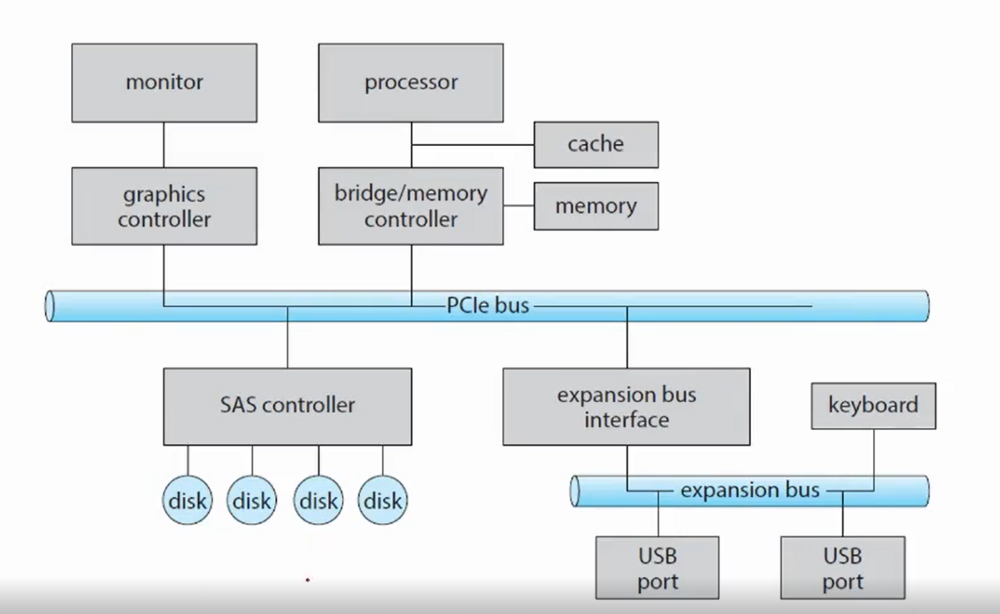

# Chapter11~15. 스토리지와 입출력 (Storage Management)
## Mass-Storage Structure
### Mass-Storage
- 비휘발성 메모리 / 세컨더리 메모리 시스템
- 일반적으로 HDD, NVM 등을 얘기함
- 백업용으로 마그네틱 테잎을 쓰는곳도 많고 광학 디스크를 쓰는데도 있고 클라우드 스토리지를 이용하는 곳도 있음
- 2차 저장 장치에는 RAID system이라는 걸 적용함

#### RAID system (Redundant Array of Independent/Inexpensive Disk )
- 독립된/ 저렴한 디스크의 복수 배열
  - 디스크 어레이(disk array)라고도 한다
  - 여러 개의 디스크를 묶어 하나의 디스크 처럼 사용하는 기술
- 기대 효과
  - 대용량의 단일 볼륨을 사용하는 효과
  - 디스크 I/O 병렬화로 인한 성능 향상 (RAID 0, RAID 5, RAID 6 등)
  - 데이터 복제로 인한 안정성 향상 (RAID 1 등)
- RAID Level
  - RAID 0 ~ RAID 6 까지 존재
  - 최근 출시되는 RAID 컨트롤러에서 사용 가능 한 RAID Level은 RAID 0, RAID 1, RAID 5, RAID 6 까지임
  - 자세한 RAID Level 설명은 [여기](https://devocean.sk.com/blog/techBoardDetail.do?ID=163608)에서 참고

### Hard Disk Drives

- 하드디스크를 뜯어본 모습
- spindle이 돌아가는 rotation값인 RPM에 따라 성능 차이 구분
- 대충 HDD 설명하는 내용...

### HDD Scheduling
- scheduling의 목표
  - access time / seek time 줄이기
  - 데이터 전송의 bandwidth를 최소화 하기

#### seek time
- 이걸 줄이는 게 가장 큰 목표
- device arm이 head를 움직이는데 특정 cylinder의 특정 sector를 찾아가는데 걸리는 시간
  - rotational latency (읽고자 하는 sector에 가는 시간)가 데이터를 읽고 쓸 때 시간이 많이 걸림
#### disk bandwidth
- 한 번에 transfer 할수 있는 용량 $\div$ 전체 시간
  - sector가 크면 용량이 커짐
  - bandwidth를 늘려줘야 함

### FIFO Scheduling

- 맨날하니까 깊이 설명 안함
- 당연하게도 최적은 아님
- cylinder를 찾기 위해서 head movement가 일어나야 하는가
  - 그림에서는 총 길이 640 cylinder가 나옴

### SCAN Scheduling
- 비효율적으로 왔다갔다 하지말고 그냥 scan을 해버리면 되지 않는가
  - disk arm이 한 쪽 end에서부터 다른쪽 end로 계속 움직이면서 scan
  - 움직이면서 request들을 처리주면 주면 되지 않는가
  - 현재 들어온 request들을 쭉 처리해 주면서 왔다갔다 하자
- scan이 일어나는 방향이 중요함
  
  - 만약 그림에서 head가 0을 향한다면 그림과 같이 움직이면 queue값을 다 처리 가능함
  - 다 처리했을 때 cylinder 길이는 236이 나옴
  - 근데 생각해봤을 때 양쪽 왔다갔다 만드는거 보다는 한 방향으로 쭉 가는게 만들기 쉬움
  - 그래서 C-SCAN이라는 걸 도입

### C-SCAN(Circular-SCAN) Scheduling
- scan을 할 때 좀 더 uniform한 wait time을 주자 (= 한 방향으로만 헤드를 움직이자)
- 한 방향으로 갈 때 scan을 하고 돌아올때는 scan 하지말고 그냥 오자
  - 장치를 오래 쓸 수 있다는 장점도 생김
- 이렇게 하면 일종의 circular list가 됨

- 어디서 시작하든 한 쪽 방향으로 쭉 scan
- 끝에가면 0으로 확 돌아와버리기
- 총 183 cylinder가 나옴 (0으로 갈때는 무시)
  - 굉장히 효율적
- Loop, C-Loop라는 것도 있는데 안중요하니까 빼겠죠?

### Boot Block

- mass storage를 쓸 때 고려해줘야 하는 사항
- 얘를 다시 다루는 이유
  - flash memory인 ROM에 저장해줘야 함
    - 처음 컴퓨터를 실행시킬 때 initial program인 bootstrapping
    - 운영체제 kernal을 load해줌
    - 그러고 운영체제한테 제어권을 넘겨줌
- 얘도 storage, second storage의 일종이다.

### RAID
- 위에 정리해놨는데 여기서 나오네; 근데 뒤에서 또 나온다네
- 데이터의 저장과 읽기, 쓰기 bandwidth를 늘려줘야 하는데 이걸 parallel하게 할 수 있음
- 만약 하드디스크가 물리적으로 고장이 났을 때 복원을 어떻게 해야할까
  - redundant한 information을 추가
    - 데이터가 깨지는 것 방지
    - recovery(복구)할 수 있도록 만들기
    - hard disk failure에도 loss data가 없도록 하고 싶음

### Redundancy
- data의 Reliability를 Redundancy로 올리는 방법
- 1개의 디스크가 있을 때
  - bad sector가 거의 나지 않음
- N개의 디스크가 있을 때
  - 오류가 발생할 확률이 훨씬 더 높아짐
- MTBF(mean time between failures) 
  - 예를 들어 MTBF 가 100000 hours이고
  - 디스크가 100개다 하면 1000시간에 1번씩 에러가 남
  - data center는 하드 디스크가 훨씬 많아서 더 심각해짐
  - 그래서 중요한 정보를 저장하기 곤란함
- 어떤 redundant 한 정보를 주더라도 reliability를 보장해야함
  - 가장 쉬운 방법은 모든 디스크 내용을 복제해 놓기

### Parallelism
- performance를 올리는 방법
- striping
  - 여러 개의 드라이브가 있다면 전송률을 올리는데 사용할 수 있음
  - bandwidth를 striping하면 훨씬 더 빠르게 데이터를 읽고 쓸 수 있음
- bit-level striping
  - striping을 bit level로 보낸다
  - bit가 8개 있으면 byte로 striping할 수도 있음
- block-level striping
  - bit가 8개 있으면 i bit를 i번째 드라이브에 쓰면 됨
  - 아예 block level striping으로 parallel하게 처리

### RAID Levels
- mirroring
  - data를 redundant하게 copy
  - highly reliable하게 복사하는 대신 너무 비쌈
- striping
  - 개수가 있는 만큼 bandwidth를 늘릴 수 있음
  - reliable과는 아무 관계가 없음
- parity bit
  - data 통신을 하면 배우게 됨
  - 이진수로 표현한거 + 홀수인지 짝수인지 추가로 보낸다는 거 같음
  - 1111 이면 홀수니까 1을 더 붙여서 11111 이렇게
  - 이걸 조금 더 확장 &rarr; checksum &rarr; CRC(cyclic redundancy check) 순환 중복 검사
- 이런 것들을 이용해서 에러가 발생했는지 발생했다면 복구할 수 있는지를 가지고 RAID Level로 나눠보자

- 이건 위에 내용 참고하자 [RAID_system](#raid-system-redundant-array-of-independentinexpensive-disk)

## I/O Systems
### Two main jobs of a computer: I/O and computing
- 컴퓨터가 하는 일 대부분 I/O
  - 요즘엔 UI/UX 중에서도 UX가 더 중요한 시기가 됐음
  - 사실 우리가 컴퓨터 하는 대부분의 일이 컴퓨터 입장에서는 가끔 입력을 주는거임
  - game같은 것도 무거운건 Gpu에서 처리하고 대부분 IO가 함
- 우리가 할 일은 IO를 컨트롤
  - IO 디바이스를 관리하는 게 OS의 할일
  - 우리는 kernal을 건드리는 일은 없고 대부분 IO device driver를 만들어 줌
  - 근데 강의에선 안 다루지만 이론은 알아야 한대요

- 모든 PC architecture의 중심에는 bus가 있음
- bus에는 controller가 하나씩 달려있음
- IO device controller를 가지고 PCI bus를 통해 CPU가 각 device에게 명령을 내림
  - 그걸 OS가 다 관장해줌

### Memory-Mapped I/O
- input/output을 하려면 어떤 device에 cpu가 명령을 전달할 것인가
- 수형이는 해봤겠다 라네요

- data-in register
- data-out register
- status register
- control register

- IO address에 어떤 instruct controller가 달려 있는지 memory에 mapping
  - 우리는 memory에 IO 명령을 줌
  - 이 메모리 명령을 통해 우리가 control register의 역할을 할 수 있음

### Three types of I/O
- 이거는 좀 중요
1. polling
  - [busy waiting](../../operatingSystem/필기%20정리/[OS]Ch_6-2_Synchronization%20Tools.md#busy-waiting--바쁜대기)이라고 이미 배움
  - register 정보에 데이터를 받을 때 busy loop를 돌면서 busy waiting을 함
  - 이걸 polling 방식의 I/O라고 함
  - status register, state register를 반복해서 bit가 clear 될 때 까지 읽자
  - bit가 clear 되면 data를 받아옴 
2. interrupt
  - 우리가 아는 그 interrupt
  - interrupt 종류를 쭉 선언
    - interrupt vector table에다가 모아놓음
  - interrupt를 처리해주는 interrupt service routine(ISR)한테 제어권을 넘겨줌
  - H/W 라면 H/W 한테 주면 되고 S/W 라면 function을 만들어서 처리
3. DMA
  - Direct Memory Access
  - Add, load, store하고 move하지 않고 그냥 H/W bus타고 바로 가버리는거
- 1,2 번이 대표적인 I/O의 방식, 너무 대용량이면 3번

### Blocking I/O vs Non-blocking I/O
- Blocking I/O
  - Thread가 suspend 되야함
  - running queue에서 waiting queue로 감(blocking 당해서)
- Non-blocking I/O
  - execution을 정지시키지 않음
  - waiting queue에서 기다리지 않는다
- Asynchronous system call
  - 계속 실행해 나감

### The diff. between non-blocking and asynchronous system call
- non-blocking
  - 즉시 return
  - 그냥 데이터 체크를 안함 + 상관없다
- asynchronous system call
  - transfer 요청만하고 할 일 하러감

## File-System Interface
### File System
- logical 하게 storage에다가 data를 쓰는 방법
- O/S가 직접해주는 H/W 부분 말고 어디에 어떻게 데이터를 저장하고 읽고 쓰고 하고 싶은거
- 2가지 파트가 있음
  1. file/folder
  2. directory

### Access Methods
1. sequential access
2. direct access

### Directory Structure
-  파일들을 관리해 줄 수 있음
- 역사적으로 directory 종류 있었는데 그림으로 보시죠

 

- 왼쪽이 사이클 없는거 오른쪽이 있는거

## File-System Implementation
### The file system itself

- file system도 여러 개의 단위로 나뉘어짐

### Allocation Method
- 파일 system에 어떻게 location 할거냐
- page paging할 때마냥
- 효율적이고 빠르게

- Contiguous Allocation
- Linked Allocation
- Indexed Allocation

### Contiguous Allocation

- 파일을 연속적으로 통째로 올리기
- 이렇게 해놓으면 알고리즘 중에 FIFO SCAN 뭘 써도 효율적이다
- 대신 읽었다가 지웠다가 하느라 external fragmentation이 발생
  - compaction 해줘야 함

### Linked Allocation

- contiguous의 문제들을 linked list로 만들어서 블록 단위로 쪼개자
  - page할때랑 거의 동일함
- sequential 하면 상관 없는데 만약 찾고자 하는게 뒤쪽에 있으면 한번에 못감
  - 처음부터 일일이 거쳐가야 해서 오래걸리고 비효율적
  - 그래서 FAT라는 걸 사용

#### FAT
- 묘하게 기분이 나쁜 이 단어
- File Allocation Table
  - 어떤 volume에다가 linked list의 index를 넣어보자

### Indexed Allocation
- zip 파일 마냥 한 block에 값을 전부 참조함
  - 그래서 한 block을 열었을 때 다른 block을 다 열어버림
- linked list의 단점인 pointer들이 scatter 되어있다는 점을 극복
  - 모든 pointer를 block에 담아놨기 때문에

### Free-space management

- 사용한 sector들을 제외하고 안쓴 list를 가지고 있어야 할당해서 쓸 수 있다.