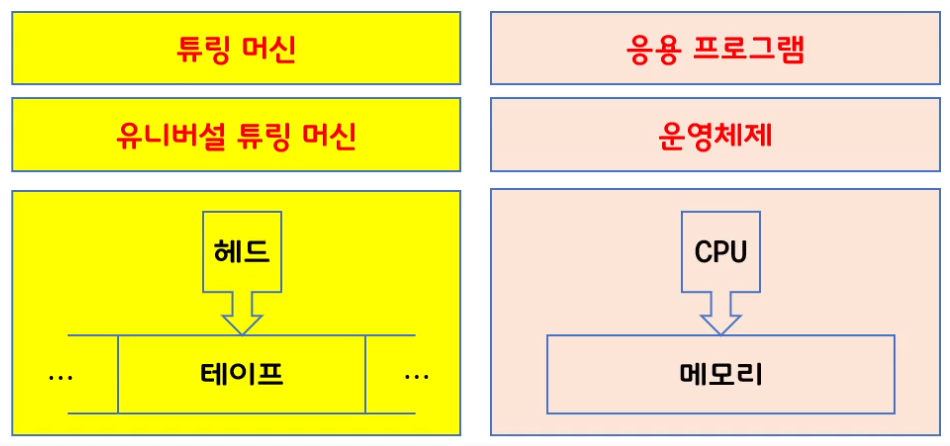
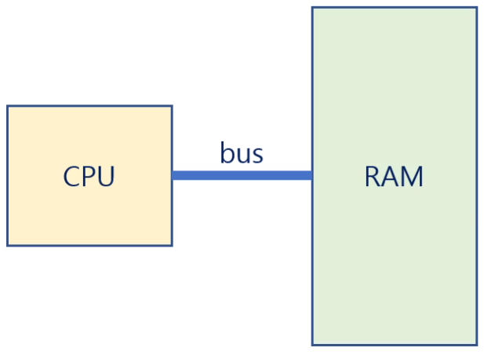

# 운영체제

## Chapter 1

### 운영체제(Operating System)란?
-a software that operates a computer system  
-컴퓨터 시스템을 운영하는 소프트웨어 

**-운영체제의 역할**
1. H/W 디바이스 제어
2. 운영체제를 통해 App들을 이용할 수 있도록 인터페이스를 저장
3. 유저가 OS를 통해 저장된 인터페이스를 사용할 때 I/O 관리 
&rarr;  H/W, S/W, USER 간의 중간 매개 역할을 함

**-운영체제도 프로그램?**
- 그렇다. OS는 컴퓨터에서 항상 실행되는 **프로그램**이다.
- 시스템 서비스를 애플리케이션에게 지정해줌
- **프로세스**(굉장히 중요!!), 리소스, UI, 를 관리하는 역할


### 컴퓨터란?
-a machine that processes the *information*  
-정보를 처리하는 기계    
- 스마트폰은 컴퓨터인가? -> O
- 계산기는 컴퓨터인가? -> X
&rarr;컴퓨터는 "정보"를 처리하는 기계이다. 

### 정보란?
-quantitative representation that measures the uncertainty  
-불확실성을 측정하여 수치적으로 표현한 것
$$\ I(x) = - log_2 P(x)$$
&rarr; I : 정보량, P : 확률   

**-정보 처리 방법**
  - 정보의 최소 단위 : bit(**b**inary dig**it**)
  - 8 bit = 2^8 &rarr;정보의 량이 8bit라면 이것은 1byte 이기도 하다.
  - 정보의 처리 : 정보의 상태 변환 (0에서 1로, 1에서 0으로)
    - Boolean Algebra(부울대수) : NOT, AND, OR
    - 논리 게이트 : NOT, AND, AND, OR, XOR, NAND, NOR
    - 트랜지스터를 이용하여 게이트(스위치) 만들 수 있음
    - 논리 회로 : IC, LSI, VSI, ULSI, SoC, 등
      - 무어의 법칙(chip의 집적도), 황의 법칙(메모리의 집적도)  
      - H/W의 경우 한계까지 발전해 왔음

    - 정보의 저장과 전송 : 플립 - 플롭, 데이터 버스, Radio Frequency

**-컴퓨터가 정보를 처리하는 법**
  - 덧셈 : 반가산기, 전가산기
  - 뺄셈 : 2의 보수 표현법
  - 곱셈과 나눗셈 : 덧셈과 뺄셈의 반복
  - 실수 연산 : 부동 소수점 표현법
  - 함수 : GOTO
  - 삼각함수, 미분, 적분, 사진촬영 동영상 재생 등 가능

**-컴퓨터가 만능?**
  - 범용성(universality)
      - NOT, AND, OR게이트만으로 모든 계산을 할 수 있다.
      - NAND 게이트만으로 모든 계산 가능
      - 범용 컴퓨터 : general-purpose computer
  - 계산 가능성(computability)
      - Turing-computable : 튜링 머신으로 계산 가능한 것
      - 정지문제(Halting Problem) : 튜링 머신으로 계산 불가한 것

#### 컴퓨터가 만능?
- 범용성 : universality
    - NOT, AND, OR 게이트만으로 모든 계산을 할 수 있다.
    - NAND 게이트만으로 모든 계산을 할 수 있다.
    - 범용 컴퓨터 : general-purpose computer

- 계산가능성 : computability
    - Turing-computable : 튜링 머신으로 계산가능한 것
    - 정지 문제 (Halting Problem): 튜링 머신으로 풀 수 없는 문제

### 컴퓨터를 만든 사람?

#### 앨런 튜링(Alan Turing) - 컴퓨터의 할아버지

    - Turing Machine(1936)
    - Turing Machine : 주니온TV <TMItalk: 튜링 머신의 이해> 참조   

|Turing Machine|Current usage in computer|
|------|---|
|Head|CPU|
|Tape|Memory(RAM)|
|Turing Machine|Application Programs|
|Universal Turing Machine|Operating System|


           
         
#### 폰 노이만(John von Neumann) -  컴퓨터의 아버지
```
  - ISA(Instruction Set Architecture, 명령어 중심) : 실제 작동하는 컴퓨터
  - 폰 노이만 아키텍처
  - RAM에 program(s/w)를 저장하고, CPU는 RAM에서 프로그램의 명령어를 fetch 해와서 execute한다
  - program : H/W에 특정 task를 실행시키는 명령어들의 집합
  - stored-program computer: 메모리에 프로그램을 저장해두는 컴퓨터
  - 내장형 프로그램(stored-program) 방식을 처음 도입
```
**cpu -bus&rarr; RAM**  
<br>


    

   
  
  
   