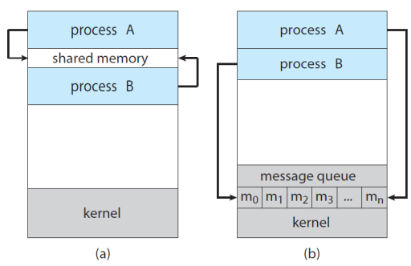

## Interprocess Communication
Processes executing concurrently : 1) independent processes 또는 2) cooperating processes  
1) <b>independent</b> process  
&rarr; 다른 프로세서와의 데이터 공유하지 않음
2) <b>cooperating</b> process    
&rarr; 다른 프로세서와 데이터 공유하여 영향을 주거나 받음  
&rarr; IPC : cooperating process 간 데이터 공유의 문제 해결 방식

## IPC(Inter-Process Communication : 프로세서 간 통신)
Cooperating processes은 IPC mechanism이 필요  
&rarr; exchange data 허용 : 프로세서 간의 send data, receive data  

### IPC의 기본 모델  
<br>  
a) shared memory : 공유 메모리 사용  
b) message passing : 메시지 공유  
&rarr; O/S에 맡김(중간 개입 ex.은행)
&rarr; message queue를 통해 메시지를 주고 받음

## IPC in Shared-Memory Systems 
### Producer-Consumer Problem
cooperating processes 개념의 가장 기본 문제, 공통 패러다임  
&rarr; producer : produces information  
&rarr; consumer : consume information  

ex 1.  
compiler(producer) : produces assembly code
assembler(consumer) : consumes assembly code  
ex 2.  
web server(producer) : produces an HTML file  
browser(consumer) : consumes an HTML file  

### A solution using shared-memory
producer와 consumer는 concurrently하게 실행
&rarr; CPU를 context switch를 통해 time sharing  

#### buffer 사용
buffer를 shared-memory로 만듦  
&rarr; a producer can fill(data를 채움) the buffer,  
&rarr; a consumer can empty(data를 비움) the buffer   

buffer를 무한대로 사용할 수 없음(unbounded buffer : buffer size 정해져있음)   
&rarr; buffer가 가득 채워져 있으면 producer가 wait  
&rarr; buffer가 비어있으면 consumer가 wait  

<b>shared memory</b> : producer와 consumer processes가 공유하고 있는 메모리 영역  
&rarr; 직접 processes 서로의 memory 영역에 접근하면 안됨(바이러스 등의 문제 발생 가능성 증가)  
&rarr; 공유하는 별도의 영역 필요  
&rarr; O/S가 해줌(?)
+++++++++++++++++++++++++++++) O/S가 해주는건 shared memory, message passing 중에 후자 아닌가?  

#### buffer 사용 코드
producer와 consumer processes code가 context switch하면서 concurrent하게 실행됨  
```c
# define BUFFER_SIZE 10

typedef struct {
  ...
} item; // 1. typedef struct을 통해 item 구조체 생성

item buffer[BUFFER_SIZE] // 2. item에 배열 buffer 만듦(프로세서 내의 영역이라서 원래는 이렇게 구현하면 안됨 -> 외부의 공뮤 메모리 영역이라 가정하고 진행 필요)   
int in = 0;
int out = 0;

=====================================================

item next_produced;

while (true) {
  /* produce an item in next_produced */
  while (((in + 1) % BUFFER_SIZE) == out) // 1. buffer가 가득 차 있는 경우
    ; // do nothing -> 2. 아무것도 하지 않으면서 대기
  buffer[in] = next_produced; // 3. 가득 차있지 않다면, 하나 넣고
  in = (in + 1) % BUFFER_SIZE; // 4. in 증가시킴

}

=====================================================

item next_consumed;

while (true) {

  while (in == out) // 1. buffer가 비어있는 경우
    ; // do nothing -> 2. 아무것도 하지 않으면서 대기
  next_consumed = buffer[out]; // 3. 비어있지 않다면, 하나 소비하고 
  out = (out + 1) % BUFFER_SIZE; // 4. out 증가시킴
  // consume the item in next_consumed

}
```

## IPC in Message-Passing Systems
shared-memory의 단점  
&rarr; processes 간의 메모리 영역 공유가 요구됨  
&rarr; shared memory에 접근 및 조작하기 위한 코드를 프로그래머가 명시적으로 작성해줘야 함  

### Message-Passing
O/S가 cooperating processes에게 수단(API)를 제공  
&rarr; communicate 시 message-passing을 통해 쉽게 진행  
&rarr; 근본적 개념은 shared-memory이지만, 관리를 O/S에게 맡기고 message만 던지는 방식  

#### message-passing facility
&rarr; send(message)  
&rarr; receive(message)  

```c
message next_produced;

while (true) {
  /* produce an item in next_produced */
  send(next_produced); // 세부 내용은 O/S가 알아서 처리
}

=====================================================

message next_consumed;

while (true) {
  receive(next_consumed); // 세부 내용은 O/S가 알아서 처리
  // consume the item in next_consumed
}
```

### Communication Links
producer와 consumer processes를 직접 이어주는 link  
&rarr; P와 Q processes가 communication 시 messages 1. send to, 2. receive만 적용하면 됨  
#### communication link의 구현방식
&rarr; <b>direct</b> or <b>indirect</b> communication  
&rarr; <b>synchronous</b> and <b>asynchronous</b> communication  
&rarr; <b>automatic(자동)</b> or <b>explicit(명시적)</b> buffering  

<b>Direct communication</b>  
각 process가 communication하는 상대를 알고 있음  
&rarr; 명시적으로 이름을 붙여야함 (recipient or sender of the communication)  
- send(𝑃, message) : send a message to process 𝑃  
- receive(𝑄, message) : receive a message from process 𝑄  

> 특징  
&rarr; Links are established <b>automatically</b>  
&rarr; A link is associated with <b>exactly two processes</b>  
&rarr; There exists <b>exactly one link</b> between each pair of processes  


<b>Indirect communication</b>  
P와 Q사이에 매개체 필요  
&rarr; the messages are sent to and received from <b>mailboxes, or ports</b>  

mailbox (ports) :  
&rarr; messages를 보내는 저장소(into which messages can be placed by processes)  
&rarr; messages를 받는 저장소(from which messages can be removed)  

즉, 특정 누군가에게 보내는 것이 아닌 mailbox에 보내는 형식  
- send(𝐴, message) – send a message to mailbox 𝐴  
- receive(𝐴, message) – receive a message from mailbox 𝐴  

> 특징  
&rarr; 두 개의 processes가 공유하는 mailbox(port)가 존재 할 때, 두 processes 사이의 link가 생성됨  
▪ The properties of communication links in this scheme:
• Links are established between a pair of processes
- only if both members of the pair have a shared mailbox.
• A link may be associated with more than two processes.
• A number of different links may exist, between each pair of processes
- with each link corresponding to one mailbox.

▪ OS provides a mechanism that allows a process to do:
• Create a new mailbox.
• Send and Receive messages through the mailbox.
• Delete a mailbox.

▪ Different design options for implementation:
• blocking or non-blocking: synchronous or asynchronous
• Blocking send: the sender is blocked until the message is received.
• Non-blocking send: the sender is sends the message and continue.
• Blocking receive: the receiver blocks until a message is available.
• Non-blocking receive: the receiver retrieves either a valid message or 
a null message.


&rarr; 
&rarr; 
&rarr; 
&rarr; 
&rarr; 
&rarr; 
&rarr; 
