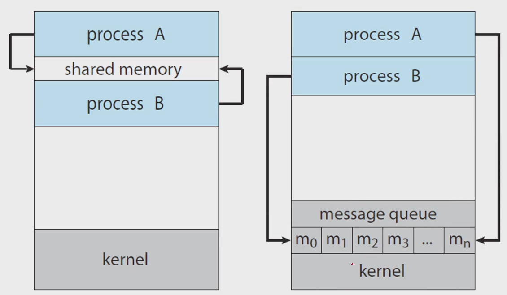

# Interprocess Communication
## Process executing concurrently may be
### independent process
- 독립적으로 실행
- 스케쥴링을 잘 해주면 잘 실행됨
- if it does not share data with any other processe
### cooperating process
- 서로 간섭함
- 메시지를 주고받으려고 할 때 문제가 발생
- if it can affect or be affected by the other processes
- Cleary, any processes that **shares data** with other processes is a cooperating process

##### 이를 해결하기 위한 것이 IPC
## *IPC Inter-Process Communication*
- Cooperating processes require an IPC mechanism
    - that will allow them to exchange data
    - that is, **send data** to and **receive data** from each otehr
- Two fundamental models of IPC
    - **shared memory** : 저장소 공유
    - **message passing** : 운영체제에 맡기는 방법, 메시지 큐를 이용해 주고 받음
     
### Consider the *Producer-Consumer* Prob
- to illustrate the concept of cooperating processes
- a common paradigm for cooperating processes
### Producer-Consumer Prob
- A ***producer*** produces information that is consumed by a ***consumer***
- e.g.
    - a *compiler* produces assembly code, and a *assembler* consumes it
    - a *web server* produces an HTML file, and a *browser* consumes it
### A solution using **shared-memory**
- To allow producer and consumer to run *concurrently*
    - time sharing 을 하면서 context switch를 이용해 동시에 함
- Let a *buffer* of items be available
    - a producer can *fill the buffer*, and
    - a consumer can *empty the buffer*