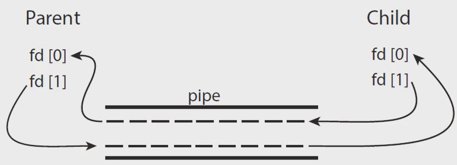

# Interprocess Communication
## Process executing concurrently may be
### independent process
- 독립적으로 실행
- 스케쥴링을 잘 해주면 잘 실행됨
- if it does not share data with any other processe
### cooperating process
- 서로 간섭함
- 메시지를 주고받으려고 할 때 문제가 발생
- if it can affect or be affected by the other processes
- Cleary, any processes that **shares data** with other processes is a cooperating process

##### 이를 해결하기 위한 것이 IPC
## *IPC Inter-Process Communication*
- Cooperating processes require an IPC mechanism
    - that will allow them to exchange data
    - that is, **send data** to and **receive data** from each otehr
- Two fundamental models of IPC
    - **shared memory** : 저장소 공유
    - **message passing** : 운영체제에 맡기는 방법, 메시지 큐를 이용해 주고 받음
    <br>
### Consider the *Producer-Consumer* Prob
- to illustrate the concept of cooperating processes
- a common paradigm for cooperating processes
### Producer-Consumer Prob
- A ***producer*** produces information that is consumed by a ***consumer***
- e.g.
    - a *compiler* produces assembly code, and a *assembler* consumes it
    - a *web server* produces an HTML file, and a *browser* consumes it
### A solution using **shared-memory**
- To allow producer and consumer to run *concurrently*
    - time sharing 을 하면서 context switch를 이용해 동시에 함
- Let a *buffer* of items be available
    - a producer can *fill the buffer*, and
    - a consumer can *empty the buffer*
    - buffer를 shared memory로 만들면 된다
- A *shared menmory* is a region of memory
    - that is shared by the producer and consumer processes
### Define a shared buffer
- in a region of memory shared by the producer and consumer process
### The scheme of using shared-memory
- requires that these processes share a region of memory and that
- the code for accssing and manipulating the shared memory
    - be written *explicitly* by the application programmer
### Message-Passing
- O/S provides the means for cooperating processes
    - to communicate with each other via a *message-passing* facility
### Two operations of the message-passing facility
- send(message)
- recieve(message)
### Communication Links
- if two processes ***P*** and ***Q*** want to communicate
    - the must *send to* and *receive* message *from* each other
- this comm. link can be implemented in a variety of ways
    - *direct* or *indirect* communication
    - *synchronous* and *asynchronous* communication
    - *automatic* or *explicit*(명시적으로) buffering
### Under direct communication
- each process that wants to communicate
    - must explicitly *name* the *recipient* or *sender* of the communication
- The primitives of this scheme
    - send(P, message) - send a message to process P
    - receive(Q, message) - receive a message from process Q
- 누구한테 주는지 누가 주는지를 명시해야함
### The properties of communication links in this schema
- Links are established *automatically*
- A link is associated with *exactly two processes*
- There exists *exactly one link* between each pair of processes
### With *indirect* communication
- the messages are *sent* to and received from *mailboxes*, or *prots*
- A mailbox(or ports)
    - can be viewed abstractly as an object
    - into which messages can be placed by processes
    - from which message can be removed
- The primitives of this scheme
    - send(A, message) : send a message to mailbox A
    - receive(A, message) : receive a message to mail box A
### The properties of communication links in this scheme
- Links are established between a pair of processes
    - only if both members of the pair have a shared mailbox
- A link may be associated with more than two processes
- A number of different links may exist, between each pair of processes
    - with each link corresponding to one mailbox
### OS provides a mechanism that allows a process to do
- Create a new mailbox
- Send and Receive messages through the mailbox
- Delete a mailbox(or Port)
- 4개의 기능만 제공해 주면 나머지는 OS 가 알아서 컨트롤
### Diffenet design options for implementation
- *blocking* or *non-blocking* == *synchronous* or *asynchronous*
- *Blocking send* : the sender is blocked until the message is received
- *Non-blocking send* : the sender is sends the message and continue
- *Blocking receive* : the receiver blocks until a message available
- *Non-Blocking receive*: the revceiver retrieves either a valid message or a null message

IPC : 프로세스 간 통신
- shared memory : P &rarr; memory &rarr; Q
- message passing : mailbox

## Examples of IPC Systems
### Examples of IPC Systems
- Shared Memory : ***POSIX Shared Memory***
    - Portable Operating System Interface (for uniX)
    - 표준화 시도 &rarr; 실패
- Message Passing: ***Pipes***
    - One of the earliest IPC mechanisms on UNIX systems
### POSIX shared memory
- is organized using memory-mapped files
    - which associate the region of shared memory with a file
- First, create a shared-memory object
- Configure the size of the object in bytes
- Finally, establish a memory-mapped file
```c
fd = shm_open(name, O_CREATE | ORDWR, 0666);
ftruncate(fd, 4096);
mmap(0, SIZE, PROT_READ | PORT_WRITE, MAP_SHARED, fd, 0);
```
### Pipes were
- one of the first IPC mechanisms in early UNIX systems
- A pipe acts as a conduit allowing two processes to communicate
### Four issue of pipe implementation
- Does the pipe allow *unidirectional* or *bidirectional* communication?
- In the case of two-way comm., is it *half-duplex* or *full-duplex*?
- Must a *relationship* exist between the communicating process?
    - such as parent-child
- Can the pipes communicate over a network?  소켓이라고 부름
### Two Common types of pipes
- Ordinary pipes P &rarr; Q
    - cannot be accessed from outside the process that created it
    - Typically, a parent process creates a pipe and uses it to communicate with a child process that it created<br>
    <br>
    - allow tow processes to communicate in producer-consumer fashion
        - the producer writes to one end of the pipe (write end)
        - the consumer reads from the other end(read end)
        - unidirectional : only one-way communication is possible
        - two-way communication &rarr; use two pipes
- Named pipes
    - can be accessed without a parent-child relationship
### On UNIX systems
- ordinary pipes are constructed using the function
    - pipe(int fd[])
    - fd[0] : the read end of the pipe
    - fd[1] : the write end
### Two other strategies in client-server systems
- Sockets
    - are defined as endpoints for communication 
    - 각각의 컴퓨터를 특정하기 위한 IP address, pipe를 특정하기 위한 port 이 둘을 합치면 socket
- RPCs(Remote Procedure Calls)
    - abstracts procedure calls between processes on networked systems
    - 원격에 있는 함수를 호출 하는 것
### Java provides
- a much easier interface to sockets and
- provides three different types of sockets
    - Socket class : connection-oriented TCP
    - DatagramSocket class : connectionless UDP
    - Multicats Socket class : multiple recipients
```java
import java.net.*;
import java.io.*;

// server
public class DateServer { 
    public static void main(String[] args) throws Exception {

        @SuppressWarnings("resource")
        ServerSocket server = new ServerSocket(6013);

        while (true) {
            System.out.println("Listening...");
            Socket client = server.accept();
            PrintWriter pout = new PrintWriter(client.getOutputStream(), true);
            System.out.println("New client is connected...");
            
            pout.println(new java.util.Date().tostring());

            client.close();
        }
    }
}

// client
public class DateClient { 
    public static void main(String[] args) throws Exception {
        Socket socket = new Socket("127.0.0.1", 6013);

        InputStream in = socket.getInputStream();
        BufferedReader br = new BufferedReader(new InputStreamReader(in));

        String line = null;
        while ((line = br.readLine()) != null) 
            System.out.println(line);

        socket.close();
    }
}
```
### RPC(Remote Procedure Call)
- one of the most common forms of *remote service* 현업에서 많이 씀
- RMI in java, COM in microsoft model, etc.
- designed as a way to abstract the procedure-call mechanism
    - for use between systems with network connections
- A client invokes a procedure on a remote host
    - as it would invoke a procedure locally
### The RPC system
- hides the details that allow communication to take place
    - by providing a *stub* on the client side
- The stub of client-side locates the server and
    - *marshals* the parameters
    - 객체 직렬화를 위한 것
    - 지금 이해하려고 할 필요 없음
- IPC의 확정 개념인 RPC
- The stub of server-side received this message,
    - unpacks the *marshalled* parameters, and
    - performs the procedure on the server