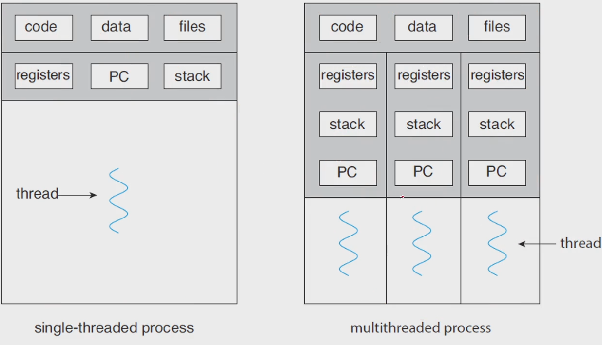
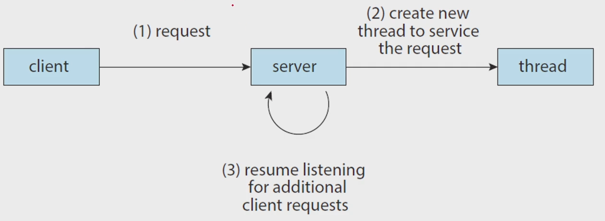
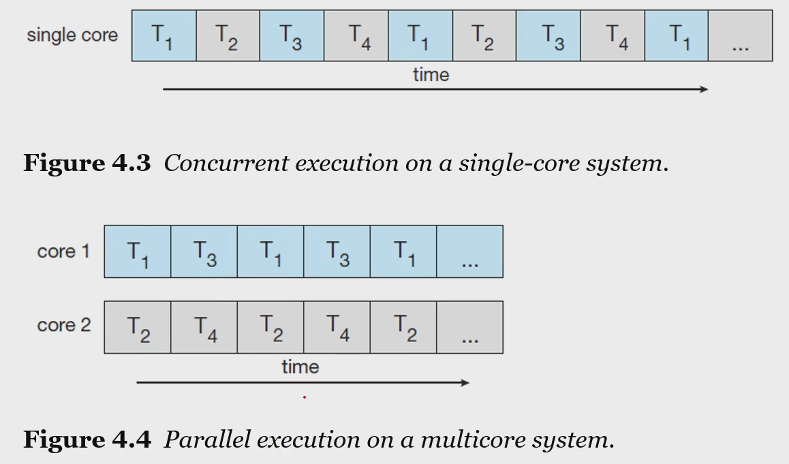
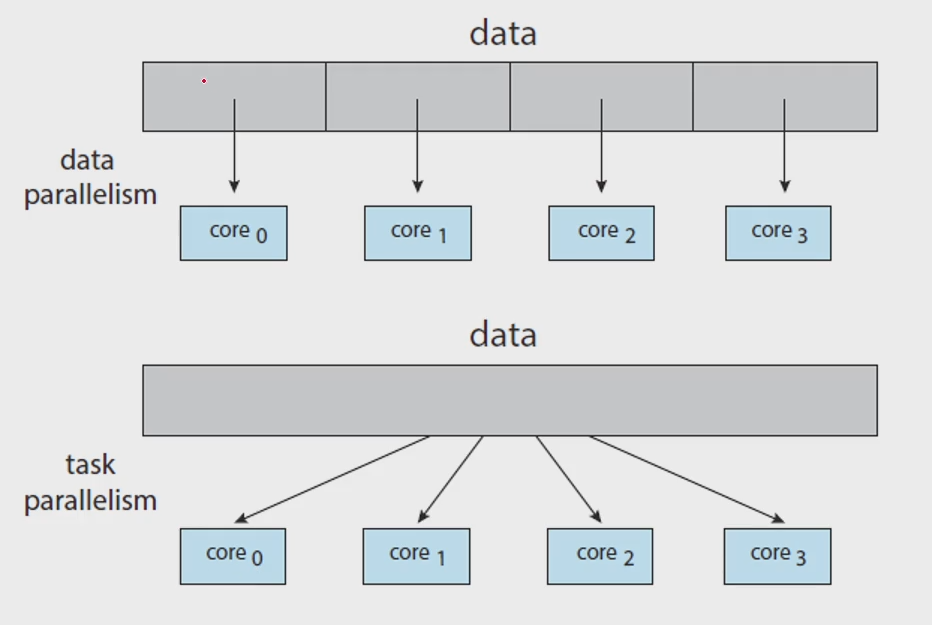

# 7. 쓰레드의 이해
# Thread & Concurrency
### So far, we assumed that
- a process was an executing program *with a single thread of control*
- however, *a process* is able to contain *multiple threads of control*, isn't it?
- context switch 를 하면 여러 프로세스를 fork()해서 했던것처럼 잘 관리 하면 thread 만 관리해서 할 수 있을듯
### a ***thread*** is
- a lightweight process
- a basic unit of CPU utilization
- comprises a *thread ID*, a * program counter*, a *register set*, and a *stack*
- e.g.
    <br>
### Moticvation for multithreading
- Multithread server architecture
    <br>
- Let us consider the case of client-server system, e.g. web server
### 멀티쓰레딩 프로그램이 장점
- Responsiveness : may allow continued execution
    - if part of process is blocked, expecially important for user interfaces
- Resouce Sharing : threads share resources of process
    - easier than shared-memory or message-passing
- Economy : cheaper than process creation
    - thread switching lower overhead than context switching
    - process의 context switch 보다 thread 의 것이 더 쉬움
- Scalability : process can take advantage of multiprocessor architectures
- 멀티쓰레딩 배우려고 멀티프로세싱 배웠다고 봐도 될정도
### Threads in Java
- In a java program,
    - threads are the fundamental model of program execution
- java provides a rich set of features
    - for the creation and management of thread
### Three tech for explicitly creating threads in Java
- *Inheritance* from the Thread class
    - create a new class that is derived from the Thread class
    - and override its public void run() method
    ```java
    class MyThread1 extends Thread {
        public void run() {
            try {
                while (true) {
                    System.out.println("Hello, Thread!");
                    Thread.sleep(500);
                }
            }
            catch (InterruptedException ie) {
                System.out.println("I'm interrupted");
            }
        }
    }
    // 쓰레드는 보통 무한반복, 계속 사용하기 때문
    // extends Thread 부분이 상속을 표시해주는 부분
    
    public class ThreadExample1 {
        public static final void main(String[] args) {
            MyThread1 thread = new MyThread1(); // 이게 fork 하는 과정과 똑같다고 생각하면 된다.
            thread.start();
            System.out.println("Hello, My Child!")
        }
    }
    ```
- *Implementing* the Runnalbe interface
    - define a new class that implements the Runnable interface
    - and override its public void run() method
    - 자바는 다중 상속이 안되기 때문에 이렇게 쓰는게 좋음
    ```java
    class MyThread2 implements Runnable {
        public void run() {
            try {
                while (true) {
                    System.out.println("Hello, Runnable!");
                    Thread.sleep(500);
                }
            }
            catch (InterruptedException ie) {
                System.out.println("I'm interrupted");
            }
        }
    }

    public class ThreadExample2 {
       public static final void main(String[] args) {
            Thread thread = new Thread(new MyThread2());
            thread.start();
            System.out.println("Hello, My Runnable Child!")
        }
    }
    ```
- Using the *Lambda* expression(beginning with Java Version 1.8)
    - rather than defining a new class, use a *lambda expression* of Runnable instead
    ```java
    public class ThreadExample3 {
        public static final void main(String[] args) {
            Runnable task = () -> { // 인터페이스의 아무것도 없는 객체참조 타입, 자세한건 몰라도됨
                try {
                    while (true) {
                        System.out.println("Hello, Lambda Runnable!");
                        Thread.sleep(500);
                    }
                }
                catch (InterruptedException ie) {
                    System.out.println("I'm interrupted");
                }
            };
            Thread thread = new Thread(task); // 파라미터로 객체 참조 변수를 주니까 가능
            thread.start();
            System.out.println("Hello, My Lambda Child!")
        }
    }
    ```
### 부모 쓰레드의 대기: ***join***
```java
public class ThreadExample4 {
    public static final void main(String[] args) {
        Runnable task = () -> {
            for (int i=0; i<5; i++) { // 빨리 끝나라고 이렇게 줌
                System.out.println("Hello, Lambda Runnable!");
            }
        };
        Thread thread = new Thread(task);
        tread.start(); // 여까진 동일
        try {
            thread.join(); // main() thread 가 돌다가 start 호출 했으니까 child 쓰레드가 돌기 시작하고, child 쓰레드가 끝나면 돌아와서 마무리
        }
        catch (InterruptedException ie) {
            System.out.println("Parent thread is interrupted");
        }
        System.out.println("Hello, My Joined Child!")
    }
}
```
### 쓰레드의 종료 : ***interrupt***
- stop이 있긴 한데 쓰지말라고 되어있음
- context switch 때와 마찬가지로 interrupt 사용
- 쓰레드 역시 프로세스와 같은 로직을 가지고 있음(ready, wait 이런거)
```java
public class ThreadEx5 {
    public static final void main(String[] args) throws InterruptedException {
        Runnable task = () -> {
            try {
                while (true) {
                    System.out.println("Hello, Lambda Runnable!");
                    Thread.sleep(100); // 빨리할라고 0.1초 줌
                }
            }
            catch (InterruptedException ie) {
                System.out.println("I'm interrupted");
                // run이 끝나면 여기로
            }
        };
        Thread thread = new Thread(task);
        thread.start();
        Thread.sleep(500);
        thread.interrupt();
        System.out.println("Hello, My Interrupted Child!")
    }
}
// 0.1 초마다 람다 러너블 실행하다가 0.5초마다 인터럽트를 건다
// 근데 꼭 5번을 거는 건 아닐거임 근데 앵간하면 5번만 나옴
```

> 이 5개는 꼭 다 돌려보세요. 나중가면 다 쓸모있다~
> 자바 기준으로 설명할거라서 지금 알아둬야함
> 구글링을 하던지 해서라도 다 이해해 놔야함

### Multithreading in a **Multicore** system
- 이제는 cpu 하나에 ram 하나 있는 시대는 갔음
- 멀티 코어에 멀티 램 시대
- more efficient use of multiple cores for imporved concurrency
- Consider an app with four threads
    - single-core : threads will be interleaved(사이사이에 끼워 넣는다) over time
    - multiple-cores : some threads can run in parallel
    <br>
### Programming Challenges in Multicore systems
- *Identifying tasks* : find areas can be divided into separate tasks
    - 완전히 병렬적으로 돌아가는 것과 아닌 것을 찾는 것
- *Balance* : ensure the tasks to perform equal work of equal value
    - 각 Thread 에 똑같은 일을 분배하는 것
- *Data splitting* : data also must be divided to run on separte cores 데이터 쪼개기
- *Data Depandency* : ensure that the execution of tasks is synchronized to accommodate the data dependency
    - 데이터 의존성 처리
- *Testing and debugging* : more difficult than single-thread
    - e.g. 브레이크 포인트 잡는 것
### Types of parallelism
<br>

- Data parallelism and task parallelism
- 이제는 구분할 필요가 없음
- 컴퓨터 한개가지고 분산 시스템 하는게 아님 이젠.
- 이 단계는 별로 안중요함

### Amdahl's Law
- 코어는 무조건 많을수록 좋은가?
- speedup <= 1/(s+(1-S)/N)
    - S : 시리얼(대충 순서대로 인듯) 하게 진행되어야 하는 양(the portion that must be performed serially on a system)
    - N : 프로세스의 코어
- e.g.
    - S=0.25, N=2, speedup = 1.6
    - s=0.25, N=4, speedup = 2.28
- 모든 작업이 병렬처리 하게 되지 않아서 생기는 것. 당연한거 아닌가

# 8. 멀티쓰레딩
## Multithreading Models
### Two types of threads
- *user* threads : 사용자 모드에서 사용 하는 것
    - supported above the kernel
    - and managed *without kernel support*
- *kernel* threads : 커널단에서 사용하는 것
    - supported and managed direct;y by *the operating system*
### Three relationships between user and kernel threads
- Many-to-One Model
    - 하나의 커널에 여러개의 쓰레드가 돌아감
    - user thread 가 너무 많아지면 감당이 안됨
- One-to-One Model
    - 각 kernel thread에 user thread를 하나씩 매칭
- Many-to-Many Model
    - 여러개의 kernel threads 가 있고 user threads 가 있고 맵핑해서 사용

### A *thread library* provides
- an API for *creating* and *managing* threads
### Three main thread libraries are in use today
- POSIX Pthreads
- Windows thread
- Java thread
### Pthreads
- refers to the POSIX standard IEEE 1003.1c
- just ***specification*** for thread behavior, not an impl
- 실제로 구현한건 아님
```c
#include <stdio.h>
#include <stdlib.h>
#include <pthread.h>

int sum;

void * runner(void *param);

int main(int argc, char *argv[])
{
    pthread_t tid;  // thread identifier
    pthread_attr_t attr;    // thread attributes

    pthread_attr_init(&attr);
    pthread_create(&tid, &attr, runner, argv[1]);   // create == java의 new
    pthread_join(tid, NULL);

    printf("sum = %d\n", sum);
}
void *runner(void *param)   // 런너
{
    int i, upper = atoi(param); // atoi string to int
    sum = 0;
    for (i=0; i<=upper; i++)
        sum += i;
    pthread_exit(0);
}
```

### 연습문제 4.17
```c
pid_t pid;
pid = fork();
if (pid == 0) {
    fork();
    thread_create( . . .);
}
fork();
```
- a. How many unique proesses are created?  6개
- b. How many unique thread are created?    2개(8개) create 해서 생기는 것은 명시적으론 2개

### 연습문제 4.19
```c
#include <stdio.h>
#include <unistd.h>
#include <wait.h>
#include <pthread.h>

int value = 0;
void * runner(void * param);

int main(int argc, char *argv[]) 
{
    pid_t pid;
    pthread_t tid;
    pthread_attr_t attr;

    pid = fork();

    if (pid == 0) {
        pthread_attr_init(&attr);
        pthread_create(&tid, &attr, runner, NULL);
        pthread_join(tid, NULL);
        printf("CHILD: value = %d\n", value);
    }
    else if (pid > 0) {
        wait(NULL);
        printf("PARENT: value = %d\n", value);
    }
}

void *runner(void *param)
{
    value = 5;
    pthread_exit(0);
}

/* 출력 결과
* CHILD: value 5
* PARENT : value = 0
*/
```

## Implicit Threading
### The Strategy of Implicit Threading
- 알아서 좀 해도
- 강의에서는 뺏는데 java 에는 execute 가 있음 자동화임
- The design of *concurrent* and *parallel* applications
    - i.e., the design of *multithreading* in *multicore* system
    - is tooooooo difficult for app developers
- So, *transfer the difficulty* to compiler and run-time libraries
### Four alternative approaches using implicit threading
- Thread Pools
    - create a number of threads in a pool where they await work
    - new Thread()를 하면 thread를 하나 만듬
    - 근데 만약 무한루프 안에 만들면 시스템이 뻗을 거임
    - 그래서 new Thread()를 프로그래머가 하지 않게 하는 것
    - Thread Pool.getThread() 이런식으로
- Fork & Join
    - explicit threading, but an excellent candidate for *implicit* threading
    - fork() 와 join()의 매커니즘을 가지고 함
    - 책에 자세히 설명 되어 있음, 운영체제에서 중요하진 않은듯
- OpenMP
    - a set of compiler directives and an API for programs written in C/C++
- Grand Center Dispatch
    - 애플에서 쓰는건데 잘 모름
### OpenMP
- identifies parallel regions as blocks of code that may run in parallel
- insert compiler directives into source code at parallel regions
- these directives instruct OpenMP runtime library to execute the region in parallel

```c
#include <stdio.h>
#include <omp.h>

int main (int argc, char *argv[])
{
    omp_set_num_threads(4);

    #pragma omp parallel // compiler directive
    {
        printf("OpenMP thread: %d \n", omp_get_thread_num());
    }
    return 0;
// 4개가 실행 되는데, 출력의 순서는 보장되지 않음
}
```

```c
#include <stdio.h>
#include <omp.h>
#define SIZE 100000000

int a[SIZE], b[SIZE], c[SIZE];

int main(int argc, char *argv[])
{
    int i;
    for (int i=0; i<SIZE; i++) {
        a[i] = b[i] = i;
    }
    #pragma omp parallel for
    for (i=0; i<SIZE; i++) {
        c[i] = a[i] + b[i];
    }
    return 0;
// time 파일명.c 하면 시간 경과시간이 나옴
// 병렬처리 한게 더 빠름 자세한건 병렬처리 시간에 할거임 ㅇㅇ
}
```