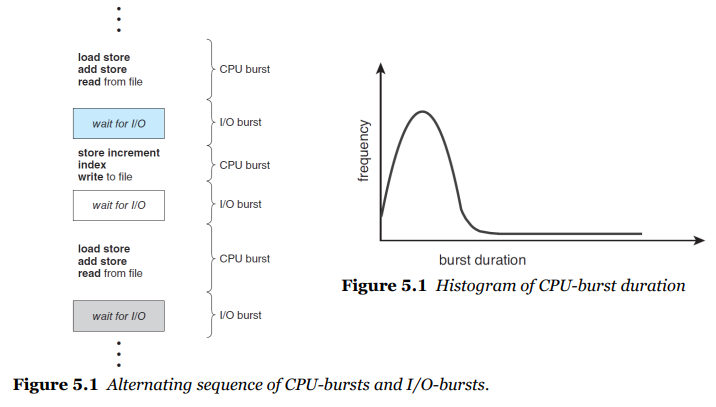
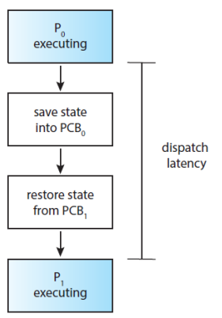
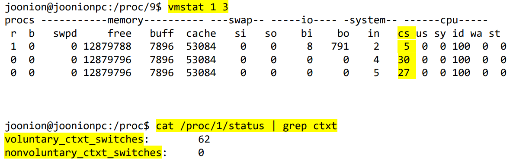
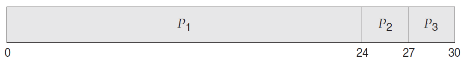
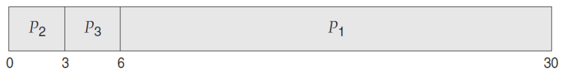
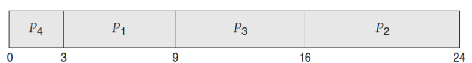

## CPU Scheduling
multiprogrammed operating systems의 기본

#### multiprogramming의 목적  
&rarr; CPU utilization 최대화  
&rarr; context switch를 통해 time sharing하여 concurrently 실행  
&rarr; some processes running at all times

 
CPU burst : running 상태   
I/O burst : ready 또는 waiting 상태   
&rarr; CPU burst time이 많은 process보다, I/O burst time이 많은 process가 많음  
&rarr; CPU Scheduling을 통해 time-sharing 했을 때, 효율이 좋아지는 이유   

### CPU scheduler
메모리에 load 되어있는 <b>ready</b> 상태의 processes 중 CPU에게 어떤 process를 <b>allocates</b> 할 것인지 선택  
#### ready queue를 만드는 방법(next process 선택 방법)
&rarr; Linked List or Binary Tree로 구현 가능  
&rarr; <b>FIFO Queue</b>(First-In, First-Out)  
&rarr; <b>Priority Queue</b> : priority 부여 방법 중요

### Preemptive(선점형) vs Non-preemptive(비선점형)
#### Non-preemptive scheduling &rarr; 자발적
process가 CPU를 선점 시 releases 되기 전까지 유지  
a process keeps the CPU until it releases it,  
either by terminating or by switching to the waiting state.  

#### Preemptive scheduling &rarr; 강제적
scheduler가 CPU를 점유하고 있는 process를 쫒아낼 수 있음
a process can be preempted by the scheduler.

### CPU-scheduling을 위한 의사결정
1. When a process switches from the <b>running</b> to <b>waiting</b> state.  
2. When a process switches from the <b>running</b> to <b>ready</b> state.  
3. When a process switches from the <b>waiting</b> to <b>ready</b> state.  
4. When a process <b>terminates</b>.  

&rarr; 1 & 4: no choice – non-preemptive  
&rarr; 2 & 3: choices – preemptive or non-preemptive  
&rarr; 현대적 O/S에서는 선택권이 넓은 preemptive 사용

### Dispatcher
context switch를 하는 module  
&rarr; CPU scheduler에 의해 선택된 process에게 control of the CPU’s core 제공  
&rarr; 모든 context switch에 호출되기 떄문에 ASAP  

#### dispatcher 기능
&rarr; switching context from one process to another  
&rarr; switching to user mode  
&rarr; jumping to the proper location to resume the user program  

Tip)  
CPU scheduler : 어떤 process를 변경할지 선택  
Dispatcher : 실제로 변경해주는 것(큰 의미로는 CPU scheduler에 포함)  

#### dispatcher latency(dispatcher 진행시간)

 
P0와 P1이 context switch 진행 시  
PCB0를 store하고, PCB1를 restore하는 시간  
&rarr; the time to stop one process and start another running  
&rarr; 가급적이면 짧아야함

#### vmstat
context switch가 얼마나 자주 일어나는지 확인하는 명령어  
 
위의 사진에서는  
<b>vmstat 1 3(1초씩 3번 검사 진행)</b>  
&rarr; 1초에 context switch가 5, 30, 27번 진행  
<b>cat /proc/1/status/grep ctxt</b>  
&rarr; voluntary_ctxt_switches(자발적 : non-Preemptive): 62  
&rarr; nonvoluntary_ctxt_switches(비자발적 : Preemptive): 0  

## Scheduling Criteria
<b>CPU utilization</b>  
&rarr; to keep the CPU as busy as possible  

<b>Throughput</b>  
&rarr; 단위 시간 내의 완결된 process의 수  
&rarr; the number of processes completed per time unit.  

<b>Turnaround time⭐️</b>  
&rarr; 제출(실행)에서 종료까지의 시간  
&rarr; how long does it take to execute a process?  
&rarr; from the time of submission to the time of completion.  

<b>Waiting time⭐️⭐️</b>  
&rarr; ready queue에서 대기 시간의 합 최소화  
&rarr; the amount of time that a process spends waiting in the ready queue.  
&rarr; the sum of periods spend waiting in the ready queue.  

<b>Response time</b>    
&rarr; response 시간 최소화  
&rarr; UI 측면에서 중요  
&rarr; the time it takes to start responding  

## Scheduling Algorithms
### CPU Scheduling Problem
: ready queue에 있는 processes 중 CPU’s core에 할당할 프로세스를 결정

### Solutions for the scheduling problem
• **FCFS**
: First-Come, First-Served  
  &rarr; (초창기 O/S에 사용되었음, 현재는 문제점이 많아 사용하지 않음)  
• **SJF**: Shortest Job First (**SRTF**: Shortest Remaining Time First)  
• **RR**: Round-Robin(time-sharing)  
  &rarr; (현대적 컴퓨터에서는 모두 사용하는 방식)
• **Priority-based**  
• **MLQ**: Multi-Level Queue  
• **MLFQ**: Multi-Level Feedback Queue 

### FCFS(First-Come, First-Served)
&rarr; the simplest CPU-scheduling algorithm  
&rarr; 먼저 요청하는 process에게 CPU를 먼저 할당  
&rarr; 구현 난이도 낮음 with a FIFO queue  

<b>고려사항 예시</b>  
&rarr; arrive at time 0  
&rarr; process with Burst Time(P1 : 24, P2 : 3, P3 : 3)

예제 1. order P1, P2, P3
  
&rarr; Waiting Time for 𝑃1 = 0, 𝑃2 = 24, 𝑃3 = 27  
&rarr; Total Waiting Time: (0 + 24 + 27) = 51  
&rarr; Average Waiting Time: 51/3 = 17  
&rarr; Turnaround Time for 𝑃1 = 24, 𝑃2 = 27, 𝑃3 = 30
&rarr; Total Turnaround Time: (24 + 27 + 30) = 81
&rarr; Average Turnaround Time: 81/3 = 27

예제 2. order P2, P3, P1
  
&rarr; Waiting Time for 𝑃1 = 6, 𝑃2 = 0, 𝑃3 = 3  
&rarr; Total Waiting Time: (6 + 0 + 3) = 9  
&rarr; Average Waiting Time: 9/3 = 3  
&rarr; Turnaround Time for 𝑃1 = 30, 𝑃2 = 6, 𝑃3 = 3  
&rarr; Total Turnaround Time: (30 + 6 + 3) = 39  
&rarr; Average Turnaround Time: 39/3 = 13  

<b>주의점</b>  
• The average waiting time under the FCFS policy  
&rarr; is generally <b>not minimal</b> and may <b>vary substantially</b>   
&rarr; if the processes’ <b>CPU-burst times </b>vary greatly.  

• Preemptive or non-preemptive?  
&rarr; The FCFS scheduling algorithm is <b>non-preemptive</b>  

• The performance in a dynamic situation:  
&rarr; What if we have one CPU-bound and many I/O-bound processes?  

• Convoy Effect(호송효과)  
&rarr; all the other processes wait for the one big process to get off the CPU  
&rarr; results in lower CPU and device utilization than might be possible   
&rarr; if the shorter processes were allowed to go first  
&rarr; 똥차 효과 : 뒷차가 좋아도 앞차가 똥차인경우 다 가지못하고 똥차속도에 맞춰짐  

### SJF(Shortest-Job-First)
: shortest-next-CPU-burst-first scheduling  
• SJF associates with each process the length of the process’s next CPU burst  
• CPU를 사용할 수 있으면, 다음 CPU burst가 가장 작은 프로세스 할당  
• 만약 동시에 도착할 경우 FCFS 방식 사용  

<b>고려사항 예시</b>  
&rarr; arrive at time 0  
&rarr; process with Burst Time(P1 : 6, P2 : 8, P3 : 7, P4 : 3)

예제 1. order P4, P1, P3, P2
  
&rarr; Waiting Time for 𝑃1 = 3, 𝑃2 = 16, 𝑃3 = 9, 𝑃4 = 0
&rarr; Total Waiting Time: (3 + 16 + 9 + 0) = 28
&rarr; Average Waiting Time: 28/4 = 7
&rarr; Turnaround Time for 𝑃1 = 9, 𝑃2 = 24, 𝑃3 = 16, 𝑃4 = 3
&rarr; Total Turnaround Time: (9 + 24 + 16 + 3) = 52
&rarr; Average Turnaround Time: 52/4 = 13

<b>주의점</b> 
• The SJF scheduling algorithm is <b>provably optimal</b>,
- it gives the minimum average waiting time for a given set of processes.

• Moving a short process before a long one
- decreases the waiting time of the short process
- more than it increases the waiting time of the long process.

- Consequently, the average waiting time decreases.
