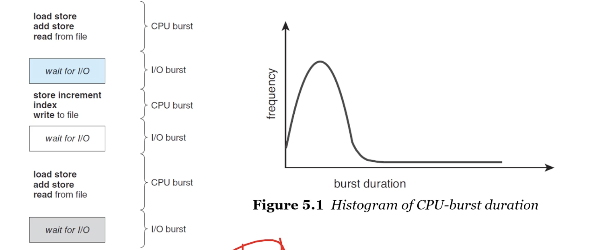
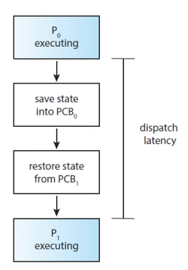
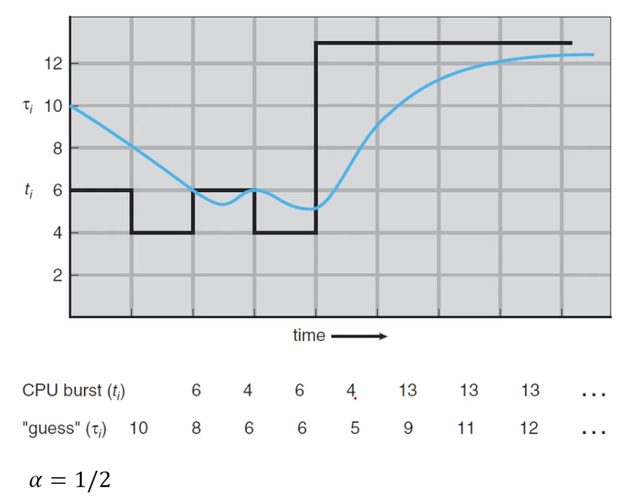
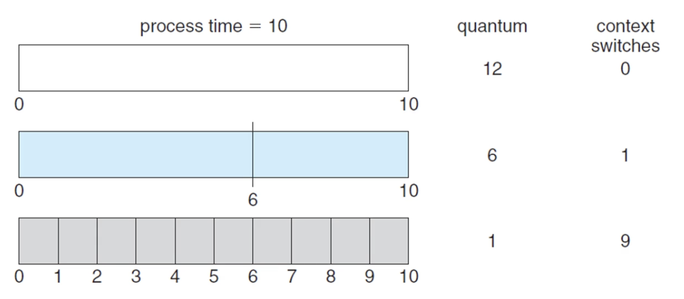
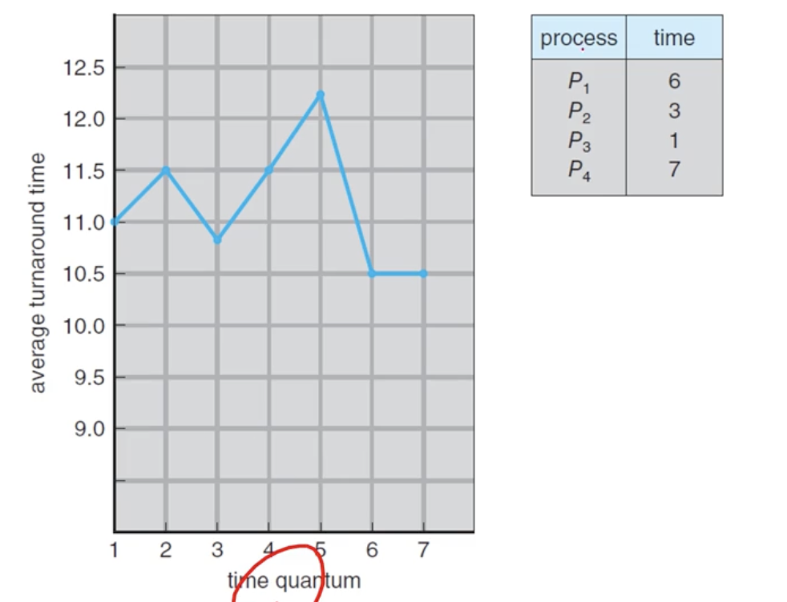
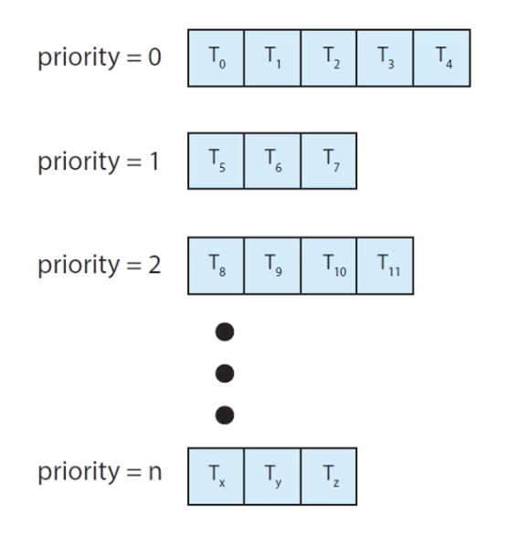
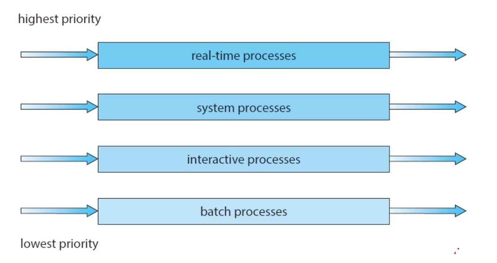
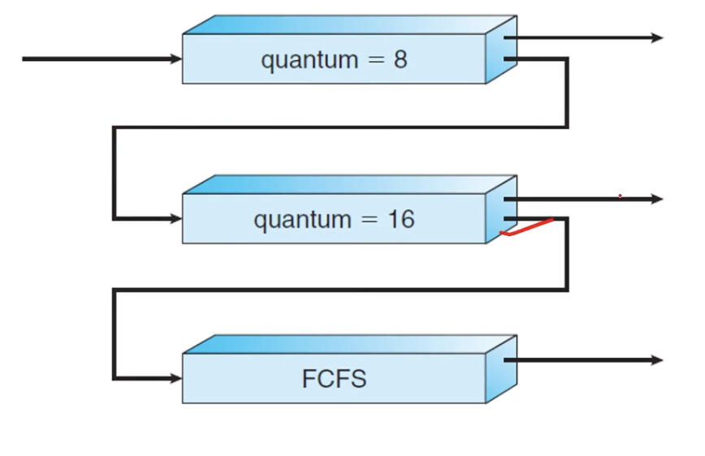

# CPU Scheduling Part 1
### CPU scheduling is
- the basis of multi programmed o/s
- The objective of multiprogramming is
    - to have some processes running at all times
    - to maximize CPU utilization
    - cpu가 성능이 너무 좋아서 노는걸 줄이기 위함 
     
### CPU scheduler
- selects a process from the processes in memory
    - that are ready to execute and allocate the CPU to that process
- Then, how can we select a next process?
    - Linked List? or Binary Tree?
    - FIFO Queue : First-In, First Our
        - 피포큐
    - Priority Queue : How can we determine the priority of a process?
### Preemptive(선점형) vs. Non-Preemptive
- 선점형은 쫓아낼 수 있다는 것
- 비선점형은 자발적으로 나가게 유도
- Non-preemptive scheduling
    - a process keeps the CPU until it releases it
    - either by terminating or by switching to the waiting state

- Preemptive scheduling
    - a process can be preempted by the scheduler

### Decision Making for CPU-scheduling

- When a process switches from the running to waiting state
-              =                   running to ready state
-              =                   waiting to ready state
- When a process terminates
- 1 & 4 : no choice - non-preemptive
    - 쓰다가 자발적으로 가는 경우
    - I/O로 인해서 자발적으로 이동
- 2 & 3 : choices - preemptive or non-preemptive
    - 2 : 쫓아낸거임. 
    - 3 : 현재 진행중인 작업보다 우선순위가 높으면 쫓아내고 우선 진행
    - 물론 현대적인 스케쥴링에선 다 선점형으로 함. 비선점형은 비효율적임
### The dispatcher is
- a module that gives control of the CPU's core
    - to the process selected by the CPU scheduler
    - running 상태의 것을 쫓아내고 가지고 오는 것 : context switch. 이것을 해주는게 dispatcher
- The func of dispatcher
    - switching context from one process to another
    - switching to user mode
    - jumping to the proper location to resume the user program
### The dispatcher should be fast as possible
- since it is invoked during every context switch
- The dispatcher latency is
    - the time to stop one process and start another running
- the role of dispatcher 
     
## Scheduling Criteria
### Scheduling Criteria
- *CPU utilization* : to keep the CPU as busy as possible
- *Throughput* : the number of processes completed per time unit
- ***Turnaround time***:
    - how long does it take to execute a process?
    - from the time of submission to the time of completion
    - 가장 중요
- ***waiting time***
    - the amount of time that a process spends waiting in the ready queue
    - the sum of periods spend waiting in the ready queue
- *Response time*
    - the time it takes to start responding
## Scheduling Algorithms
### CPU Scheduling Problem
- decide which of the processes in the ready queue
    - is to be allocated the CPU's core
### The solutions for the scheduling prob
- FCFS : First-Come, First-Served
- SJF : Shortest Job First(SRTF: Shortest Remaining Time First)
    - 잔여시간이 가장 짧게 남은 것 우선
- 위 두개는 프로세스가 있으면 전체 시간에 다 할당
- RR : Round-Robin
    - 시분할(time sharing)은 RR과 관련
- Priority-based
    - RR을 쓰는데 다음을 선택할때 우선순위 부여
- MLQ : Multi Level Queue
    - 경우에 따라 구분해서 함
- MLFQ : Multi-Level Feddback Queue
    - 현대적인 형태
    - 피드백을 기반해 MLQ를 함
### FCFS Scheduling
- 가장 간단한 스케쥴링 알고리즘
- The process that requests the CPU first
    - is allocated the CPU first
    - can be easily implemented with a FIFO queue
    - 걍 순서대로 하는거
### cal
- waiting time === turnaround time // 대충비슷한거 같은데 똑같은 거라고 함
### Note that
- The average waiting time under the FCFS policy
    - is generally not minimal and may vary substantially
    - if the processes' CPU-brust times vary greatly
- Preemptive or non-preemptive?
    - The FCFS scheduling algo is non-preemptive
- The perform in a dynamic situation
    - What if we have one CPU-bound and many I/O process?
- *Convoy Effect* (호송효과)
    - all the other processes wait for the one big process to get off the CPU
    - results in lower CPU and device utilization than might be possible
    - if the shorter processes were allowed to go first
    - 똥차효과;; 뒤차가 아무리 빨라도 앞차가 느리면 못간다~
### SJF scheduling
- Shortest-Job-First : shortest-next-CPU-burst-first scheduling
- SJF associates with each process
    - the length of process's next CPU burst
- When the CPU is available
    - assign it to the process that has the smallest next CPU burst
- if two or more process are even
    - break the tie with the FCFS
    - 같으면 걍 선입선출
# CPU Scheduling Part 2
## Scheduling Algorithms
### Note that
- The SJF scheduling algo is provably optimal
    - it gives the minimum average waiting time for a given set of process
- Moving a short process before a long one
    - decreases the waiting time of the short process
    - more thean it increases the waiting time of the long process
    - Consequently, the average waiting time decrease
### Can you impl the SJF scheduling?
- 근데 구현 어캐함
- There is no way to know the length of the next CPU burst
- 각 프로그램이 실행시간이 얼마나 걸릴지 모름
- Try to approximate the SJF scheduling
    - We my be able to predict the length of the next CPU
    - Pick a process with the shortest predicted CPU burst
### how to predict the next CPU burst?
- *exponential average*(지수 평균) of the measured lengths of *previous* CPU burst
- $ \tau_{n+1} = \alpha\tau_n + (1 - \alpha)\tau_n $ where
    - $ \tau $ is the length of the $ n $<t>th CPU burst,
    - $ \tau_{n+1} $ is our predicted value for the next CPU burst,
    - for $ 0 \le \alpha \le 1 $ (가중치) 
     
    - alpha 가 0 이거나 1이면 완전 과거나 최근만 보니까 그 사이를 줘야함
- SJF는 이론적으로만 좋지 사실상 안씀
### Note also that
- the SJF algo can be either ***preemptive*** or ***non-preemptive***
- The choice arises
    - when a new process arrives at the *ready* queue
    - while a previous process is *still* executing
    - 선점형이 더 유리함
- What if a newly arrived process is shorter than
    - what is left of the currently executing process?
### SRTF Scheduling
- Shortest-Remaining-Time-First : *Preemptive SJF* scheduling
- SRTF will preemptive the currently running process
    - whereas a non-preemptive SJF will allow it to finish its CPU burst
### **RR** Scheduling
- Round-Robin : *preemptive* *FCFS* with a *time quantum*
    - 시간 지나면 나가
- A *time quantum*(or time slice) is a small unit of time
    - generally from 10 to 100 milisec in length
- The ready queue is treated as a *circular queue*
    - allocating the CPU to each process
    - for a time interval of up to 1 time quantum
### One of two things will happen
- The process may have a CPU burst of less than one time quantum
    - the process it self will release the CPU voluntarily
    - the scheduler will proceed to the next process in the ready queue
- If the CPU burst is longer than one time quantum
    - the timer will go off and will cause an interrupt to the OS
    - a context switch will be executed
    - the process will be put at the tail of the ready queue
### Note that
- The average waiting time under the RR policy is often long
- The RR scheduling algo is ***preemptive***
    - if a process's CPU burst exceeds one time quantum
    - that process is preempted and is put back in the ready queue

### The performance of the RR scheduling algo
- depends heavily on the ***size*** of the time quantum 
 

- time quantum에 따라 OS 의 성능이 좌지우지된다
- How turnaround time varies with the time quantum 
 

### Priority-base Scheduling
- A priority is associated with each process
    - and the CPU is allocated to the process with the highest priority
    - Processes with equal priority are scheduled in FCFS order
- Note that the SJF is a special case of the priority-based scheduling
    - in this case, the priority is the inverse of the next CPU burst
- We assume that low numbers represent high priority
### Priority scheduling can be
- either preemptive(SRTF) or non-preemptive(SJF)
### The prob of starvation(indefinite blocking)
- a bloced process : ready to run, but waiting for the CPU
- some low-priority processes may wait indefinitely
- 계속 대기만 하는것. deadlock 에서도 나올거임
### A solution to the starvation prob is aging
- gradually increase the priority of processes
    - that wait in the system for a long time
### Combine RR and Priority scheduling
- execute the *highest-priority* process and
- runs processes with the *same* priority using *round-robin* scheduling
### Multi-Level Queue(MLQ) Scheduling
 

- 각각의 분리된 ready queue에 각각의 분리된 우선순위 부여 
 

### Multi-Level Feedback Queue(MLFQ) Scheduling
 

- 실전 O/S의 CPU스케쥴링 알고리즘 + 멀티코어
### On most modern operating systems
- it is kernel threads - not processes - that are being scheduled
- 쓰레드를 하는게 요즘인데, 어려워서 프로세스로 공부함
- and user threads are managed by a thread library
    - So, the kernel is unaware of them,
    - ultimately mapped to associated kernel threads
- 지금 까지 공부한걸 커널 쓰레드에 적용한다
### Scheduling in the Real-Time-Operating System
- 주어진 시간 내에 어떤 일을 완료할 수 있어야 실시간 이라고 부름
- ***Soft Realtime*** vs ***Hard Realtime***
- Soft real-time systems provide no guarantee
    - as to when a critical real-time process will be scheduled
    - guarantee only that a critical process is preferred to noncritical one
    - 좀 놓쳐도 ㄱㅊ
- Hard real-time systems have stricter requirements
    - A task must be services by its deadline
    - 반드시 데드라인 내에 실행되어야 함
- priority를 가지고 작동
- 재밌는 얘기 있었는데 빠짐 달 탐사 어쩌구
 

 
&rarr; 예제 문제 중요하니까 다 풀어봐라 
