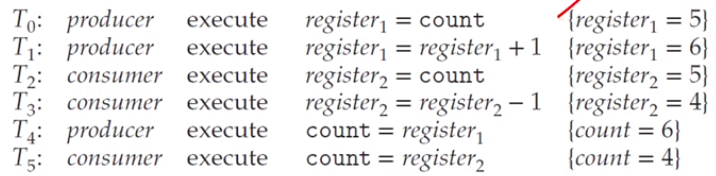

# Ch 6. Synchronization Tools

# 11 프로세스 동기화

## Backgound

### Cooperating processes

- cna either affect or be affected by each other
- can share a logical address space or be allowed to share data
- However, concurrent access to shared data
  - may result in data inconsistency
- Hence, we need to ensure
  - the orderly execution of cooperating processes
  - that share a logical address space to maintain data consistancy

### The inegritty of data shared by several processes(or thread)

- Concurrent execution
  - a process may be interrupted at any point in its instruction stream
  - the processing core may be assigned to another process
- Parallel execution
  - two or more instruction streams(representing diff processes)
  - execute _simulataneously_ on separate _processing_ cores

### Consoder an e.g. of how this is happen

- Let us revisit the procducer-consumer prob
  - where two processes _share data_ and are _running asynchronously_
- To count items in the buffer, and an integer variable count:
  - init to 0
  - incremented every time we add a new item to the buffer
  - decremented every time we remove a item from the buffer

### Data inconsistency

- although two processes are correct separately
  - they may not function correctly when executed concurrently
- Suppose that the value of count is currently 5
  - the producer and consumer concurrently execute
  - two statement: cnt++; and cnt--;
- Then, value possible
  - 4 or 5 or 6

### How these res can happen?

- Note that two statement _cnt++_ and _cnt--_
  - may be implemented in _machine language_ as follows
  ```
  register_1 = cnt
  register_1 = register_1 + 1
  cnt = register_1
  ```
- Even though _register_1_ and _register_2_ may be the same physical register
  - the contents of these registers will be
  - **_saved_** and **_resotred_** by the _interrupt handler_(or scheduler)
- The concurrent execution of cnt++ and cnt--
  - is equivalent to a sequential execution
  - in which the lower-level statements presented previously
  - are _interleaved_ in some _arbitrary order_<br>
    <br>

### **_Race Condition_** (경쟁상황 경쟁상태)

- A situation
  - where several processes (or threads)
  - access and manipulate the _same_(or _shared_) _data concurrently_
  - and the outcome of the execution
  - depends on the _particular oredr_ in which the access takes place

### To guard against the race condition

- We need to ensure that
  - only one process at a time can manipulate the shared data(e.g. the variable cnt)
- To make such a guarantee
  - we require that the processes are _synchronized_ in some way
  - to say, _process_(or _thread_) _synchronization_
- 경쟁상황을 막기 위해 데이터 에세스 하는 부분을 순차적으로 실행될 수 있도록 하는 것

## The Critical Section Prob

### The Critical Section Problem 임계영역 문제

- Consider a system consisting of n processes {p_0 ~ P_n-1}
  - Each process has a segment of code, alled a critical section
  - -in which the process may be accessing - and updating - data
  - that is shared with at least one ohter process
- The important feature of the system is that,
  - when one process is executing in its critical section
  - no other process is allowed to execute in its critical section

### The **_critical-section prob_**

- No two processes are executing in their critical sections at the same time
- To design a protocol that
  - the processes can use to **_synchronize_** their activity
  - so as to _cooperatively share_ data

### Sections of codes

- The **_entry-section_** the section of code
  - to request permission to enter its critical section
- The _critical-section_ follows the entry-sectino
- the **_exit-section_** follows the critical-section
- The _remainder-section_ is the section of remaining code

### Three requirements for the solutions

- **_Mutual Exclusion_** 상호배재
  - If process P_i is executing in its critical sectino
  - then no other processes can be executing in their critical section
- _Progress_ aviod _deadlock_
  - If no process is executingg in its critical section and some processes wish to enter their critical section
  - then the selection of next process will enter its critical section next cannot be postponed indefinitely
- _Bounded waiting_ aviod _starvation_
  - A bound (or limit) on the number of times that other processes are allowed to enter their ciritcal sections
  - after a procces has made a request to enter its critical section and before that request is granted
- 위 3가지 요건이 다 만족되어야 함, 사실 다 풀긴 어려움 그래서 안씀
- 아래 두개는 발생하면 처리하는 식으로 해결함 보통

### E.g. of race condition

<br>

### A simple solution in a _single-core_ env

- _Prevent interrupts_ from occurring
  - while a shared variable was being modified
  - 단순 무식한 방법이네
- We could be sure that
  - the current sequence of instructions
  - would be allowed to execute in order without preemption
- No other instructions would be run
  - so no unexpected modifications could be made to the shared data
- Unfortunately, _not feasible_ in a _multiprocessor_ env

### Two general approaches

- preemptive kernels and non-preemptive kernels

- _Non-preemptive kernel_
  - a kernel-mode process will run
  - until it exits kernel mode, blocks, or voluntarily yields the CPU
  - essentially free from race conditions on kernel data structures
- Preemptive kernel
  - allows a process to be preemptive when it is running in kernel mode
  - essentially diifuclt to design
  - but favorable since it may be more responsive


# 12. 동기화 문제의 해결책
## 