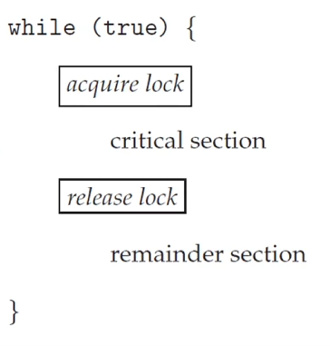

# Chapter 6-1. Synchronization Tools
- 오해하고 있던 사실
```java
static class Producer implements Runnable {
  @Override
  public void run() {
    for (int k = 0; k < 10000; k++) {
      /* entry section */
      flag[0] = true;
      turn = 1;
      while (flag[1] && turn == 1)
        ;

      /* critical section */
      count++;
      
      /* exit section */
      flag[0] = false;

      /* remainder section */
      }
    }
  }

static class Consumer implements Runnable {
  @Override
  public void run() {
    for (int k = 0; k < 10000; k++) {
      /* entry section */
      flag[1] = true;
      turn = 0;
      while (flag[0] && turn == 0)
        ;

      /* critical section */
      count--;
      
      /* exit section */
      flag[1] = false;

      /* remainder section */
    }
  }
}
```
guarantee가 없다 = 아무것도 장담할 수 없어. 보장할 수 없어. 약속할 수 없어.

여기서 producer가 p0 고 consumer가 p1
그래서 flag[0]는 producer가 사용하고 싶어서 buffer에 대기를 거는거고
turn = 1 이 consumer에게 사용권한을 주는 것 (사실상 서로 먼저 이용하라고 양보하는 것과 같음)

그래서 flag가 1이고 turn이 consumer 차례일 때는 대기하고 있다가 consumer가 다 사용하고 나서 flag를 넘겨주면 빠져나오는 것

1. 두 프로세스 모두 flag를 true로 설정하고 다른 프로세스의 flag와 turn을 확인한다고 했을 때 두 프로세스 모두 조건을 충족한다고 판단하면 두 프로세스가 동시에 
critical section으로 진행하여 데이터 불일치가 발생 = 상호 배제가 안됨 = race condition 발생

2. 특정 상황에서 두 프로세스 모두 서로가 critical section을 완료할 때까지 무한 루프에 갇힐 수 있음.


애초에 두 프로세스가 동시에 critical section에 들어가면 프로세스가 parallel 하게 실행되는 것과 같기 때문에 문제가 발생함.

# Chapter 6-2. Synchronization Tools 2 
# 뮤텍스와 세마포어
### Higher-level software tools to solve the CSP
- Software solution : peterson's algorithm
- Hardware solution : test and set / compare and swap

- Mutex Locks
  - 가장 간단한 synchronization 툴
  - 임계 영역에 들어가기 위해 필요한 열쇠
  - 나올 땐 반납
- Semaphore
  - 제일 보편적이고 많이 쓰는 거
  - Mutex lock은 2개만 제어 가능
  - Semaphore는 n개를 제어할 수 있음.
- Monitor
  - Mutex와 semaphore의 단점을 해결한 것
  - Java에서 사용하는 modify 등이 monitor 도구
- Liveness
  - 위에 것들은 상호배제만 해결해 준다
  - liveness는 deadlock 문제까지 해결해 줌

## Mutex Lock
- mutex
  - **mut**ual **ex**clusion(상호 배제)
  - critical section(임계영역)을 보호하고 race condition을 방지함
  - 반드시 critical section에 들어갈 때 열쇠를 얻는 과정과 나올 때 열쇠를 반납하는 과정이 있어야함<br>
  

  - Mutex Locks의 2가지 기능과 1가지 variable
    - acquire() / release()
      - 열쇠를 얻고 반납하는 기능
      - 이 2가지 기능은 반드시 atomic 해야한다.
    - available
      - 열쇠를 누가 가져갔는지 아닌지 확인하는 기능<br>
  

  - busy waiting(바쁜 대기ㅋㅋ)
    - 어떤 프로세스가 critical section에 들어가기 전에 무한로프를 돔
    - single CPU 코어에서 ready queue에 들어갔을 때 쓸데없이 무한로프를 돌아서 CPU가 낭비됨
    - 실제 멀티프로세싱 시스템에서는 이게 큰 문제로 작용함
  - Spinlock
    - 프로세스가 lock이 올때까지 기다리면서 spin 하기 때문에 busy waiting을 하는 mutex lock을 spinlock이라고 함.
    - 이 spinlock이 생각보다 유용할 때가 있음
      - CPU가 여러 개 있으면 한개의 CPU가 공회전 하고 있을 때 다른 CPU가 처리하는 방식을 이용하면 context switch를 할 필요없이 바로 CPU에서 실행시킴.
      - wait queue에서 ready queue 로 context switch 할 필요없어지기 때문에 시간을 오히려 save 할 수 있음
      - Multicore system에서는 Spinlock이 더 유용

```c
void *counter (void *param)
{
    int k;
    for (k = 0; k < 10000; k++) {
      /* entry section */ 
      pthread_mutex_lock(&mutex);
      /* critical section */
      sum++;
      /* exit section */
      pthread_mutex_unlock(&mutex);

      /* remainder section */
    }
    pthread_exit(0);
}

#include <stdio.h> 
#include <pthread.h>

int sum = 0; // a shared variable

pthread_mutex_t mutex;

int main()
{
  pthread_t tid1, tid2;
  pthread_mutex_init(&mutex, NULL);
  pthread_create(&tid1, NULL, counter, NULL);
  pthread_create(&tid2, NULL, counter, NULL);
  pthread_join(tid1, NULL);
  pthread_join(tid2, NULL);
  printf("sum = %d\n", sum);
}
```
- 실행값 : 20000, 20000, 20000, 20000, ... 그럼 20000

## Semaphore
### Semaphore
- semaphore : 신호장치, 신호기

- 정의
  - Semaphore를 S로 사용
  - integer 변수, 초기화의 방법에 따라 2개의 standard atomic operations
  - wait(), signal() / 가끔은 P(), V() 로 쓰임
    - P = Proberen(test), V = Verhogen(increment)
    - 

  - S를 n으로 설정하고 n을 쭉 감소시키다가 S=0 이 되면 진입을 막음
  - n 개의 instance를 가진 자원을 서로 공유할 때 사용

### Binary and Counting Semaphores
- Binary Semaphore
  - 만약 자원이 0이나 1이라면 mutex lock과 같음
- Counting Semaphore
  - 만약 자원이 1 이상이면 무한대로 늘어날 수 있음
  - 그 말은 즉 여러 개의 instance를 가진 자원에 사용할 수 있음

### Using the counting semaphore
- resource를 사용할 때는 wait()를 해서 count 감소
- resource를 다 썼을 때는 signal()을 호출해 count 증가

### Using the semaphore to solve synchronization problem
- S1 바로뒤에 S2를 실행 시키려면 2개가 synchronization 되어있어야함

### Semaphore Implementation
- busy waiting 문제가 발생할 수 밖에 없다.
- 우리는 scheduler를 배웠기 때문에 semaphore가 positive하지 않을 때 busy waiting 문제를 방지하기 위해 waiting queue에 대기시키고 signal을 통해 불러올 수 있다.
- 그렇게 불러온 값을 ready queue에 넣는다.
- 구현
  
  - signal
    - S 가 0보다 작거나 같으면 linked list에서 삭제시키고 wake up 시킴
    - 그래서 waiting queue에서 ready queue로 이동
```c
void *counter (void *param)
{
int k;
for (k = 0; k < 10000; k++) { 
  /* entry section */
  sem_wait(&sem);

  /* critical section */
  sum++;

  /* exit section */
  sem_post(&sem);

  /* remainder section */
  }
  pthread_exit(0);
}

#include <stdio.h> 
#include <pthread.h>
#include <semaphore.h>

int sum = 0; // a shared variable

sem_t sem;

int main()
{
  pthread_t tid1, tid2;
  sem_init(&sem, 0, 1);
  pthread_create(&tid1, NULL, counter, NULL);
  pthread_create(&tid2, NULL, counter, NULL);
  pthread_join(tid1, NULL);
  pthread_join(tid2, NULL);
  printf("sum = %d\n", sum);
}

int main()
{
  pthread_t tid[5]; int i;
  sem_init(&sem, 0, 5);
  for (i = 0; i < 5; i++)
    pthread_create(&tid[i], NULL, counter, NULL);
  for (i = 0; i < 5; i++)
    pthread_join(tid[i], NULL);
  printf("sum = %d\n", sum);
}
```
- binary는 별 문제없이 실행됨.
- Semaphore 가 n 일때는 출력값이 이상하게 나옴 (47618, 46041, 45954, 44408,...)
  - 이게 정상동작임
  - 왜냐하면 semaphore에 열쇠가 5개 있기때문에
  - 열쇠가 5개라서 5개의 thread가 진입하다보니 race condition이 발생함
  - instance 개수는 열쇠의 개수와 같아야함.
  - 그래서 instance 개수별로 진입해서 순서대로 빠져나오는 것을 반복해야함.

### 마무리
- Binary Semaphore 와 Counting Semaphore는 모두 locking에 기반함

## 모니터와 자바 동기화
### The difficulty of using semaphores
- semaphore는 편리하고 효과적이지만 timing error(programming error)가 자주 발생함
- 어떤 특정 sequence를 잘못 쓰면 항상 발생하는 것도 아니고 잡기도 어려운 문제가 자주 발생함

### An illustrative example of semaphore's problem
- wait하고 signal해야하는데 이 순서를 지키지 않으면 어떻게 될까
  - signal을 먼저하면 critical section에 다 들어가버림
  - race condition 발생

- wait를 두번하거나 해서 signal을 호출하지 않았을 때도 마찬가지

### How to deal with these kinds of difficulties
- 살다보면 별의 별 일 다 생김...
- 이 문제들을 해결하는 가장 좋은 방법
  - 이렇게 쓸 가능성을 낮춰주는 것
  - 가장 simple한 synchronization tool을 사용하자 = monitor

## Monitors
### Monitor
- high level의 동기화 도구의 가장 기초적인 방법
- monitor type
  - 어떤 mutual exclusion을 제공해주는 하나의 데이터 타입
  - 하나의 class라고 생각해도 됨
  - 어떤 variable을 선언하고 해당 variable에 해당된 instance를 호출하도록 함.


### Conditional Variables
- 모니터가 자체적으로 synchronization을 풀기에는 부족한 점이 있음
- 그래서 condition이라는 variable을 도입함.

### Java Monitors
- Java의 동기화를 이해해야 함
- Java에서는 monitor lock / intrinsic lock을 사용함
- thread synchronization을 위한 concurrency mechanism으로 monitor를 사용한다.

- 알아야 할 2가지
  - **synchronized** 
  - **wait()** / **notify()**

### synchronized keyword
- 임계영역에 해당하는 코드 블록을 선언할 떄 사용하는 자바 키워드
- 해당 코드 블럭(임계영역)에는 모니터락을 획득해야 진입 가능
  - 열쇠를 받아야 진입, 나올때는 반납
- 모니터락을 가진 객체 인스턴스를 지정할 수 있음
- 메소드에 선언하면 메소드 코드 블록 전체가 임계영역으로 지정됨
  - 이 때, 모니터락을 가진 객체 인스턴스는 this 객체 인스턴스임

```java
synchronized (object){
  // critical section
}

public synchronized void add(){
  // critical section
}
```
- 와 자바는 멋있다.(그치 예진아)

### wait() and notify() methods
- java.lang.Object 클래스에 선언됨: 모든 자바 객체가 가진 메소드임

- 쓰레드가 어떤 객체의 wait() 메소드를 호출하면
  - 해당 객체의 모니터락을 획득하기 위해 대기 상태로 진입함.

- 쓰레드가 어떤 객체의 notify() 메소드를 호출하면
  - 해당 객체 모니터에 대기중인 쓰레드 하나를 깨움

- notify() 대신에 notifyAll() 메소드를 호출하면
  - 해당 객체 모니터에 대기중인 쓰레드 전부를 깨움

### Example 1


### Example 2


### Example 3


### Example 4


### Example 5


- 모니터는 개념적으로 이해해두기

## Liveness
### Liveness
- 지금까지 배운 것들은 상호배제만 제공해 주고 starvation, deadlock은 해결이 안됨
- 그거까지 해결해 주는게 liveness...? (아니 해결되는거 앞으로도 없다매요)

- 아직 그렇게 볼 필요는 없고 2가지만 보자
  - deadlock
  - priority inversion

### Deadlock
- 8장가면 자주 볼것(맛만 보기)

- 교착상태를 일으키는 가장 기본적인 형태


### Priority Inversion (우선순위 역전)
- 우선순위가 있는 프로세스가 높은 우선순위가 낮은 우선순위에게 밀리는 현상
  - 말그대로 역전
  - lower-priority process가 synchronization이 되어있으면 그걸 밀어낼 수가 없음
    - TV 보는 아들... (하준아...)
    - 리모콘을 놓고 갈 때까지 아빠가 기다림...
- 해결법
  - priority-inheritance protocol
    - 엄마를 불러라...
    - low priority를 high priority로 복사해줘라