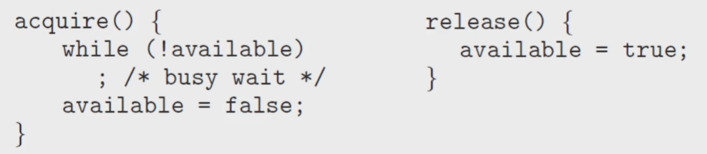

# 13 뮤텍스와 세마포어
## Mutex locks
### Higher-level software tools to solve the CPS:
- soft : Peterson
- hard : Atomic variable
    - 둘 다 실전에서는 사용하기 어려움
- _Mutex Locks_ : the simplest tools for synchronization
    - 임계영역에 접근하려면 열쇠가 필요하게 만들어버림
    - 두개만 있다고 생각했을 때 가장 간단
- _Semaphore_ : more robust, convenient, and effective tool
- _Monitor_: overcomes the demerits of mutex and semaphore
    - 요즘에 다 이거 씀
    - 위 모두 상호 배제 문제만 해결해줌.
- _Liveness_ : ensures for processes to make progress
    - 얘는 deadlock 까지 해결
### Mutex Lock
- *mutex* : **mu**tal **ex**clusion
- to protect critical section and prevent race condition
- a progress must _acquire_ teh ***lock*** before _entering_ a critical section
- _release_ the ***lock*** when it exits the critical section
### Two functions and one variable for the Mutex Locks:
- acquire() and release()
- availabe : a Bollean variable whose value indicates 
    - if the lock is available or not
### The definition of acquire() and release(): 
 

- 다시 3번
- Calls to either acquire() and release() must be preformed _atomically_
- can be implemented using the *compare_and_swap* operation

### Busy waiting : 바쁜대기
- Any other process trying to enter its critical section
    - must _loop continuously_ in the call to acquire()
- busy waiting is clearly a _problem_ in a real multiprogramming system,
    - where a single CPU core is shared among many processes
    - _waste CPU cycles_ for some other processes to use productively
- 이걸 막는게 가장 중요함
### Spinlock: 
- the type of mutex lock using the method of _busy waiting_
- the process _spins_ while waiting for the lock become available
- However, spinlocks do have an _advantage_
    - in that _no context switch_ is required waiting on a lock
    - a context switch may take considerable time
- busy waiting 하고 있으면 context switch 가 안일어나서 그거 쓰는 시간이 걸림
- ready queue 갈 시간을 아낄 수 있다
- 여러개의 CPU를 사용하고 있을 경우에
- Incertain circumstances _on multicore systems_
    - spinlocks are the _preferable_ choice for locking
    - One thread can _spin_ on one _processing core_
    - while another thread performs its critical section _on another core_
- 구현 
 

- lock &rarr; onlock 의 구조를 반복
- 간단한건 이걸로 컷 / 개잘되네 ㄷ

## Semaphores
### Semaphore
- 의미 : **신호장치, 신호기**
- e.g. 간단한 예제 
 

### Defining the Semaphore
- A _semaphore_ S is
    - an integer variable that, apart from initialization
    - is accessed only through _two standard atomic operations_
    - **wait()** and **signal()**, or sometimes **P()** and **V()**
- P() and V() are introduced by Edsger Dijkstra(독일사람임)
    - Proberen(to test) and Verhogen(to increment) 아마 독일어인듯
### Definition of wait() and signal()
 

- All _modifications_ to the integer value of the semaphore
    - in the wait() and signal() operations must be executed _atomically_
- S가 10일때 감소시키는걸로 해야겠네 머임
- 열쇠가 한개가 아니라 꾸러미가 있는거임
    - 열쇠 락커가 여러개 있고 맞는데 가져다 쓰는 느낌
    - 다쓰면 이제 진입못하게 하고 밖에서 대기하게 함
    - 비선점형 방식이랑 비슷한듯?
### Binary and Counting Semaphores
- n 개의 인스턴스를 가진 자원을 공유할 때 사용 가능
- _Binary_ semaphore
    - range only between 0 and 1 : similar to _mutex_lock_
- _Counting_ Semaphore
    - range over an unrestricted domain
    - can be used to resources with _a finite number of instances_
### Using the counting semaphore
- _Initialize_ a semaphore to _the number of resources available_
- When a process uses a reousrce
    - _wait()_ on the semaphore:  _decrement_ the count
- When a process release a resource
    - _signal()_ on the semaphore: _increment_ the ount
- When the count goes to 0, all resources are being used
    - The, processes that wish to use a resource _will block_
    - _unitl_ the count becomes _greater than 0_
### Using the semaphore to solve synchronization problem
- Consider two processes $P_1$ and $P_2$ running concurrently
    - $P_1$ with a statement $S_1$, and $P_2$ with a statement $S_2$
- Suppose that $S_2$ should be _executed only after_ $S_1$ has completed
    - Let $P_1$ and $P_2$ share a _semaphore_ **synch**, initialized to 0.
    - 초기화를 0으로 해서 순서대로 진행될 수 밖에 없음
### Semaphore Implementation:
- Semaphores alos suffer from the problem of _busy waiting_
- To overcome this problem, modify the definition of P() and V()
- WHen a process executes the **wait()** operation
    - and finds that the semaphore _is not positive_, it must wait
    - rather tahn busy waiting, suspend itself and goes to the _waiting queue_
- When other process executes the **signal()** operation
    - waiting processes can be _restarted(wake up)_ and placed into the _ready queue_
- impl 
 
 

- S = n 으로 구현 / Counting Semaphore 
     
    - 얘는 좀 망가지네 &rarr; 이게 정상임
    - 왜냐, 열쇠가 5개임 지금. 그래서 race condition이 그대로 발생 했음. 상호배제 실패함
    - n개의 instance 가 없어서 이런 게 발생
    - n을 S로 사용할 때, 인스턴스의 개수와 동일해야 함
    - n을 다시 1로 바꾸면 binary semaphore 가 되니까 정상적으로 작동함.
- 위 모든 건 locking 을 기반으로 구현