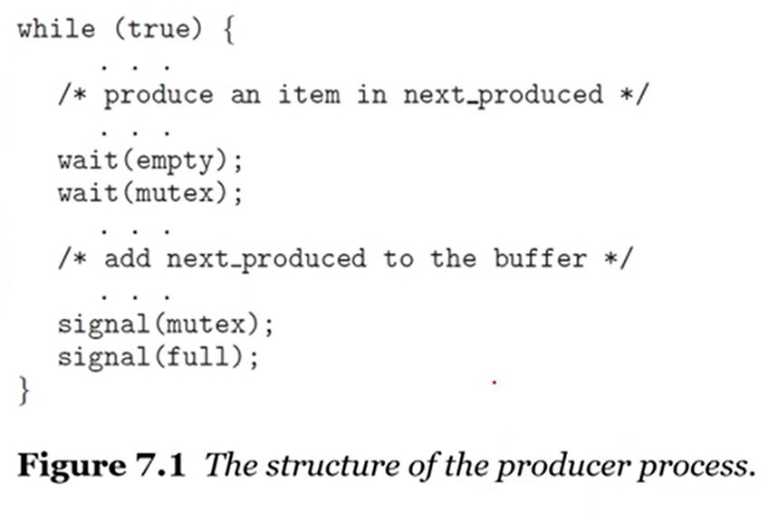
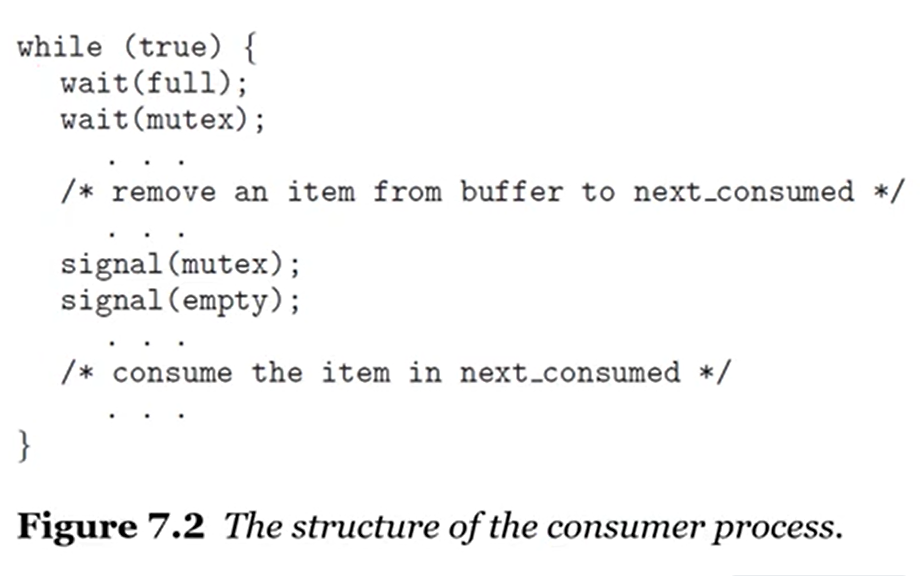
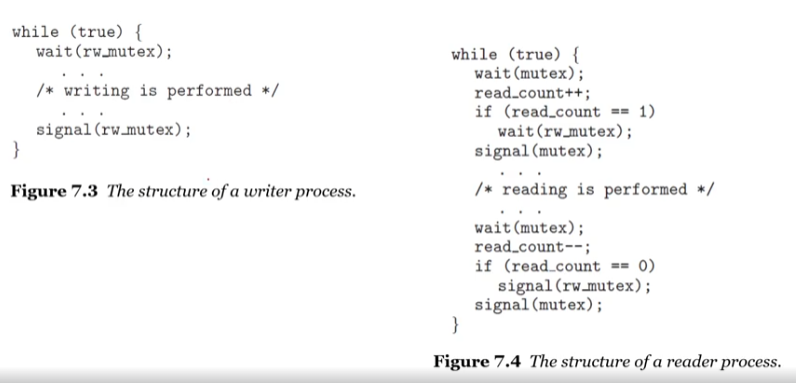
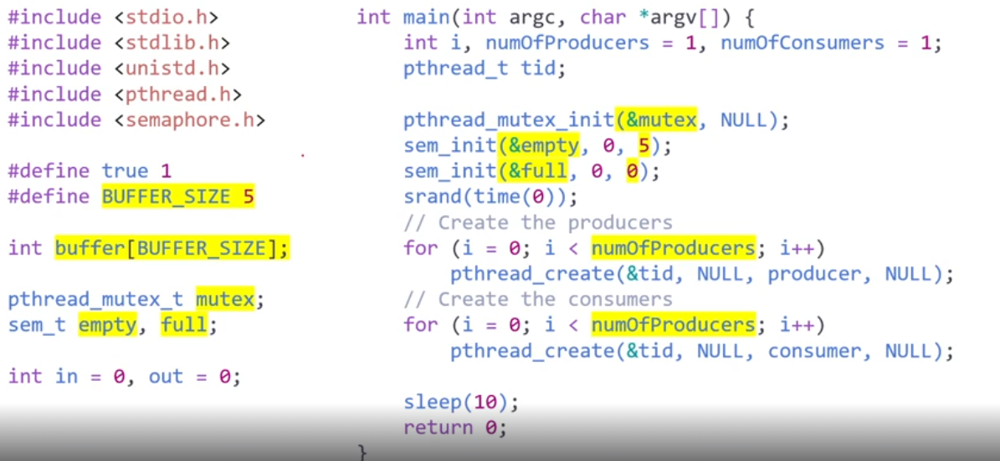
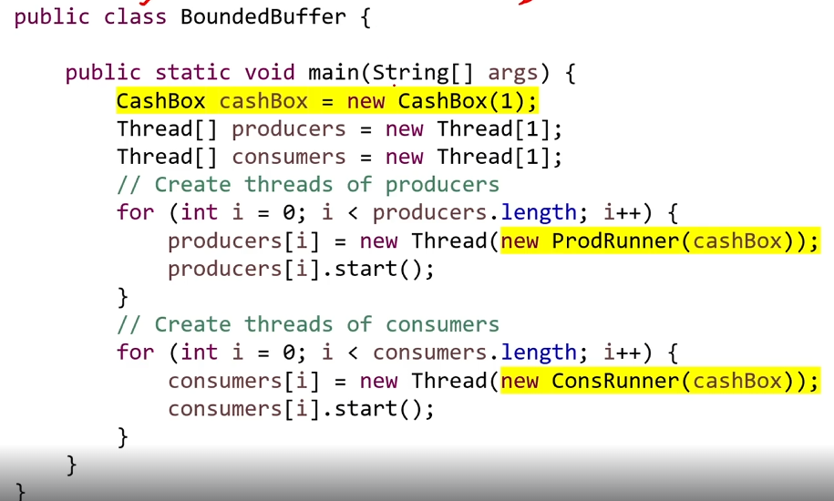

# 동시성 제어의 고전적인 문제들
교수님 : 좀 재밌을 거에요~ 머리는 아프지만
## Classic Problems of Synchronization
### Examples of a large class of Concurrency-Control Problems
- 동시성을 제어하는 문제들
  - Bounded-Buffer
    - 대표적인 문제
    - 생성자 - 소비자 문제를 유한 버퍼(bounded-buffer)로 해결할 때 어떻게 되는지
  - Readers-Writers
    - 이것도 재밌어요
  - Dining-Philosophers
    - 가장 재미있는 거
    - 철학자들이 저녁식사하다가 다 죽었어요
    - 저번에 풀었던 젓가락 문제 그거인듯
  
#### Bounded-Buffer Problem
- producer-consumer problem
  - producer가 계속 생산해내고 consumer는 계속 소비
  - 공유된 자원을 통해서 data를 주고 받음
  - producer는 버퍼를 가득 채우는 것이 목표
  - consumer는 버퍼를 계속 비워주는 것이 목표 <br>



  - shared data Structures
    - binary semaphore mutex
      - 버퍼 pool에 접근할 때 동시에 접하면 mutual exclusion 발생
      - 1로 초기화
    - counting semaphores empty and full
      - empty / full 버퍼의 개수를 세기위해서 사용
      - empty는 n으로 설정하고 감소시킴
      - full은 0으로 설정하고 증가시킴

- Readers-Writers Problem
  - 대부분 shared-data에는 read와 write에 포함되어 있지만 RW problem은 다름
  - 여러개의 프로세스 들이 어떤 건 읽기만 하고 어떤건 둘 다 함.
    - DB에서 select, update 등

  - 만약 2개 이상의 reader가 동시에 접근한다고 했을 때는 문제가 되지 않는다.
  - 근데 2개 이상의 writer 혹은 writer와 reader가 동시에 접근하면 문제가 발생한다.

### Some Variations of the Readers-Writers Problem
- 우선 순위와 관련된 개념들
- 첫 번째 문제
  - reader는 writer가 write 하고있다고 해서 무조건 wait하면 안된다.
- 두 번째 문제
  - writer한테 무조건 우선순위를 주기
  - 다른 reader들의 진입을 막음
  - 훨씬 강력하지만 훨씬 복잡함
- 이런 방법들은 starvation이 잘 일어남

### Solution to the first readers-writers problem
```java
semaphore rw_mutex = 1;
semaphore mutex = 1;
int read_count = 0;
```
- rw_mutex를 read write에 공유해서 사용하고
- mutex를 mutual exclusion을 보장하는데 사용하자
- read_count 가 증가할 때 critical section

 <br>
- scheduler가 reader와 writer 중 누가 들어갈 지 결정해줌

### The Reader-Writer Locks
- 예시를 열심히 공부할 필요 없는 이유
- Mutex Lock 처럼 reader-writer lock을 만들자
- reader-writer lock 을 획득 할 때
  - read 냐 write 냐 를 지정
  - reader lock을 획득하면 여러 개가 진입가능
  - write가 획득하면 1개만 진입가능하게 만듬
- exclusive access가 writer에서는 보장이 되기 때문에 문제없음

 <br>
- empty는 n으로 초기화(Buffer_size로)
- full은 0으로 초기화

- buffer가 1개인데도 consumer가 2번 실행이 됨

 <br>
