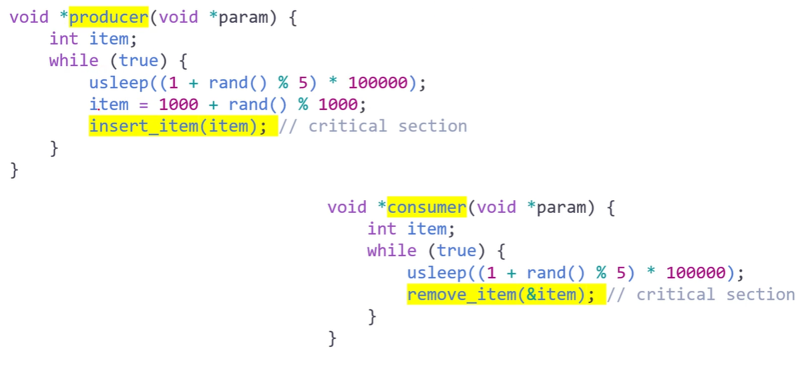

# 동시성 제어의 고전적 문제들
- 재밌을 거임 ㅋㅋ
## Classic Problems of Synchronization
### e.g. of a large class of _Concurrentcy-Control_ probs.:
- The _Bounded-Buffer_ Problem
    - The Producer-Consumer Prob
- The _Readers-Writers_ Prob
- The _Dining-philosophers_ Prob
- 대표적인 동기화 문제들
### The Bounded-Buffer PRob
- Recall the Producer-Consumer Prob
    - with a pool consisting of _n buffers_, each capable of _holding one_ item
- The producer _produces full buffers_ for the consumer
    - The consumer _produces empty buffers_ for the producer
### Shared Data Structers:
- A binary semaphore **mutex**
    - provides _mutual exclusion_ of accesses to the buffer pool
    - and is _initialized_ to the value 1
- 2 _counting semaphores_ **empty** and **full**
    - are used to _count_ the number of _empty_ and _full_ buffers
    - empty is initialized to the value _n_, full is to the value 0
```c
int n;
semaphore mutex = 1;
semaphore empty = n;
semaphore full = 0;
```
<br>
<br>

- 완벽히 대칭구조가 맞춰져 있어야 가능
- 어려워서 안씀 ㅋ

### The Readers-Writers Prob
- What if the _processes_ running concurrently
    - are ither the ***readers*** or the ***writers*** to the _shared_ data?
    - e.g., a _database_ shared among several concurrent processes
    - 이러면 문제가 달라짐
- The _reader_ may want _only to read_ the database,
    - whereas the _writers_ to _update_(that is, _read and write_) the database
- Note that, obvisouly, _no adverse effects_ will result,
    - if _two or more readers_ access the shared data simultaneously
    - 데이타가 안깨지면 됨 reader 들은 안함
- However, _chaos_ may ensue,
    - if _a writer_ and some other process(either a _reader or a writer_)
    - access the database simultaneously
    - 혼돈의 카오스 ㄷㄷ
### Some Variations of the Readers-Writers Probs
- _Priorities_ are involved with all the variations
- The _first_ readers-writers prob
    - _No readers_ should _wait_ for other readers to finish
    - simply beacuse a _writer_ is _waiting_
    - reader 와 writer에게 공평한 권한을 줘서 access 하게 해 줘야함
- The _second_ readers-writers prob
    - If a _writer_ is waiting to access the object
    - _no new readers_ may start _reading_
    - write를 해야하는데 reader에 밀려서 못하는 경우
- Note that _starvation_ may occur in these two cases
    - writer에게 모든 우선순위를 줘버리면 읽지를 못함
    - reader가 개많은데 writer 우선순위를 같이 줘버리면 쓰지를 못함
### Solution to the _first_ readers-writers prob
- The reader processes share the following data structures
```c
semaphore rw_mutex = 1; // 둘다 binary 인듯, 이것도 critical section 보호긴 한데..
semaphore mutex = 1; // critical section 보호를 위한 것
int read_count = 0;
// reader의 갯수가 0이 되면 진입하게 하는거
```
- **rw_mutex** is _common_ to both readers and writers
- **mutex** is used to ensuer _mutual exclusion_
    - when the variable **read_count** is updated
- **read_count** keeps trap of
    - how many processes are currently reading the object<br>

<br>

### Solution to Readers-Writers Prob
- Note that, if _a writer_ is in the _critical section_, and _n_ readers are waiting
    - then _one reader_ is queued on **rw_mutex**
    - and $n - 1$ _readers_ are queued on **mutex**
- Also observe that, when a writer executes **signal(rw_mutex)**,
    - we may resume the execution of
    - either the _waiting readers_ or _a single waiting writer_
    - The selection is made by the _scheduler_
        - 공평하게 주면 1번 sol
        - writer한테 주면 2번 sol
### The Reader-Writers Locks
- api 있음
- The readers-writers prob and its solutions
    - have been _generalized_ to provide _reader-writer locks_
- Acquiring a reader-writer lock
    - requires specifying the mode of the lock : either _read_ or _write_
- Note that
    - _multiple processes_ may acquire _a reader-writer lock_ in the read mode,
    - but _only one process_ may acquire the _lock for writing_
    - as exclusive access is required for writers
- 개념만 살펴볼거임 뒤에서
### PThread solution to the Bounded-Buffer Prob

<br>
<br>
<br>

- producer 하고 producer 실행 되는 경우가 간혹 있음
- consumer 후 consumer 역시 발생
- 버퍼가 5개일 때 발생, 1개로 줄여도 역시 마찬가지로 발생
- consumer와 producer를 하나씩만 넣으면 잘 돌아감
- buffer가 한개일 때랑, n 개일 때랑
- producer & consumer가 1개일때랑, n 개일때랑
- 뭐 그런 상황에서 동기화문제는 안생김??????? 생기는데? 니가 생기는거 보여줬잖아
- 어쩌라는거지
- 아 한개씩일때는 안생겼다 이건가


### Java solution to the Bounded-Buffer Prob
<br>
<br>
<br>
<br>
<br>
<br>

- 자바는 동기화 굉장히 간단
- instance 가 monitor lock 을 획득해서 따로따로 돌아감
- 동기화도 잘됨
- 드디어 notify와 wait 가 등장했네요 엄.예진씨
- notify는 signal 역할
- 용돈박스 단 하나
- 외아들한테 용돈을 주는 구조
- producer 와 cosumer가 하나씩이라 문제가 없음
- consumer가 여럿이여도 문제는 딱히 없음
- producer 5, cash box 5, consumer 5 이면
    - producer가 연속으로 나오거나, consumer가 연속으로 나오는 경우가 있음
    - 근데 충돌이나거나  뭐 그런게 없음
    - 먼소린지 알겠지
    - 뭔 소린데
    - 표시는 안해놔서 그렇지 producer와 consumer가 각각 다 다른 거 인듯
    - 마킹 해놓고 돌리면 다른 결과가 나올거같네요

### Java solution to the first Readers-Writers Prob
<br>
<br>
<br>

- notifyAll 은 젤 앞에있는거 하나만 readyqueue에 넣는게아니라 전부 경쟁해서 들어가게함
    - 공평하게 들어가게 할라고 한거임

