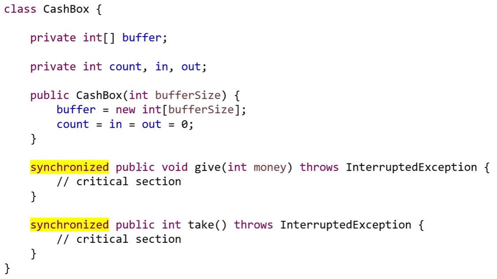
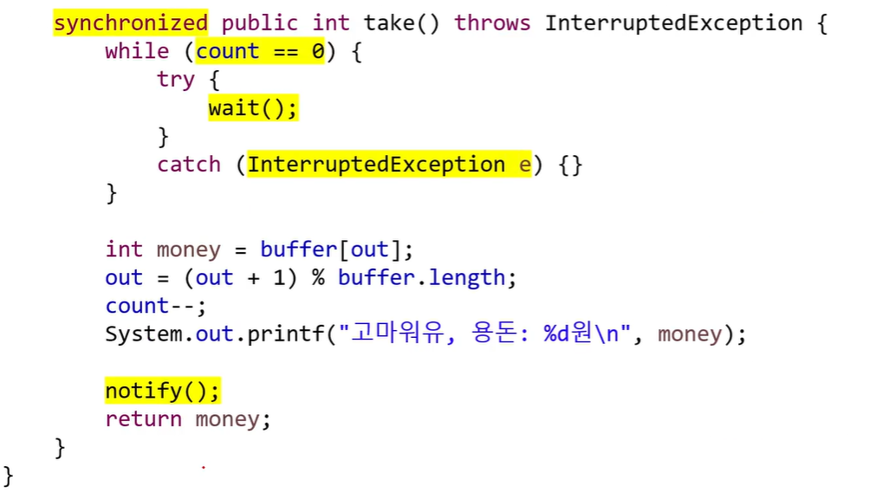
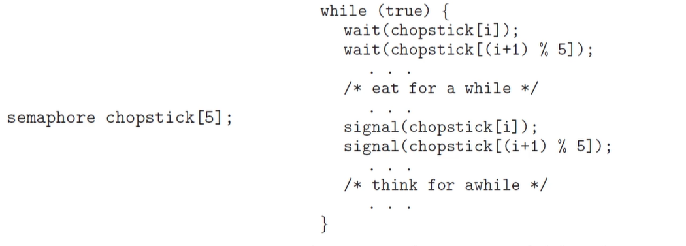
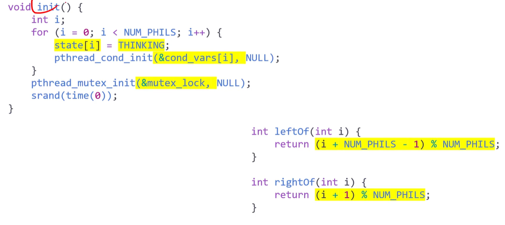
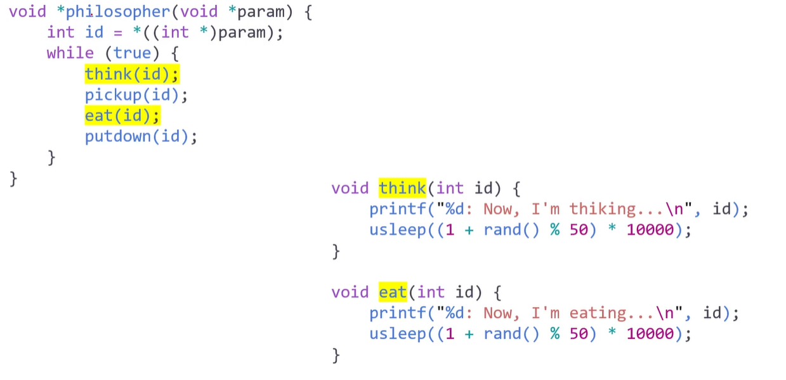
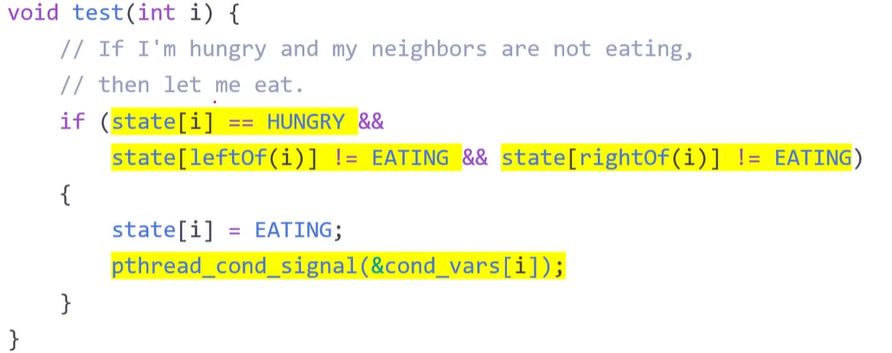

# 동시성 제어의 고전적 문제들
- 재밌을 거임 ㅋㅋ
## Classic Problems of Synchronization
### e.g. of a large class of _Concurrentcy-Control_ probs.:
- The _Bounded-Buffer_ Problem
    - The Producer-Consumer Prob
- The _Readers-Writers_ Prob
- The _Dining-philosophers_ Prob
- 대표적인 동기화 문제들
### The Bounded-Buffer PRob
- Recall the Producer-Consumer Prob
    - with a pool consisting of _n buffers_, each capable of _holding one_ item
- The producer _produces full buffers_ for the consumer
    - The consumer _produces empty buffers_ for the producer
### Shared Data Structers:
- A binary semaphore **mutex**
    - provides _mutual exclusion_ for accesses to the buffer pool
    - and is _initialized_ to the value 1
- 2 _counting semaphores_ **empty** and **full**
    - are used to _count_ the number of _empty_ and _full_ buffers
    - empty is initialized to the value _n_, full is to the value 0
```c
int n;
semaphore mutex = 1;
semaphore empty = n;
semaphore full = 0;
```
<br>
<br>

- 완벽히 대칭구조가 맞춰져 있어야 가능
- 어려워서 안씀 ㅋ

### The Readers-Writers Prob
- What if the _processes_ running concurrently
    - are ither the ***readers*** or the ***writers*** to the _shared_ data?
    - e.g., a _database_ shared among several concurrent processes
    - 이러면 문제가 달라짐
- The _reader_ may want _only to read_ the database,
    - whereas the _writers_ to _update_(that is, _read and write_) the database
- Note that, obvisouly, _no adverse effects_ will result,
    - if _two or more readers_ access the shared data simultaneously
    - 데이타가 안깨지면 됨 reader 들은 안함
- However, _chaos_ may ensue,
    - if _a writer_ and some other process(either a _reader or a writer_)
    - access the database simultaneously
    - 혼돈의 카오스 ㄷㄷ
### Some Variations of the Readers-Writers Probs
- _Priorities_ are involved with all the variations
- The _first_ readers-writers prob
    - _No reader_ should _wait_ for other readers to finish
    - simply beacuse a _writer_ is _waiting_
    - reader 와 writer에게 공평한 권한을 줘서 access 하게 해 줘야함
- The _second_ readers-writers prob
    - If a _writer_ is waiting to access the object
    - _no new readers_ may start _reading_
    - write를 해야하는데 reader에 밀려서 못하는 경우
- Note that _starvation_ may occur in these two cases
    - writer에게 모든 우선순위를 줘버리면 읽지를 못함
    - reader가 개많은데 writer 우선순위를 같이 줘버리면 쓰지를 못함
### Solution to the _first_ readers-writers prob
- The reader processes share the following data structures
```c
semaphore rw_mutex = 1; // 둘다 binary 인듯, 이것도 critical section 보호긴 한데..
semaphore mutex = 1; // critical section 보호를 위한 것
int read_count = 0;
// reader의 갯수가 0이 되면 진입하게 하는거
```
- **rw_mutex** is _common_ to both readers and writers
- **mutex** is used to ensure _mutual exclusion_
    - when the variable **read_count** is updated
- **read_count** keeps track of
    - how many processes are currently reading the object<br>

<br>

### Solution to Readers-Writers Prob
- Note that, if _a writer_ is in the _critical section_, and _n_ readers are waiting
    - then _one reader_ is queued on **rw_mutex**
    - and $n - 1$ _readers_ are queued on **mutex**
- Also observe that, when a writer executes **signal(rw_mutex)**,
    - we may resume the execution of
    - either the _waiting readers_ or _a single waiting writer_
    - The selection is made by the _scheduler_
        - 공평하게 주면 1번 sol
        - writer한테 주면 2번 sol
### The Reader-Writers Locks
- api 있음
- The readers-writers prob and its solutions
    - have been _generalized_ to provide _reader-writer locks_
- Acquiring a reader-writer lock
    - requires specifying the mode of the lock : either _read_ or _write_
- Note that
    - _multiple processes_ may acquire _a reader-writer lock_ in the read mode,
    - but _only one process_ may acquire the _lock for writing_
    - as exclusive access is required for writers
- 개념만 살펴볼거임 뒤에서
### PThread solution to the Bounded-Buffer Prob

<br>
<br>
<br>

- producer 하고 producer 실행 되는 경우가 간혹 있음
- consumer 후 consumer 역시 발생
- 버퍼가 5개일 때 발생, 1개로 줄여도 역시 마찬가지로 발생
- consumer와 producer를 하나씩만 넣으면 잘 돌아감
- buffer가 한개일 때랑, n 개일 때랑
- producer & consumer가 1개일때랑, n 개일때랑
- 뭐 그런 상황에서 동기화문제는 안생김??????? 생기는데? 니가 생기는거 보여줬잖아
- 어쩌라는거지
- 아 한개씩일때는 안생겼다 이건가


### Java solution to the Bounded-Buffer Prob
<br>
<br>
<br>
<br>
<br>
<br>

- 자바는 동기화 굉장히 간단
- instance 가 monitor lock 을 획득해서 따로따로 돌아감
- 동기화도 잘됨
- 드디어 notify와 wait 가 등장했네요 엄.예진씨
- notify는 signal 역할
- 용돈박스 단 하나
- 외아들한테 용돈을 주는 구조
- producer 와 cosumer가 하나씩이라 문제가 없음
- consumer가 여럿이여도 문제는 딱히 없음
- producer 5, cash box 5, consumer 5 이면
    - producer가 연속으로 나오거나, consumer가 연속으로 나오는 경우가 있음
    - 근데 충돌이나거나  뭐 그런게 없음
    - 먼소린지 알겠지
    - 뭔 소린데
    - 표시는 안해놔서 그렇지 producer와 consumer가 각각 다 다른 거 인듯
    - 마킹 해놓고 돌리면 다른 결과가 나올거같네요

### Java solution to the first Readers-Writers Prob
<br>
<br>
<br>

- notifyAll 은 젤 앞에있는거 하나만 readyqueue에 넣는게아니라 전부 경쟁해서 들어가게함
    - 공평하게 들어가게 할라고 한거임

# 철학자들은 왜 굶어 죽었을까?
## Classic Probs of Synchronization
### The _DIning-Philosophers_ Prob
- Consider _five philosophers_ who spend their lives _thinking_ and _eating_
    - share _five single chopsticks_
- Sometimes, a philosopher gets hungry
    - and tries to pick up _two chopsticks_ that are closet to her
- When a hungry philosopher has _both her chopsticks_ at the same time
    - she eats _without releasing_ the chopsticks<br>
<br>

- need to allocate _several resources_ among _several processes_
    - in a _Deadlock-free_ and _starvation-free_ manner
    - 다 다른 리소스, 프로세스임
    - 지금까지 상호배제를 만들어주는건 많이 함
    - 근데 데드락, 기아 문제는 해결 못해봄

### Semaphore Sol
- One simple sol. is to represent each chopsitck with a semaphore
    - A philosopher _acquires_ a chopsitck by executing a _wait()_ operation
    - She _realease_ her chopsticks by executing a _signal()_ operation<br>
    <br>
### The prob of _deadlock_ and _starvation_
- Simple semaphore sol. guarantees _mutual exclusion_
- However, how about deadlock or starvation?
    - Suppose that all five philosophers become hungry at the same time
    - and each grabs her left chopsticks, trying to grab her right chopstick
    - Here comes a deadlock situation
### Possible _Remedies_ to the deadlock prob
- Allo _at most four philosophers_ to be sitting simultaneously at the table
    - 철학자의 숫자를 제한할 수 없으면 못할듯
- Allow a philosopher to pick up her chopsticks
    - only if _both chopsticks_ are available
- Use an _asymmetric_ sol.
    - an _odd-numbered_ philosopher picks up first her _left chopsticks_ and then her _right chopstick_
    - whereas an _even-numbered_ philosopher picks up her _right chopstick_ and the her _left chopstick_
    - 동시에 잡는건 아님(상호배제 상태이니까) 그래서 식사 가능
- Note that a deadlock-free sol.
    - does not necessarily eliminate the possibility of _starvation_
    - deadlock은 방지하는 비용이 너무 커 그니까 피하고 발생하면 해갸ㅕㄹ하자

### Monitor Sol.
- 양쪽의 젓가락이 가능할 때만 집게하는거. 위에 두번째꺼
- Let a philosopher to pick up her chopstick
    - only if _both_ of them are _available_
- We need to distinguish among _three states_ of the philosophers
    - _thinking, hungry,_ and _eating_
- A philosopher can _Set_ her state to be _eating_
    - only if her _two neihbors_ are _not in_ the state of _eating_
- We also need a _condition variable_ which
    - allows philosopher to _delay_ herself when she is _hungry_
    - but is _unable to obtain_ the chopsticks she needs
### Sol. to the Dining-Philosophers Prob
- The distribution of the chopsticks
    - is controlled by the monitor, ***Dining Philosopher***
- Each philosopher must to invoke the operation _pickup()_
    - before starting to eat, suspending the philosopher process
- After the successful comletion of pickup()
    - the philosopher may eat, and invokes the operation _putdown()_
- Note that
    - _mutual exclusion_ is guaranteed and _no deadlocks_ wil occur
    - however, _starvation_ is still _possible_

<br>
<br>
<br>

### Pthread sol. to the Dining-Philosophers Prob
<br>
<br>
<br>
<br>
<br>
<br>
<br>

- 5만 명에서 죽었는데, 아마 thread 생성단에서 생긴듯
- deadlock 생성은 pickup 할때랑 putdown 할때 lock 을  안해버리면 댐
    - 아마 eat 하는 시간이랑, think 하는 시간이 길어서 그런듯
    - deadlock 안걸리는데 ㅋㅋ 아마 걸리는게 맞을듯
- 자바가 어디갔지.. 

## 7.5 Alternative Approaches
### Thread-Safe Concurrent Applications
- _Concurrent applications_ have good peformance on multicore systems
    - using techniques such as _mutex locks, semaphores,_ and _monitors_
- However, they present an increased risk of
    - _race conditions_ and _liveness harzards_ such as _deadlock_
- There are alternative approaches
    - for the design of _thread-safe concurrent_ applications

1. Transactional Memory
    - atomic operation, 입 / 출금, 메모리 영역 자체를 트랜젝션하게 만드는 거
2. OpenMP
    - #pragma omp 이렇게 배움
    - #pragma omp critical 하면 critical section 으로 만들어버림
3. Functional Programming Language
    - 함수형 프로그래밍을 하면 이런일이 아예 발생을 안함
    - 이건 다 명령형(imperative) 프로그래밍을 해서 그럼
        - 명령형은 cpu가 있고 memory가 있고 뭐 그런거
    - Scalar, E?, hasckl, pyhton, java 뭐 이런거
        - 모든 것을 다 함수로
        - 함수로 다 해버림
        - 함수 만능설
        - 둘이 완전 다름
            - 영어랑 한국어가 다른것처럼 다름
            - 사고방식 자체가 우리와 아예 다릅니다.
        - 하드웨어 속도로 다 커버칠 수 있으니까 상관없음 ㅋㅋ
        - 그니까 기회되면 공부해봐라


