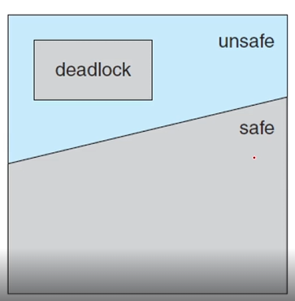

# 데드락의 이해
- 가장 어려운 파트
- 기다리고 기다린 빌어먹을 데드락
## System Model
### A deadlock is
- 일단 시작부터 무슨 소리 하시는지 못알아먹겠고
- 어떤 프로세스들이 야기할 수 있는 이벤트
- 다른 프로세스가 interrupt를 걸어주기를 바라는 상태에서 그 event를 waiting 하고 있으면~

- 8장부터는 thread라는 말을 많이 쓸거임
- waiting thread가 다시는 자기 상태를 바꾸지 못하고 wait 상태에서 대기만 함
  - 어떤 resource가 다른 wait하는 thread에 의해 점유되어 있을 때

### Let us consider a system
- 자원을 가지고 있는 system을 생각해 보자
  - 이 자원들이 여러개의 thread들에 의해 공유되고 있을 때
- resource를 여러 개의 type으로 구분할 수 있음
  - identical instance 가 여러개 있음
  - 예시로는 CPU cycles, files, I/O devices 들이 있음
- 자원의 타입들이 같다면 어떤 instance를 할당해줘도 만족하는 resource type과 안에 들어가 있는 instance가 중요
  - resource가 몇 개 있는지는 중요하지 않음
- thread가 resource를 요청할 때
  - request - use(critical section) - release
  - instance가 여러 개라 critical section에 여러 개의 자원이 들어갈 수 있음

## Deadlock in Multithreaded Applications
### How can a deadlock occur?
```c
/* thread_one runs in this function */
pthread_mutex_t first_mutex;
pthread_mutex_t second_mutex;

pthread_mutex_init(&first_mutex, NULL);
pthread_mutex_init(&second_mutex, NULL);

void *do_work_one(void *param)
{   
    pthread_mutex_lock(&first_mutex);
    pthread_mutex_lock(&second_mutex);
    /**
     * Do some work
     */
    pthread_mutex_unlock(&second_mutex);
    pthread_mutex_unlock(&first_mutex);

    pthread_exit(0);
}


/* thread_two runs in this function */
void *do_work_two(void *param)
{
    pthread_mutex_lock(&second_mutex);
    pthread_mutex_lock(&first_mutex);
    /**
     * Do some work
     */
    pthread_mutex_unlock(&first_mutex);
    pthread_mutex_unlock(&second_mutex);

    pthread_exit(0);
}
```
- request하고 release하는 순서가 반대임
- 두 코드를 봤을 때 처음부터 각각 다른 mutex를 request해서 가지고 있는 상태
  - deadlock이 발생하기 쉬운 코드임 

## Deadlock Characterization
### Four Necessary Conditions
1. Mutual Exclusion
  - 상호배제 조건
  - 적어도 한 개의 resource가 non-sharable 할 때 일어남
    - 예를 들어 파일 하나를 전부 reader가 읽기만 할 때 deadlock 걱정을 할 필요가 없음
    - 적어도 writer가 한 개는 있어야 non-sharable 해짐

2. Hold and Wait
  - 점유 대기
  - 어떤 thread가 최소 1개 이상의 thread를 hold하고 있어야 문제가 일어남
  - thread가 아무런 resource를 가지고 있지 않으면 문제가 일어날 일이 없음

3. No preemption
  - 선점 불가
  - 예를 들어 스케쥴러가 CPU라는 자원을 뺏어버리면(선점해버리면) 문제가 발생하지 않음
  - 어차피 강제적으로 가져가는 거라 deadlock이 일어날 수가 없음

4. Circular Wait
  - 원형으로 대기
  - waiting thread를 dependency graph 형태로 그렸을 때 원형일 때 발생
    - 여러 개의 thread가 원형으로 서로를 기다리는 형태에서 발생

- 4개의 조건이 deadlock의 필수 조건임
  - 4개가 다 만족할 때만 deadlock
  - 아주 억지로 만들지 않는 이상은 만들기가 쉽지 않음
  - 자주 발생하지도 않음

### Resource-Allocation graph
- 자원 할당 그래프
- 방향성 그래프인데 deadlock을 정확하고 쉽게 이해하기 위해서 만들어보는 graph
 
- Vertex 집합은 V, Edge 집합은 E라고 했을 때
- V의 node는 2가지 형태가 있음
  1. thread 집합 (T)
  2. resource 집합 (R)
- Ti 가 Rj를 가르키는 방향성 edge는 **request edge**(요청 edge)
  - Ti가 Rj를 요청했다를 의미하는 간선
- Rj가 Ti를 가르키는 방향성 edge는 **assignment edge**(할당 edge)
  - 어떤 Rj의 edge가 있으면 이미 Ti에 할당되어 있다는 뜻임  

 <br>

- deadlock의 전형적인 모습
- cycle이 생김  

 <br>


 <br>

- 요로케요로케요로케요로케~
- cycle이 2개가 있음에도 불구하고 필요한 resource를 전부 받을 수 있음
- deadlock이 발생하지 않음
- 인줄 알았으나 잘못 얘기한거임
- 서로서로 물리기 때문에 deadlock이 발생함

 <br>

- R2가 쓰다가 T4에게 반납을 할 수 있기 때문에
- deadlock이 발생하지 않음

### An important observation
- 중요한 점
- cycle이 없으면 
  - deadlock이 절대로 발생하지 않음
- cycle이 있으면
  - deadlock이 있을수도 있고 없을 수도 있음

## Methods for Handling Deadlocks 
### Three ways of dealing with the Deadlock Problem
- deadlock이 생기면 대하는 우리의 3가지 자세
  1. 아이 모르겠다 그냥 무시하자
    - 마치 deadlock이 절대 일어나지 않을 것처럼 무시하고 살기
  2. 완전히 방지하거나 회피하자
    - 방지하자
      - Deadlock prevention
      - deadlock이 절대 일어나지 않게 프로그램을 짜자
      - 거의 불가능하고 만약 가능한다고 해도 위성급에 사용하는 매우 비싼 시스템에 사용
    - 피해보자
      - 조금 비싼 system에는 적용을 함
      - Banker's Algorithm
  3. 어차피 일어날 거 그냥 내버려두자~
    - 1년에 한두 번 발생하는 거 그냥 내버려두기
    - 그리고 detect를 하고 deadlock이 발생하면 그냥 껐다가 키기~ 를 할 수는 없고
      - deadlock이 발생해서 wait 상태에서 빠져나가지 못하는 걸 확인하면 빨리 recovery
    - 실질적으로 많이 쓰임

## Deadlock Prevention
### Deadlock Prevention
- deadlock이 4가지 condition이 무조건 필요한 점을 이용
  - 만약 4가지 중 한개를 막아버리면 되지않을까 하는 생각

#### Mutual Exclusion
- 적어도 한 개의 resource가 non-sharable하다면 발생
  - 모든 resource를 sharable하게 만들어보자
- 이런 경우는 있을 수가 없음
- mutex lock을 공유하자 같은 소리가 말이 안되기 때문에

#### Hold and Wait
- 점유대기
- thread가 어떤 resource를 잡고있으니까 발생
  - thread가 request할 때마다 가지고 있는 것을 다 내려놓게 만들자
  - 예를 들어 파일 10개를 오픈해놨는데 한개를 더 열기위해서 10개를 다 닫고 한개를 염
  - 그러고 다시 파일 10개를 다시 염 &rarr; 굉장히 비효율적
- impractical하다
  - 좋은 아이디어지만 실용적이지 않다.

#### No Preemption
- 선점불가
- thread가 자원을 선점할 수 없으니까 문제가 생긴다.
  - 한 thread가 선점이 가능하게 만들자
  - 필요한 resource들 전부 뺏어버리게 만들자
- 이렇게 하면 결국 뺏긴 쪽에서 문제가 생김
- 결국 일반적으로 쓸수가 없음

#### Circular Wait
- 순환 대기
- 4가지 조건 중에서 그나마 유일하게 쓸만하다
- resource type에 순서를 부여하자
  - 이렇게 하면 deadlock은 줄일수가 있지만 그만큼 starvation이 늘어남

- 결국 이렇게 해도 lock ordering 조차도 deadlock prevention을 보장할 수는 없다.

## Deadlock Avoidance
```c
// 아빠와 아들 계좌
void transaction(Account from, Account to, double amount)
{
  mutex lock1, lock2;
  lock1 = get_lock(from);
  lock2 = get_lock(to);    

  // 내 계좌에 lock
  acquire(lock1);
    // 아들 계좌에 lock
    acquire(lock2);
      
      // 아빠 계좌에서 돈을 빼서 아들 계좌에 입금
      // 아빠 의지이길 바란다.
      withdraw(from, amount);
      deposit(to, amount);
      
    release(lock2);
  release(lock1);
}


transaction(checking_amount, savings_account, 25.0)
transaction(savings_account, checking_amount, 50.0)
```
- transaction 2개가 동시에 호출되면 문제가 안생길 것 같은데 문제가 생김
  - acquire lock 1 한 상태에서 acquire lock 2를 하고 있으면 문제가 생김

- deadlock prevention은 잘 안되니까 prevent하지말고 avoid하자
  - 그걸 해주는게 뱅커 알고리즘

# 데드락과 뱅커 알고리즘
## Deadlock Avoidance
### The Demerits of the Deadlock Prevention
- circular wait를 제외하면 단점밖에 없었음
  - side effect도 많았고 device utilization 도 떨어지고 system throughput도 감소함
- multithreading을 통해 얻은 장점을 prevention이 다 까먹어버림
  - 그래서 prevent 말고 avoid를 해보자

### Deadlock Avoidance
- 어떤 request가 왔을 때 request를 받아주기 전에 잠시 future deadlock을 고민해보자
  - 미래를 예측하고 thread를 wait 시키기
- 그러려면 추가적인 정보가 필요
  - resource가 어떻게 요청되는지 알아야함
- 예를 들어 R1, R2라는 resource가 있는 system에서 
  - thread P가 R1을 가지고 있는 상태에서 R2를 요청
  - thread Q가 R2가 잡혀있는 상태에서 R1을 요청
  - deadlock 발생
  - 이런 상황에서 deadlock이 있을 거 같으면 reject해버리자

### Given a priori information
- priori information (선행지식)

- 선행 지식이 주어졌다면 deadlock state에 들어가지 못하게 막아버리자
  - 그러려면 process가 요구할 최대 자원개수를 알고있으면 좋다
    - available, allocated 한 resource 개수
    - 앞으로 요구할 최대 개수

### Safe State
- 안전 상태
- 어떤 resource를 각 thread에 maximum 까지 allocation 해줄 수 있는 상태를 말함
  - 그렇게 해줄 수 있는 sequence가 있음
  - sequence를 찾아내면 deadlock을 avoid 할 수 있음
  - 그러면 grant해줘도 된다

- 그래서 **Safe Sequence를 찾아내는 게** deadlock avoidance의 핵심

### Basic Facts
  <br>

- safe state는 deadlock이 발생할 수 없는 상태
- 이걸 다시 말하면 모든 deadlock은 unsafe state에서만 일어남
  - 그래서 safe state에만 머무르면 deadlock이 발생하지 않을 거임
  - unsafe state에 들어가면 deadlock이 발생할 수 있는 가능성이라는 게 생기기 때문에

### Given the concept of a safe state
- safe state를 이용한 2가지 avoid algorithm
  1. single instance
  2. multiple instance
- 항상 safe state에만 유지하게 만들자는게 이 idea의 핵심
- 기본적으로 system은 safe state에 있음
  - 그 이후에 들어오는 resource 때문에 deadlock이 발생하는 거기 때문에 resource를 항상 확인하자
  - 이거 그냥 git branch 하는 거 아니냐

### Revisit the Resource-Allocation Graph
- Resource-Allocation Graph (RAG)
  - instance가 하나일 때는 아주 부드럽게 작동함
  - 그러면 claim edge라는 걸 추가해보자
    - Ti가 Rj를 요청할 거다~ 라고 물어보는 것
    - 만약 cycle이 안생기면 그냥 grant해버리기
    - cycle이 생기면 grant 못하게 막아버리고 대기시키기 (cycle이 해소될 때까지)


 <br>

- 점선으로 표현된 게 claim edge에요~
1. 왼쪽 사진에서 T2의 claim edge를 확인해서 cycle이 문제가 없어서 grant해줌
2. 그래서 오른쪽 사진처럼 실선으로 바뀜
3. 그랬더니 T1의 request를 받아주면 cycle이 생김
4. 그래서 안 받아줌

### Banker's Algorithm
- RAG 보다 무겁고 복잡하고 머리아픔
- Banker 이름의 유래
  - bank 이름 그대로 은행은 절대로 우리 돈을 고객이 사용하지 않게 해줌
  - 그래서 bank 이름을 이용해 banker 알고리즘 이라 함

### Data structures
- thread의 개수가 n / resource 개수가 m

- Available : available 한 resource type의 개수를 가지고 있는 vector
- Max : 각 thread가 앞으로 요청할 resource instance의 최대 개수
- Allocation : currently allocated 된 resource 개수
- Need : 앞으로 요청할 어떤 remaining resource

- Available[m]
  - Available[j] == k 면 k개의 instance가 available
- Max[n x m]
  - Max[i][j] == k 면 Ti가 앞으로 최대 k개의 instance를 요청
- Allocation[n x m]
  - Allocation[i][j] == k 면 Ti가 k개의 instance를 가지고 있음
- Need[n x m]
  - Need[i][j] == k 면 Ti가 Rj의 resource를 k개 더 요청할거라는 말

### Safety Algorithm
- 그래서 이렇게 동작합니다
1. Let Work and Finish be vectors of length m and n, respectively, Initialize Work = Available and Finish[i] = false for i=0, 1, ..., n-1.
2. Find an index i such that both  <br>
  a. Finish[i] == false  <br>
  b. Need i <= Work  <br>
  If no such i exists, go to step 4
3. Work = Work + Allocation_i  <br>
  Finish[i] = true  <br>
  Go to step2
4. If Finish[i] == true for all i, then the system is in a safe state
- 어차피 설명해줘도 모르니 문제 풀어보세요

### Resource-Request Algorithm
- 이것도 마찬가지 입니다~
1. If Request i <= Need_i, go to step 2. Otherwise, raise an error condition, since the thread has exceeded its maximum claim.
2. If Request i <= Available, go to step 3. Otherwise, Ti must wait, since the resources are not available.
3. Have the system pretend to have allocated the requested resources to thread Ti by modifying the state as follows:  <br>
  Available = Available - Request i  <br>
  Allocation i = Allocation i + Request i  <br>
  Need i = Need i - Request i  <br>

### An illustrative example
- 5개의 thread / T = {T_0, T_1, T_2, T_3, T_4}
- 3개의 resource / R = {A, B, C} 
- 각 애들이 가지고 있는 instance 개수 / A = 10, B = 5, C = 7
- 어떤 system의 current state를 보면 이렇게 표현할 수 있음  <br>
 


### Note that Need[i][j] = Max[i][j] - Allocation[i][j]
- 필요한 개수는 최대 개수에서 내가 가지고 있는 걸 빼면 됨  <br>


### Now we claim that the system is currently in a safe state
- Allocation과 need와 available만을 가지고 계산
 <br>

### When a new request is submitted
 <br>
- 아직 request를 grant해준 상태가 아님

### Now, determine whether this new system state is safe
 <br>

- 죄송하지만 여러분이 safety 알고리즘 돌려보세요

### Now, determine with a request of (3, 3, 0) by T4
 <br>


### How about a request of (0, 2, 0) by T0?
 <br>

## Deadlock Detection
### Deadlock Detection
- prevent하거나 avoid를 안해주면 deadlock이 발생할 수 있다.
  - 이걸 일일이 막자니 비효율적임
- 그래서 아예 deadlock 상태를 허용해 주고 감시를 하자

### Single Instance of Each Resource Type
- wait-for graph
  - RAG graph랑 비슷한데 변형된 거

 <br>

- dependency graph를 그린게 wait-for graph
- 결국엔 single instance deadlock detection은 wait-for 그래프에서 cycle detection하고 같은거

### Several Instances of a Resource Type
- wait-for 그래프로는 해결이 안되니까 banker's 알고리즘하고 같은걸 적용하자

### Data structures
- Available[m]:
- Allocation[n x m]:
- Request[n x m]
  - current request를 그대로 받아들여서 banker 알고리즘에 적용하자
  - 다 같은데 request를 사용하는 것만 다름

### Detection Algorithm
1. Let Work and Finish be vectors of length m and n, respectively, Initialize Work = Available. For i = 0, 1, ... n-1 if Allocation_i != 0, then Finish[i] = false. Otherwise, Finish[i] = true
2. Find an index i such that both <br>
  a. Finish[i] == false <br>
  b. Request_i <= Work <br>
  If no such i exists, go to step 4
3. Work = Work + Allocation_i <br>
  Finish[i] = true <br>
  Go to step2
4. If Finish[i] == false for some i, 0 <= i < n, then the system is in a deadlocked state. <br>
  Moreover, if Finish[i] == false, then the thread T_i is deadlocked

### An illustrative Example
- 5개의 thread / T = {T_0, T_1, T_2, T_3, T_4}
- 3개의 resource / R = {A, B, C} 
- 각 애들이 가지고 있는 instance 개수 / A = 7, B = 2, C = 6
 <br>

### Now we claim that the system is not in a deadlocked state
- 모든 애들한테 다 true가 되는게 존재함
- 그러면 deadlock이 없는 거

### Now we claim that the system is now deadlocked
 <br>

- 다 똑같은데 001만 다름

## Recovery from Deadlock
### When should we invoke the detection algorithm?
- 얼마나 자주 deadlock이 일어나느냐에 따라 달라짐
  - 만약 deadlock이 자주 일어나면 그만큼 많이 detect해주면 됨
  - 대신에 잘못만든거임;;
- thread의 개수에 따라서 cycle이 커지는 거에 따라 달라짐
- 너무 뜸하게 detection 알고리즘을 돌리면 cycle이 너무 많이 존재할 수 있음
  - 그러면 deadlock을 발견해도 소용이 없음
  - deadlock 예측 결과에 따라 detect를 많이 돌려줄 필요성이 있음

### When a detection algorithm determines a deadlock exists
- deadlock이 발견되면 어떻게 할거냐
  - 껐다 켜라
  - 아주 중요한 시점에서는 recover 해주는 거
  - 그 방법으로는 2가지가 있다

### deadlock Recovery
- recover해주는 방법 2가지
1. Process and Thread Termination
  - deadlock이 일어난 thread 집합을 다 정지/restart 시켜버림
  - 집합 중 가장 의심스러운 놈 하나만 죽여봄
  - 안되면 계속 의심스러운 죽이기 반복
2. Resource Preemption
  - Selecting a victim  
    - resource를 선점해버리자
    - 희생양을 하나 선정해서 cost를 가장 작게 해서 요청한 thread한테 줘버리기
  - Rollback
    - thread한테 주고 rollback 해버리기
  - Starvation
    - 너무 많이 발생하는 기아
    - 그를 방지하기 위해서 victim 횟수에 따라 너무 많이 발생하면 봐주는 자비로운 시스템을 만듬