# 데드락(교착상태)의 이해
- 가장 어려운 시간 ㄷㄷ
## 8.1 System Model
### A ***deadlock*** is
- a situation in which
    - every process in _a set of processes_ is waiting for
    - an event that can be caused only _by another process in the set_
    - 다른애가 인터럽트를 걸어줘야 하는데 wait상태에서 못빠져 나오고 갇혀있는거
- a situation in which
    - a _waiting thread_ (or _process_) can _never again change state_
    - beacuse the _resources_ it has requested
    - are held _by other waiting threads_(or processes)
    - 리소가 필요한데 다른애한테 점유되어있는 상테
### Let us consider a system
- consisting of a _finite number of resources_
    - to be distributed among a number of _competing threads_
- _Resource types_ consist of
    - some number of _identical instances_
    - e.g., CPU cycles, files, and I/O devices(such as printers, drives, etc.)
- If a thread requests an _instance_ of a _resource type_
    - the allocation of _any instance_ should _satisfy_ the request
- A thread may utilize a resource as follows:
    - _Request - Use - Release_
    - Use 가 critical section : 여러개의 자원이 들어갈 수 있음
## Deadlock in Multithreaded Applications
### How can a deadlock occur?
```c
pthread_mutex_t first_mutex;
pthread_mutex_t second_mutex;

pthread_mutex_init(&first_mutex, NULL);
pthread_mutex_init(&second_mutex, NULL);

/* thread_one runs in this function */
void *do_work_one(void *param)
{   
    // mutex 두개를 획득해서 critical section에 진입
    pthread_mutex_lock(&first_mutex);
    pthread_mutex_lock(&second_mutex);
    /**
     * Do some work
     */

    // critical section 후 release
    pthread_mutex_unlock(&second_mutex);
    pthread_mutex_unlock(&first_mutex);

    pthread_exit(0);
}

/* thread_two runs in this function */
void *do_work_two(void *param)
{
    // mutex 두개를 획득해서 critical section에 진입
    // second 부터 함
    pthread_mutex_lock(&second_mutex);
    pthread_mutex_lock(&first_mutex);
    /**
     * Do some work
     */
    pthread_mutex_unlock(&first_mutex);
    pthread_mutex_unlock(&second_mutex);

    pthread_exit(0);
}
```
- 둘 다 무죄
- first mutex를 점유하고 second mutex를 점유하려는 시점에 다른 함수가 second mutex를 획득해버리면 둘다 아무것도 안함
- 데드락이 발생하기 쉬운 코드

## Deadlock Characterization
### Four Necessary Conditions
1. Mutual Exclusion
    - _At least_ one resource _is held_ in a _non-sharable_ mode
    - 읽기만 하면 sharable함
    - writer가 있어야 발생
    - 상호배제가 필요하지 않으면 데드락이 안일어나
2. Hold and Wait
    - A thread _holds at least_ one resource and _waiting to acquire_ additional resources _held by_ other threads
3. No preemption
    - Resources _cannot_ be _preempted_
    - 선점불가할때만 발생
4. Circular Wait
    - _A set of waiting threads_ exist such that the _dependency graph_ of waiting is _circular_
    - 데드락을 걸린 애들을 그래프로 그려보면 순환하고 있음
- 이 4개가 동시에 만족해야 데드락이 성립됨
    - 그래서 데드락이 앵간하면 안생김
    - 예제 만들기도 어려움
    - 그래서 생기면 재앙임
### Resource-Allocation graph
- 자원 할당 그래프
- is a _directed graph_ to describe deadlocks more precisely
- consists of a set vertices $V$ and a set of Edges $E$
- Two different node types of V:
    - $T = {T_1, T_2, ..., T_n}$ : the set of all the _active threads_ in the system
    - $R = {R_1, R_2, ..., T_m}$ : the set of all the _resource types_ in the system 
- A directed edge : $T_i$ &rarr; $R_j$ (**request edge**) 요구엣지
    - signifies that a thread $T_i$ has _requested_ an instance of $R_j$
- A directed edge : $R_j$ &rarr; $T_i$ (**assignment edge**) 할당엣지
    - signifies that an instance of $R_j$ has been _allocated to_ a thread $T_i$
    - $T_i$에 이미 할당되어 있는거임<br>
<br>
<br>
<br>

- 데드락 생김 서로서로 물고있어서<br>

<br>

- 이건 발생 안함<br>

### An important observation
- if a _resource-allocation graph_ does _not have a cycle_
    - then the system is _not_ in a deadlocked state
- If a _resource-allocation graph has a cycle_
    - then the system _may_ or _may not_ be in a deadlocked state
### Three ways of dealing with the Deadlock Problem
- _Ignore_ the problem altogether
    - and pretend that deadlocks never occur int the system
    - 기도메타
- Use a protocol to _prevent_ or _avoid_ deadlocks
    - ensuring that the system will _never enter_ a deldocked state
    - Deadlock Prevention
        - 이게 진짜 개비쌈
    - _Deadlock Avoidance_ : _Banker's Algorithm_
        - 비싼데에 씀, 어려움; , 유명함
- allow the system to enter a deadlocked state
    - then _detect_ it, and _recover_ it
    - Deadlock Detection
    - Recovery from Deadlock
    - 찾으면 해결해주는 방식으로 가자
## Deadlock Prevention
### Deadlock Prevention
- For a deadlock to occur
    - each of the _four necessary conditions_ must hold
- Hence, we can _prevent_ the occurrence of a deadlock
    - by ensuring that _at least one_ of these conditions cannot hold
1. Mutual Exclusion
2. Hold and Wait
3. No Preemption
4. Circular Wait
### Mutual Exclusion 상호배제
- At least one resource must be non-sharable
    - 모든 리소스가 공유가능하면 발생안할듯
- _In general_, it _cannot be applied to_ most applications
    - some resources are _intrinsically_ non-sharable
    - e.g., a mutex lock cannot be shared by several threads
### Hold and Wait
- We can guarantee that, whenever a thread requests a resource,
    - it does not hold any other resources
    - 파일 10개를 열어놓고 한개를 열려면 열어놨던거 다 닫고 하나 열고 다시 다 열어야함
- It is _impractical_ for most applications
    - 비실용적
### No Preemption
- Wecan use a protocol to ensure that there should be _preemption_
- If a thread is holding some resources and requests another resources
    - that cannot be immediately allocated to it
    - then, all resources the thread is currently holding are _preempted_
- The preempted resources are added to the list of resources 
    - for which the threads are waiting
- The thread will be restarted
    - only when it can regain its _old resources_ as well as _new ones_
- _cannot generally be applied_ to most applications
### Circular Wait: sometimes _practical_
- 그나마 쓸만함
- Impose a _total ordering_ of all resource types
    - and to _require_ that each thread requests
    - resources in an _increasing order_ of enumeration
    - 점유된 리소스 보다 번호가 높은것만 요청하게 만듬. 하다 안되면 내려놓게
    - 이러면 적어도 데드락은 안일어나는데 starvation의 위험이 늘어남
- It is _provable_ that these tow protocols are used,
    - then the circular-wait condition _cannot hold_
- Note that, however
    - imposing a lock ordering does not guarantee deadlock prevention
    - if locks can be acquired dynamically
## Deadlock Avoidance
```c
// transaction은 원자성이 보장되어야 함, 하나라도 실행되지 않으면 안댐
void transaction(Account from, Account to, double amount)
{
    // 뮤텍스락이 무려 두개
    mutex lock1, lock2

    lock1 = get_lock(from);
    lock2 = get_lock(to);    

    // 계좌 둘다 잠금
    acquire(lock1);
        acquire(lock2);
            
            // 출금과 입금이 두개의 락을 획득했을 때만 발생
            withdraw(from, amount);
            deposit(to, amount);
        
        release(lock2);
    release(lock1);
}

// 이러면 발생함 근데 ㅋㅋ
// 이 두개가 동시에 발생해버리면..
transaction(checking_amount, savings_account, 25.0) // T-1
transaction(savings_account, checking_amount, 50.0) // T-2
```
- 어캐하면 고칠 수 있을 까
- 그랜드 락을 써서 하면 될듯
- 아니면 모니터락을 걸어서 해결
- 자세히 할 필요 없음
- Deadlock 을 Prevention 해 보자는 거였는데. 1,2,3 번 조건은 본질적으로 불가능
    - 4번은 되는데 좀 에바임
- 피하는게 뱅크알고리즘임

# 데드락과 뱅커 알고리즘
## Deadlock Avoidance
### The _Demerits_ of the Deadlock Prevention
- It prevents deadlocks by limiting how requests can made,
    - ensuring that _at least one of the necessary conditions_ cannot occur
- However, possible side effects of preventing deadlocks are
    - _low device utilization_ and _reduced system throughput_
    - 멀티쓰레딩으로 벌어놓은거 다 까먹음 얘가
### Deadlock Avoidance
- Let the system to decide for each request whether or not
    - the thread should _wait_ in order to _avoid_ a possible _future deadlock_
- It requires _additional information_ about
    - _how resources are to be requested_
- e.g., in a system with resources $R_1$ and $R_2$
    - A thread $P$ will request first $R_1$ and then $R_2$ before releasing them
    - A thread $Q$ will request $R_2$ then $R_1$
    - P가 R1을 붙잡고 있는 상태에서 R2요청
    - Q가 R2를 붙잡고 있는 상태에서 R1 요청
### Given a _priori_ information
- it is possible to _construct an algorithm_ that
    - ensure the system will _never enter_ a deadlocked state
- Let the _maximum number_ of resources of each type that it may need
- Let the _state_ of resource allocation be
    - the number of _available_ and allocated_ resources
    - and the _maximum demands_ of the threads
### Safe State 안전 상태
- 포말하게 정의하는 것
- A state is _safe_
    - it the system _can allocate_ resources to each thread(up to its _msximum_)
    - _in some order_ and _still avoid_ a deadlock
- A system is in a safe state _if only if_ there exists a _safe sequence_
- Asequence of threads <$T_1, T_2, ..., T_n$> is a _safe sequece_
    - if, for each thread $T_i$, the resources that $T_i$ can still request
    - can be satisfied by the currently available resources + resources held by all $T_j$, with $j < i$
### Basic Facts:
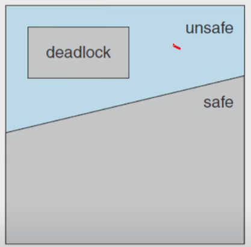<br>

- A _safe state_ is _not a deadloced state_
- Conversely, a deadlocked state is an unsafe state
- However, not all unsafe states are deadlocks,
    - an unsafe state _may_ lead to a deadlock
### Given the concept of a **safe state**
- we can define an avoidance algorithm(single, multiple) that
    - ensure that the syetem will _never enter_ a deadlocked state
- The idea is simply to ensure that
    - the system will _always remain in a safe state_
- _Initially_, the system is _in a safe state_
- Whenever a thread _request_ a _resource_ that is currently _available_,
    - the system _decides_ whether the resource can be _allocated or not_
- The request is _granted_
    - _if and only if_ the allocation _leaves_ the system _in a safe state_
### Revisit the Resource-Allocation Graph
- Suppose that a system has _only one instance_ of each resource type
- Then, introduce a new type of edge, called a _claim edge_
- A _claim edge_: $T_i$ &rarr; $R_j$ indicates that
    - a thread _may request a resource _at some time in the future_
- Then we can check for the safety
    - by a _cycle-detection_ algorithm in a directed graph
- If _no cycle_ exists, the request can be _granted_ immediately,
    - since the resource allocation will _leave_ the system in a _safe state_
- If a _cycle_ is _detected_, the nthe request _cannot be granted_
    - since the resource allocation will _put_ the system in an _unsafe state_<br>

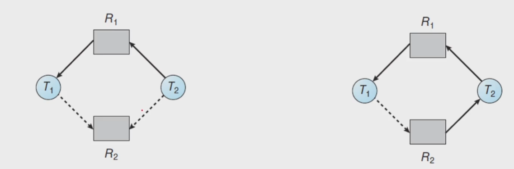<br>

- 점선이 claim

### Banker's Algorithm
- RAG is _not applicable_ to a resource allocation system
    - with _multiple instances_ of each resource type
- Banker's algorithm is _applicable_ to such a system
    - but _less efficient_ and _more complicated_ than the RAG
- Why Banker's?
    - the _bank_ never allocateds its available cash in such a way that
    - it could no longer satisfy the needs of all its customers
### Data structures:
- Let $n$ be the number of _threads_ in the system
    - and let $m$ be the number of _resources types_
- _Available_ : a _vector_ indicates the number of _available resource types_
- _Max_ : A _matrix_ defines the _maximum demand_ of each thread
- _Allocation_ : A _matrix_ defines the number of resources of each type _currently allocated_ to each thread
- _Need_ : A _matrix_ indicates the _remaining resource need_ of each thread
- $Available[m]$ :
    - if $Available[j] == k$, then $k$ instances of $R_j$ are available
- $Max[n x m]$ :
    - if $Max[i][j] == k$, then $T_i$ may requestat most $k$ instances of $R_j$
- $Allocation[n x m]$:
    - if $Allocation[i][j] == k$,  then $T_i$ is currently allocated $k$ instances of $R_j$
- $Need[n x m]$:
    - if $Need[i][j] ==k$, then $T_i$ may need $k$ more instances of $R_j$  
### Safety Algorithm
1. Let _Work_ and _Finish_ be vectors of length $m$ and $n$, respectively, Initialize $Work = Available$ and $Finish[i] = false$ for i=0, 1, ..., n-1
2. Find an index $i$ such that both<br>
    a. $Finish[i] == false$<br>
    b. $Need_i \leq Work$ <br>
    If no such $i$ exists, go to step 4
3. $Work = Work + Allocation_i$<br>
    $Finish[i] = true$<br>
    Go to step2
4. If $Finish[i] == true$ for all $i$, then the system is in a safe state

### Resource-Request Algorithm
1. If $Request_i \leq Need_i$, goto step2. Otherwise, raise an error condition, since the thread has exceeded its maximum claim
2. If $Request_i \leq Available$, goto step3. Otherwise, $T_i$ must wait, since the resources are not available
3. Have the system pretend to have allocated the requested resources to thread $T_i$ by modifying the state as follows:<br>
    $Available = Available - Request_i$<br>
    $Allocation_i = Allocation_i + Request_i$<br>
    $Need_i = Need_i - Request_i$<br>

### An illustrative e.g.
- a set of five threads: $T = {T_0, T_1, T_2, T_3, T_4}$
- a set of three resource types: $R = {A, B, C}$
- the number of instances of each resource types : $ A = 10, B = 5, C = 7$
- the snapshot representing the current state of the system<br>
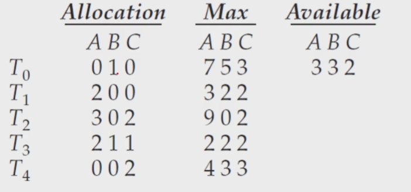<br>

- 17:30 부터

### Note that $Need[i][j] = Max[i][j] - Allocation[i][j]$
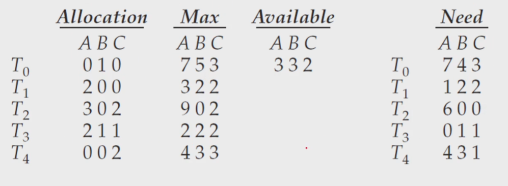<br>

### Now we claim that the system is currently in a safe state
- In deed, the sequence $<T_1, T_3, T_4, T_0, T_2>$ satisfies the safety criteria <br>
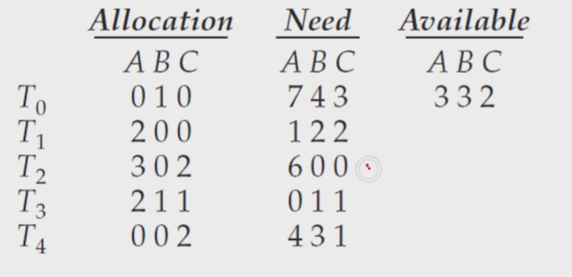<br>

- 복잡하니까 종이로 따라해보셈 : 21:30 부터
### When a _new request_ is submitted:
- Suppose that $T_1$ requests one instance of $A$ and tow instances of $C$
    - $Request_1 = (1, 0, 2)$
- Decide whether his request should be _granted or not_
- resource, request 알고리즘을 써야함<br>
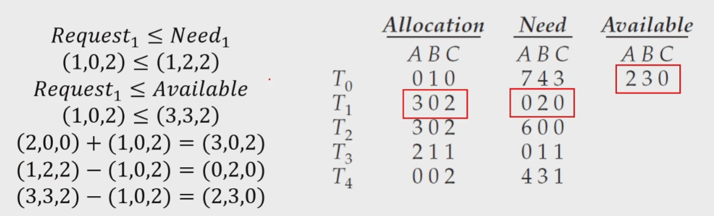<br>

- 이건 아직 grant 한 상태가 아님

### Now, determine whether this new system state is safe
- Safety algorithm finds that $<T_1, T_3, T_4, T_0, T_2>$ satisfies the safety criteria <br>
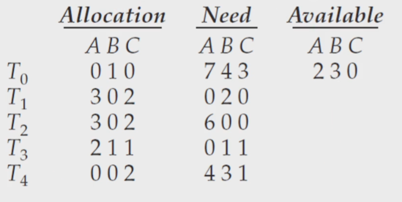<br>

### Now, determine with a request of $(3, 3, 0)$ by $T_4$
- $Request_4 = (3, 3, 0),$ <br>
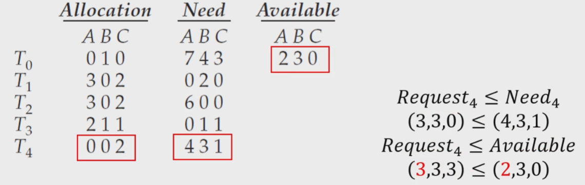<br>

### How about a request of $(0, 2, 0)$ by $T_0$?
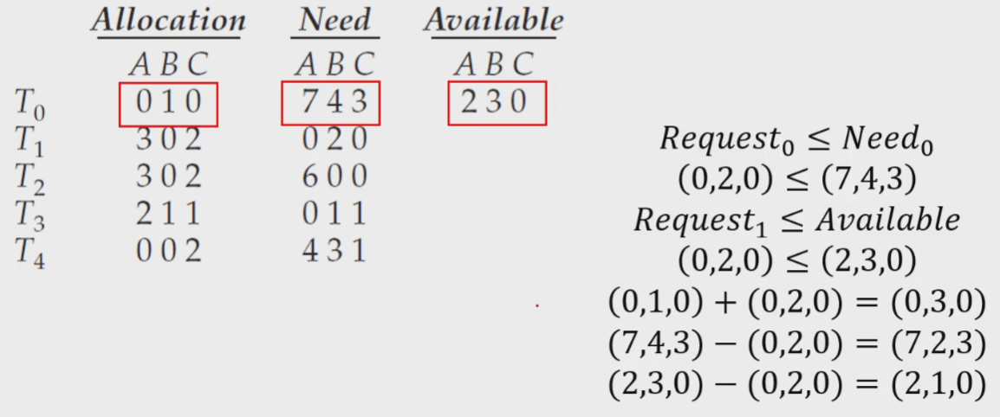<br>

## Deadlock Detection
### Deadlock Detection
- If a system does not _prevent_ or _avoid_ the deadlock
    - then a deadlock situation may occur
- In this environment, the system may provide:
    - An algorithm that examines the state of t he system to _determine whether_ a deadlock has occurred
    - An algorithm to _recover_ from the deadlock
### Single Instance of Each Resource Type
- Maintain a _wait-for graph_
    - a variant of the resource-allocation graph
- _Periodically, _invoke an algorithm_ that
    - searches for a cycle in the _wait-for_ graph<br>
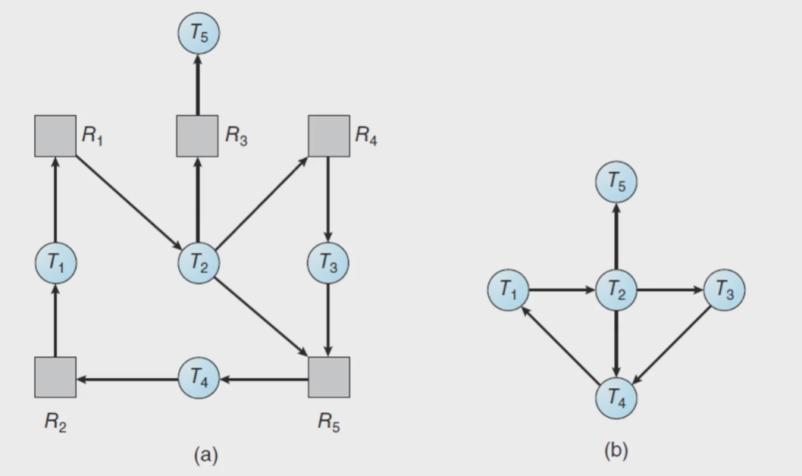<br>

- _(a) resource-allocation graph / (b) Corresponding wait-for graph_

### Several Instances of a Resource Type
- The wait-for graph is not applicable to a system
    - with _multiple instances_ of each resource type
- We can design a deadlock deatection algorithm
    - that is _similar to_ those used in _the banker's algorithm_

### Data structures:
- $Available[m]$:
- $Allocation[n x m]$:
- $Request[n x m]$: indicates the _current request_ of each thread
    - if $Request[i][j] == k$, then $T_i$ is requesting $k$ more instances of $R_j$
### Detection Algorithm
1. Let _Work_ and _Finish_ be vectors of length $m$ and $n$, respectively, Initialize $Work = Available$. For $i = 0, 1, ... n-1$ $if $Allocation_i \neq 0$, then $Finish[i] = false$. Otherwise, $Finish[i] = true$
2. Find an index $i$ such that both<br>
    a. $Finish[i] == false$<br>
    b. $Request_i \leq Work$ <br>
    If no such $i$ exists, go to step 4
3. $Work = Work + Allocation_i$<br>
    $Finish[i] = true$<br>
    Go to step2
4. If $Finish[i] == false$ for some $i$, $0 \leq i < n$, then the system is in a deadlocked state.<br>
    Moreover, if $Finish[i] == false$, then the thread $T_i$ is deadlocked

### An illustrative e.g.
- a set of five threads: $T = {T_0, T_1, T_2, T_3, T_4}$
- a set of three resource types: $R = {A, B, C}$
- the number of instances of each resource types: $A = 7, B = 2, C = 6$
- the snapshot representing the current state of the system<br>
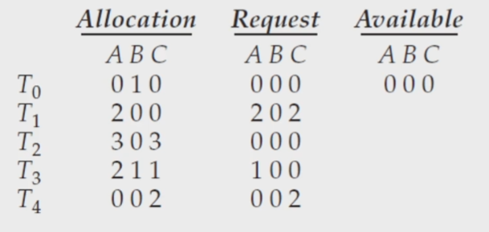<br>

### Now we claim that the system is _not in a deadlocked state_
- the sequence $<T_0, T_2, T_3, T_4, T_1>$ result in $Finish[i] == true$ for all $i$

### Now we claim that the system is _now deadlocked_
- a deadlock exists, consisting of threads $T_1, T_2, T_3,$ and $T_4$<br>
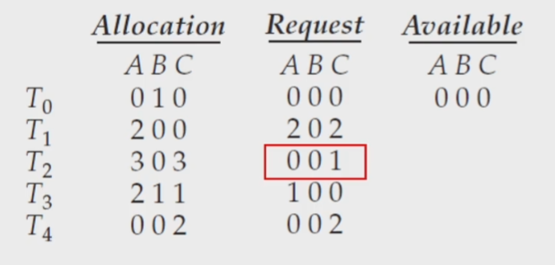<br>

## Recovery from Deadlock
### When should we invoke the detection algorithm?
- How _often_ is a deadlock likely to occur?
    - _more frequent_ deadlocks, _more frequent_ deadlock detections
    - 데드락이 자주 일어나면 시스템을 잘못만든거임
- How _many_ threads will be affected by dfeadlock when it happens?
    - the number of threads involved in the deadlock cycle _may grow_
- Invoking _for every request_ .vs. invoking _at defined intervals_
    - Note that there is a considerable overhead in computation time
    - However, there may be many cycles in the resource graph
    - if the detection algorithm is invoked at arbitrary points in time
### When a detection algorithm determines a deadlock exists,
- _inform the operator_ that a deadlock has occurred
- or let the system _recover from_ the deadlock _automatically_
    - Process and Thread Termination
    - Resource Preemption
### deadlock Recovery
- _Process and Thread Termination_
    - Abort _all_ deadlocked processes
    - Abort _one_ process _at a time_ until the deadlock cycle is eliminated
    - 다 죽이는건 부담스러우니까 한개만 죽여봄 일단. 해서 다 되면 해결, 안되면 하나 더 죽여보면댐
- _Resource Preemption_
    - _Selecting a victim_ : consider the order of preemption to _minimize_ cost
    - _Rollback_ : _roll back_ the process to some _safe state_ and _restart_ it
    - _Starvation_ : _picked as a victim_ only a finite number of times
    - 자비로운 시스템 ㄷㄷ

