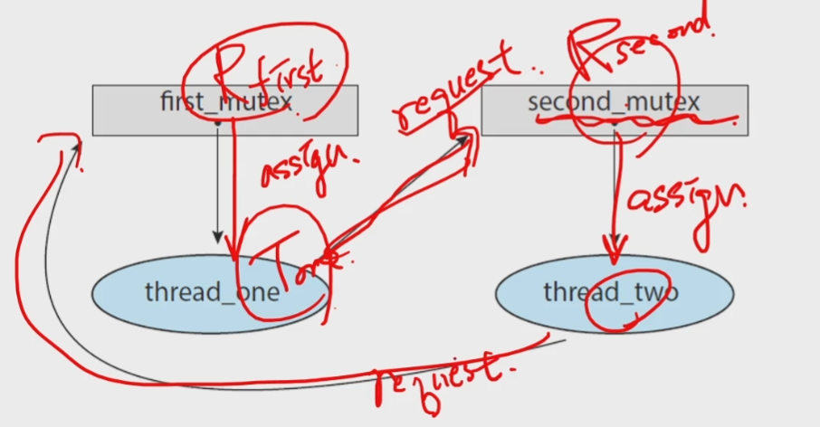
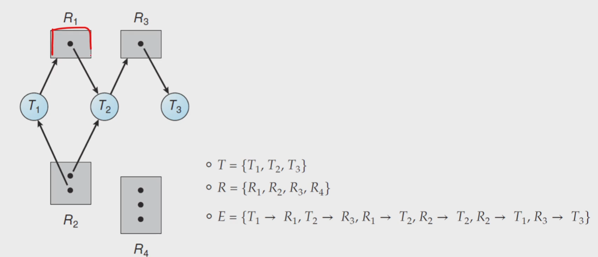
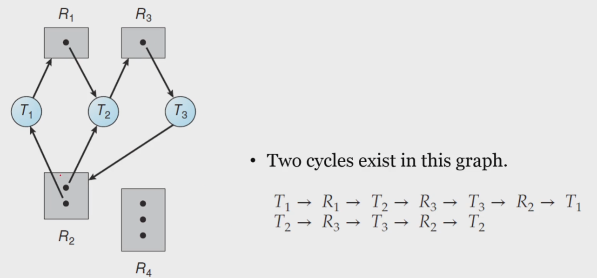
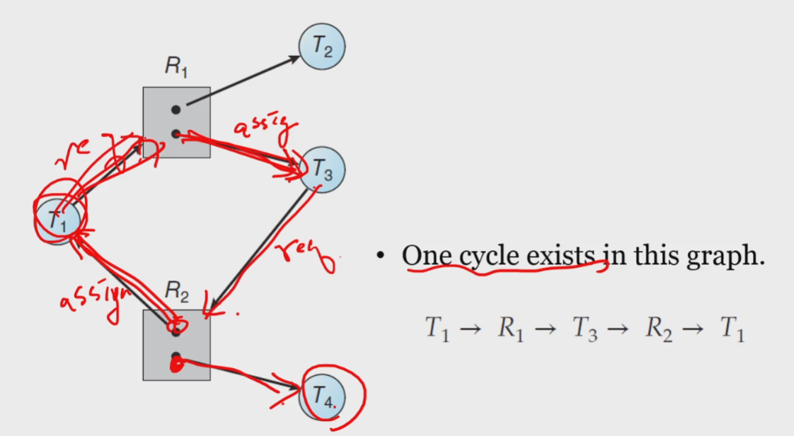

# 데드락(교착상태)의 이해
- 가장 어려운 시간 ㄷㄷ
## 8.1 System Model
### A ***deadlock*** is
- a situation in which
    - every process in _a set of processes_ is waiting for
    - an event that can be caused only _by another process in the set_
    - 다른애가 인터럽트를 걸어줘야 하는데 wait상태에서 못빠져 나오고 갇혀있는거
- a situation in which
    - a _waiting thread_ (or _process_) can _never again change state_
    - beacuse the _resources_ it has requested
    - are held _by other waiting threads_(or processes)
    - 리소가 필요한데 다른애한테 점유되어있는 상테
### Let us consider a system
- consisting of a _finite number of resources_
    - to be distributed among a number of _competing threads_
- _Resource types_ consist of
    - some number of _identical instances_
    - e.g., CPU cycles, files, and I/O devices(such as printers, drives, etc.)
- If a thread requests an _instance_ of a _resource type_
    - the allocation of _any instance_ should _satisfy_ the request
- A thread may utilize a resource as follows:
    - _Request - Use - Release_
    - Use 가 critical section : 여러개의 자원이 들어갈 수 있음
## Deadlock in Multithreaded Applications
### How can a deadlock occur?
```c
pthread_mutex_t first_mutex;
pthread_mutex_t second_mutex;

pthread_mutex_init(&first_mutex, NULL);
pthread_mutex_init(&second_mutex, NULL);

/* thread_one runs in this function */
void *do_work_one(void *param)
{   
    // mutex 두개를 획득해서 critical section에 진입
    pthread_mutex_lock(&first_mutex);
    pthread_mutex_lock(&second_mutex);
    /**
     * Do some work
     */

    // critical section 후 release
    pthread_mutex_unlock(&second_mutex);
    pthread_mutex_unlock(&first_mutex);

    pthread_exit(0);
}

/* thread_two runs in this function */
void *do_work_two(void *param)
{
    // mutex 두개를 획득해서 critical section에 진입
    // second 부터 함
    pthread_mutex_lock(&second_mutex);
    pthread_mutex_lock(&first_mutex);
    /**
     * Do some work
     */
    pthread_mutex_unlock(&first_mutex);
    pthread_mutex_unlock(&second_mutex);

    pthread_exit(0);
}
```
- 둘 다 무죄
- first mutex를 점유하고 second mutex를 점유하려는 시점에 다른 함수가 second mutex를 획득해버리면 둘다 아무것도 안함
- 데드락이 발생하기 쉬운 코드

## Deadlock Characterization
### Four Necessary Conditions
1. Mutual Exclusion
    - _At least_ one resource _is held_ in a _non-sharable_ mode
    - 읽기만 하면 sharable함
    - writer가 있어야 발생
    - 상호배제가 필요하지 않으면 데드락이 안일어나
2. Hold and Wait
    - A thread _holds at least_ one resource and _waiting to acquire_ additional resources _held by_ other threads
3. No preemption
    - Resources _cannot_ be _preempted_
    - 선점불가할때만 발생
4. Circular Wait
    - _A set of waiting threads_ exist such that the _dependency graph_ of waiting is _circular_
    - 데드락을 걸린 애들을 그래프로 그려보면 순환하고 있음
- 이 4개가 동시에 만족해야 데드락이 성립됨
    - 그래서 데드락이 앵간하면 안생김
    - 예제 만들기도 어려움
    - 그래서 생기면 재앙임
### Resource-Allocation graph
- 자원 할당 그래프
- is a _directed graph_ to describe deadlocks more precisely
- consists of a set vertices $V$ and a set of Edges $E$
- Two different node types of V:
    - $T = {T_1, T_2, ..., T_n}$ : the set of all the _active threads_ in the system
    - $R = {R_1, R_2, ..., T_m}$ : the set of all the _resource types_ in the system 
- A directed edge : $T_i$ &rarr; $R_j$ (**request edge**) 요구엣지
    - signifies that a thread $T_i$ has _requested_ an instance of $R_j$
- A directed edge : $R_j$ &rarr; $T_i$ (**assignment edge**) 할당엣지
    - signifies that an instance of $R_j$ has been _allocated to_ a thread $T_i$
    - $T_i$에 이미 할당되어 있는거임<br>
<br>
<br>
<br>

- 데드락 생김 서로서로 물고있어서<br>

<br>

- 이건 발생 안함<br>

### An important observation
- if a _resource-allocation graph_ does _not have a cycle_
    - then the system is _not_ in a deadlocked state
- If a _resource-allocation graph has a cycle_
    - then the system _may_ or _may not_ be in a deadlocked state
### Three ways of dealing with the Deadlock Problem
- _Ignore_ the problem altogether
    - and pretend that deadlocks never occur int the system
    - 기도메타
- Use a protocol to _prevent_ or _avoid_ deadlocks
    - ensuring that the system will _never enter_ a deldocked state
    - Deadlock Prevention
        - 이게 진짜 개비쌈
    - _Deadlock Avoidance_ : _Banker's Algorithm_
        - 비싼데에 씀, 어려움; , 유명함
- allow the system to enter a deadlocked state
    - then _detect_ it, and _recover_ it
    - Deadlock Detection
    - Recovery from Deadlock
    - 찾으면 해결해주는 방식으로 가자
## Deadlock Prevention
### Deadlock Prevention
- For a deadlock to occur
    - each of the _four necessary conditions_ must hold
- Hence, we can _prevent_ the occurrence of a deadlock
    - by ensuring that _at least one_ of these conditions cannot hold
1. Mutual Exclusion
2. Hold and Wait
3. No Preemption
4. Circular Wait
### Mutual Exclusion 상호배제
- At least one resource must be non-sharable
    - 모든 리소스가 공유가능하면 발생안할듯
- _In general_, it _cannot be applied to_ most applications
    - some resources are _intrinsically_ non-sharable
    - e.g., a mutex lock cannot be shared by several threads
### Hold and Wait
- We can guarantee that, whenever a thread requests a resource,
    - it does not hold any other resources
    - 파일 10개를 열어놓고 한개를 열려면 열어놨던거 다 닫고 하나 열고 다시 다 열어야함
- It is _impractical_ for most applications
    - 비실용적
### No Preemption
- Wecan use a protocol to ensure that there should be _preemption_
- If a thread is holding some resources and requests another resources
    - that cannot be immediately allocated to it
    - then, all resources the thread is currently holding are _preempted_
- The preempted resources are added to the list of resources 
    - for which the threads are waiting
- The thread will be restarted
    - only when it can regain its _old resources_ as well as _new ones_
- _cannot generally be applied_ to most applications
### Circular Wait: sometimes _practical_
- 그나마 쓸만함
- Impose a _total ordering_ of all resource types
    - and to _require_ that each thread requests
    - resources in an _increasing order_ of enumeration
    - 점유된 리소스 보다 번호가 높은것만 요청하게 만듬. 하다 안되면 내려놓게
    - 이러면 적어도 데드락은 안일어나는데 starvation의 위험이 늘어남
- It is _provable_ that these tow protocols are used,
    - then the circular-wait condition _cannot hold_
- Note that, however
    - imposing a lock ordering does not guarantee deadlock prevention
    - if locks can be acquired dynamically
## Deadlock Avoidance
```c
// transaction은 원자성이 보장되어야 함, 하나라도 실행되지 않으면 안댐
void transaction(Account from, Account to, double amount)
{
    // 뮤텍스락이 무려 두개
    mutex lock1, lock2

    lock1 = get_lock(from);
    lock2 = get_lock(to);    

    // 계좌 둘다 잠금
    acquire(lock1);
        acquire(lock2);
            
            // 출금과 입금이 두개의 락을 획득했을 때만 발생
            withdraw(from, amount);
            deposit(to, amount);
        
        release(lock2);
    release(lock1);
}

// 이러면 발생함 근데 ㅋㅋ
// 이 두개가 동시에 발생해버리면..
transaction(checking_amount, savings_account, 25.0) // T-1
transaction(savings_account, checking_amount, 50.0) // T-2
```
- 어캐하면 고칠 수 있을 까
- 그랜드 락을 써서 하면 될듯
- 아니면 모니터락을 걸어서 해결
- 자세히 할 필요 없음
- Deadlock 을 Prevention 해 보자는 거였는데. 1,2,3 번 조건은 본질적으로 불가능
    - 4번은 되는데 좀 에바임
- 피하는게 뱅크알고리즘임


<br>


