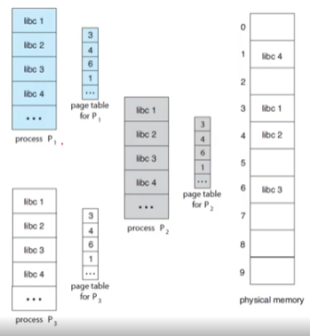

# Chapter 9. Main Memory
## Background
- 골치아픈건 다 지나갔습니다. 불행 끝 행복 시작
### A process is a program in execution
- 다시 복기하는 process의 정의
  - 실행 중인 프로그램
  - 이 말은 즉 main memory에 프로그램이 load 되어있는 상태를 얘기함.

### A memory consists of
- memery는 8bit(byte) 단위로 구성되어있는 것- swa pig
  - 때 = access할 필요가 있을 때ry는 각각의 주소를 가지고 있음만 들어와라
- swap out
  - out of memory
  - 밖에 나가있어라

- swap in
- 있을 때 = access할 필요가 있을 때mery에서 instruction을 패치해와서 instruction의 program c un- swappinger가 지정하는 주소에 있는 instruction을 실행만 들어와라- swap out
  - out of memory
  - 밖에 나가있어라

- 요가 있을 때 = access할 필요가 있을 때tion이 load와 store를 해서 memory에 access함.만 들어와라- swap out
  - out of memory
  - 밖에 나가있어라

### Memory Space
- 지금까지 CPU가 process를 어떻게 나누어 가지냐 다뤘음
- 이제부터는 memory에 어떻게 process 들을 저장하고 관리할 거냐를 다룰거임

- memery 주소 공간을 각 process들이 따로따로 관리  할- swapping수 있음
  - 때 = access할 필요가 있을 때iprogramming만 들어와라
- swap out
  - out of memory
  - 밖에 나가있어라

  - multiprocessing
- 2가지의 register들을 가지고 합법적인 주소의 access를 제어해줘야 함
  1. base register
  2. limit register
- 다시 말해서 base랑 limit를 가지고 범위를 지정해서 process들을 실행시키자는 얘기
  - 확인해서 해당 주소가 아니면 segmentation false를 return
  - 프로그램에서 방출

### Protection of memory space

- base와 limit를 범위를 확인
- 만약 해당 범위에서 벗어났을 시에 trap을 일으켜 문제를 일으킴
- 어떤 CPU 하드웨어에서 모든 address access를 user mode에서 생성
  - 항상 base와 limit register를 체크해줘야 함.
  - 그래서 H/W 로 구성해야함

### Address Binding
- program 별로 주소를 구성하는 방식이 다 다름
- 변수를 설정하고 해당 변수에 값을 할당할 때
  - a라는 변수 설정, a라는 값이 10을 할당
  - 우리는 memery 주소공간에 10을 써달라고 요청할 뿐
- swa pig
  - 있을 때 = access할 필요가 있을 때이 어떤 번지에 있어야하는지는 compiler가 지정해줘야함만 들어와라
- swap out
  - out of memory
  - 밖에 나가있어라

- 프로그램도 우리가 실행 시키기 전에는 binary executable 파일로 디스크에 저장되어있을 뿐이다.(쓸모없는 정보)
  - 우리가 호출해야 그제서야 memory가 되고 program으로서 작동함
- 우리가 symbolic하게 정의해준 memery 번지를 complier가 지정해줌- swap in
  - memory에 올라와 있을 필요가 있을 때 = access할 필요가 있을 때만 들어와라
- swap out
  - out of memory
  - 밖에 나가있어라

- linker 
  - complier가 바인딩 할 때 linker가 커다란 logical한 address를 만들어 냄
  - 해당 값의 포인터의 주소(symbolic address)를 linker가 linking 해줌
- loader
  - 그 이후에 loader가 loading하면서 재바인딩 해줌
  - relocatable address를 absolute address로 변환
 

- source program 일 때
  - symbolic
- object file 을 거치면서
  - relocatable한 logical address
- linker를 거치면서
  - logical한 address를 가짐
- program이 memory에 load
  - physical address를 확보

### Logical vs Physical Address Space
- logical address
  - user process에서 access하려고 하는 address
  - 실제 physical한 address하고는 관계가 없어야 함
- physical address  
  - 어떤 memory address를 이용해서 특정 register에 mapping
- logical address space
- physical address space

### MMU(Memory Management Unit)
- 어떤 방법을 사용하든 logical address를 physical address로 변형하는 역할을 함.

- relocation register
  - base register의 역할을 함

### Dynamic Loading
- 어떤 program이 memory에 loading되면 그게 process
  - 만약 실행파일이 memory보다 크다면?
  - dynamic loading을 해줘야한다.
- dynamic loading 
  - memery 주소공간을 효율적으로 활용
- swap in
  - 때 = access할 필요가 있을 때outine을 한번에 loading하지 않고 필요할 때만 호출하자만 들어와라
- swap out
  - out of memory
  - 밖에 나가있어라

- dynamic loading을 하면
  - 필요할 때만 routine들이 loading됨
  - relocatable linking loader가 필요한 routine을 호출할 때 address table에 반영

### Dynamic Linking and Shared Libraries
- DLLs
  - Dynamically Linked Libraries
  - user program이 실행되는 중에 linking되는 library
  - process가 아니라 library만 load되어 있는 것
  - 뒤에가면 paging하고 demand paging까지 배우고 어떻게 linking하는지 알게될 거임.
- static linking
  - system library를 다른 object module처럼 loader가 binary 코드를 static하게 linking 해버리고 loading하는 것
- dynamic linking
  - loading을 dynamic하게 하는 것처럼
  - linking을 실행시까지 연기(지연)를 해주면 실행 중에 dll파일을 access해서 linking해버림
- shared library
  - 주로 shared library에다가 씀
  - windows에서 사용하는 .dll 파일이 Dynamically Linked Library
  - Linux에서 사용하는 .so 파일이 Shared Library
  - 사용하는 방법은 다르지만 개념은 같음

## Contiguous Memory Allocation 
### Contiguous Memory Allocation (연속 memery 할당)- swa pig
- 야memory에 올라와 있을 필요가 있을 때 = access할 필요가 있을 때함만 들어와라- swap out
  - out of memory
  - 밖에 나가있어라

- process한테 available memory를 어떻게 할당할거냐
  - 가장 무식하게 할당하는 방법
  - 메인 memory를 유저 프로세스 통째로 loading
  - section에 통째로 올려버려서 contiguous함
  - 그래서 single section of memory를 가짐    
  - 이걸 Contiguous Memory Allocation 이라고 함

### Memory Protection

- 통째로 올려놨기 때문에 protection은 쉬움
- limit와 relocation을 부여하고 영역을 지정
- 뒤에서는 그렇게 안됨...

### Memory Allocation
- allocation하는 전략이 여러 개 있음
- Variable-Partition scheme
  - 어떤 파일에 있는 process들의 크기를 다 모름
  - 그러면 partition, memory 영역, section이 variable함
  - variable partition을 가지고 있으면 어떤 프로세스를 어떻게 할거냐가 문제가 됨
- hole
  - a block of available memory
  - memery가 할당될 수 있는 공간
- swap in
<i 있을 때 = access할 필요가 있을 때./img/variable_partition.png" width="20%">만 들어와라- swap out
  - out of memory
  - 밖에 나가있어라

1. process 8이 끝나서 memery 반납- swap in
2. 올라와 있을 필요가 있을 때 = access할 필요가 있을 때 들어옴만 들어와라- swap out
  - out of memory
  - 밖에 나가있어라

3. process 5가 끝났는데 공간이 2개로 쪼개짐
4. 그래서 **hole** 이 생김
5. 이 hole을 어떻게 관리할까 가 논제

### The Problem of Dynamic Storage Allocation
- process들이 끝날 때마다 실행되고 빠져나가고 하게되면 free hole들이 발생
- 어떤 size가 n인 memery에서 free hole 을  swapping어떻게 관리해줄까?
- 을 때 = access할 필요가 있을 때만 들어와라- swap out
  - out of memory
  - 밖에 나가있어라

  1. First-Fit
    - linked-list를 순서대로 따라가면서 free hole들을 확인
    - 넣을 수 있는 공간이 있으면 그냥 넣어버리자
  2. Best-Fit
    - priority queue로 만들고 가장 작은 것부터 확인
    - 가장 작은 것 중에 넣을 수 있는 공간에 순서대로 넣기
  3. Worst-Fit
    - 가장 큰 것에 집어 넣기
- Best Fit이 제일 좋긴 하지만 뭐가 더 좋을지는 모르기 때문에 성능 테스트는 해봐야 함

### Fragmentation
- 단편화 문제
- free hole을 채우더라도 그 사이사이 중간에 빈 공간이 남음
- Garbage collection으로 그 전부를 묶어주려하면 실행되고 있는 processor들도 다 옮겨야해서 불편함이 발생
1. external fragmentation
  - 사용되는 processor들 사이에 생긴 자투리 공간
  - 조그만 hole들이 여러개로 남아서 돌아간다. 
2. internal fragmentation
  - memory를 똑같은 크기로 쪼개서 프로그램을 쭉 실행시킴
  - 프로그램이 실행되다가 해당 프레임 안에서 공간이 남음
  - 이걸 내부 단편화라고함
  - 뒤에서 paging을 배우고 나서 좀 더 배울 것

### Segmentation

- Contiguous Memory Allocation : 통째로 옮기자
- Paging : 똑같은 크기로 쪼개서 옮기자
- 이 중간에 있는게 segmentation
- 쪼개긴 쪼개는데 종류별로 쪼개자

- Paging이 너무 훌륭해서 segmentation은 잘 안씀 이제

# Chapter 9-2. 페이징과 스와핑
## Paging
### Paging
- memory management를 연속하지 않도록 쪼갬
- external fragmentation을 피함
- 크기가 작아 사이사이 들어가기도 좋음
- OS와 H/W를 조합해서 제공해야 하지만 H/W의 도움없이는 안됨

### Basic Method for Paging
- memory를 쪼갠 것들을 mapping을 시키는 것이 가장 기본적인 방법
  - physical memory를 고정된 사이즈로 쪼갬(frames)
  - logical하게 memory를 쪼갬 (pages)

- 프로그램의 physical 공간과 logical 공간의 binding을 완전히 끊어버림
- page를 쪼갰으니까 그 page에 number(p)와 p에 page offset(d)만 주자
  - 물리 주소를 쓸 필요가 없음
  - page size가 1KB이고 page number가 2이고 page offset이 34면 
  - logical address 주소는 2x34 이렇게 됨
- 해당 logical address의 bit 수를 결정하는 요소
  - page number가 몇 개냐
  - page offset이 몇 개냐

### The page number
 

- page number가 page table에 따로 관리해야 함
  - process 별로 다 다르기 때문에
  - CPU가 address를 generation하면 해당 logical address가 몇 번 page의 몇 번 offset에 있다는 것을 확인

### Outlines of the steps taken by the CPU
- logical address를 physical address로 변경
    1. page number 'f'를 추출, 그걸 가지고
    2. page에 해당되는 number 'f'의 page frame을 찾아서 
    3. 해당 page frame의 offset을 가지고 memory access를 함(변경함)
 

- logical memory는 page 0~3 &rarr; 4개
- page table
  - 0번 page &rarr; 1번
  - 1번 page &rarr; 4번
  - 2번 page &rarr; 3번
  - 3번 page &rarr; 7번
- physical frame은 0~7 &rarr; 8개

- logical memory에 해당되는 page와 page table과 해당되는 physical frame이 mapping 됨
  - 순서와 상관없이 logical하게 program이 loading 되어있음
  - 그래서 굉장히 자유로움
- physical memory의 빈 부분이 free hole이 됨
- 크기가 전부 같아(frames) external fragmentation이 발생하지 않음

- 만약 logical memory의 크기가 더 크면 page 4 가 필요
  - internal fragmentation

### The page size (like the frame size)
page size를 어떻게 정할까 = frame size를 어떻게 정할까
- H/W에 dependant함
  - 크게 고민할 필요없음
  - 옛날에는 4KB / 요즘은 memery가 크고 속도도 빨라져서 4MB or 1MB로 
- swa pig설정
  -  올라와 있을 필요가 있을 때 = access할 필요가 있을 때일만 들어와라
- swap out
  - out of memory
  - 밖에 나가있어라

- 반드시 2의 제곱수여야 한다. (배수라고 했는데 예시가 30인걸 보니 잘못 말하신듯)
  - 4KB 나 1GB 이런식으로 설정하자
- logical address space = 2^m / page size = 2^n
  - high-order m-n bits &rarr; page number
  - low-order n bits &rarr; page offset
 

- 뭐가 잘못된거야?
  - 몰라 그냥 넘어가~~ (우리에게 필요한 자세)

### When a process arrives in the system to be executed
- 어떤 새로운 process가 도착했을 때 memory allocation을 해주기 위해 해야할 일
  - 그냥 들어온 순서대로 allocation 해주면 되는 듯
 

### Hardware Support
- CPU scheduler가 새로운 process를 execution할 때(context switch가 일어날 때)
  - page table도 context switch에 포함시켜야 함
  - page에서 빠져나갔다가 재진입 했을 때 page에 table이 그대로 남아있을 거라는 보장이 없어서
  - 나중에 demanding paging 까지하면 더 심각해짐
- 근데 사실 page table이 작은게 아니라서 관리하기도 워낙 힘듬
  - 그래서 생각한게 PTBR

### PTBR(page-table base register)
- page table의 시작번지를 가리키는 register
  - page table 자체는 main memory에 넣음
- CPU 안에 있음
- context switch 할 때도 빠름
  - PTBR만 PCB에 저장해놓으면 되니까
  - 대신 access time은 느림
  - page table이 main memory에 있어서 memory를 2번 access 해야해서 속도가 느려짐
    1. page table의 entry 접속
    2. actual data에 접속

### Translation Look-aside Buffer(TLB)
- 아주 작고 lookup이 빠른 cache memory를 사용
 

- Page table에 memory access를 할 때
  1. logical address에 가서 page table을 거침
  2. physical frame에 memory access  
  &rarr; 너무 비효율 적임  
- 중간에 TLB 라는 cache를 둠
  - H/W로 사용
  - page number와 frame number가 TLB에 있으면 TLB hit가 일어나고 바로 access
  - H/W access 이기 때문에 시간이 거의 안듬
  - TLB miss 시간을 줄여줌 (절반만큼)

### Effective Memory-Access Time
- TLB hit
  - 우리가 access하고 하는 page가 TLB안에 포함되어 있는 상태
- TLB miss
  - cache memory에 page number가 없을 때
  - main memory에 있는 page table에 갔다와야 함
- hit ratio
  - TLB hit가 발생하는 비율
- 예시
  - 어떤 system이 access하는데 10ns 가 걸린다
    - 80% hit ratio = 0.80 x 10 + 0.20 x 20 = 12ns
    - 90% hit ratio = 0.99 x 10 + 0.01 x 20 = 10.1ns
    - 뒤에 20을 곱하는 이유는 TLB miss시간이 포함되어 x2해준거

### Memory Protection with Paging
- Paging이 도입되면 protection bit 라는 걸 사용
  - 각 frame 별로 valid 한지 아닌지 확인
- valid-invalid bit
  - 만약 valid하면
    - logical address space에 포함됨
    - legal
  - 만약 invalid하면
    - logical address space에 포함되지 않음
    - illegal
- 만약 illegal address가 오면
  - valid-invalid bit를 보고 trap을 걸어줌
  

### Shared Pages
- Paging을 통해서 공통의 DLL 같은 것들을 공유하기 굉장히 좋음
- Standard C library를 생각해봤을 때
  - library module들을 모든 processor가 가지고 있다
  - 굉장히 비효율적임
- Reentrant code
  - 실행중에 자기 코드를 변경할 필요가 없는 code  
  

## Structure of the Page Table
### Structuring the Page Table
- 이번엔 Page table이 너무 커지니까 고민
- excessively large한 page table 관리법
  1. Hierarchical Paging
    - 계층적으로 paging
  2. Hashed Page Table
    - page를 hashing 해버리자
  3. Inverted Page Table
    - 역으로 조사관리 하자

### Hierarchical Paging
 

### Hashed Page Tables
 

### Inverted Page Tables
 

- 어떤 PID가 어떤 page를 가지고 있는지 역으로 관리하자
- PID를 추가해주는 것을 Inverted Page Tables 라고 한다
  - 복잡한거 다 할 필요 없음

## Swapping
### Swapping
- degree of multiprogramming이 훨씬 증가됨
  - 한 process 당 한 frame, 한 page만 옮길 수 있음
  - 동시에 돌릴 수 있는 program process의 수가 훨씬 더 많음
- process의 instruction, data/ 어떤 명령어, 명령어가 access하는 data
  - memery에 상주해 있어야 함.
- swap in
  - access할 필요가 있을 때만 들어와라
- swap out
  - out of memory
  - 밖에 나가있어라

### Standard Swapping
  

- processor 전체를 swapping 시키는 것
- 전체를 swapping 시키는 것은 너무 prohibitive함 (부담스러움)

### Swapping with Paging
- Standard Swapping하는 것이 너무 부담스러우니까 paging을 도입
  - page를 가지고 swapping하자
  - physical memory와 logical memory의 분리가 충분히 가능해짐
  - 아주 작은 page의 swapping이 가능
- 오늘날의 paging
  - swapping with paging
  - swap out &rarr; page out
    - backing store에서 memory로 page를 옮기는 것
  - swap in &rarr; page in
    - memory에서 backing store로 page를 옮기는 것
- paging은 virtual memory에서 가장 큰 힘을 발휘한다
  - 다음시간에 배울 것
 
