# 주메모리의 관리
- 불행 끝 행복시작 ㄷㄷ
## Background
### A process is a program _in execution_
- to say, a set of instructions kept in a _main memory_

### A memory consists of
- a large _array of bytes_, each with its own address
- CPU _fetches_ instructions from memory using the _program counter_
- and instructions may cause _load from_ and _store to_ the memory

### Memory space
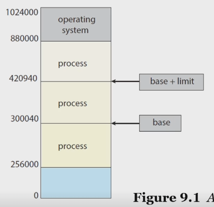 

- We need to make sure that each process has a _separate memory space_
- A pair of registers: _base register_ and _limit register_
    - A provides the ability to determine the range of _legal addresses_

### Protection of memory space
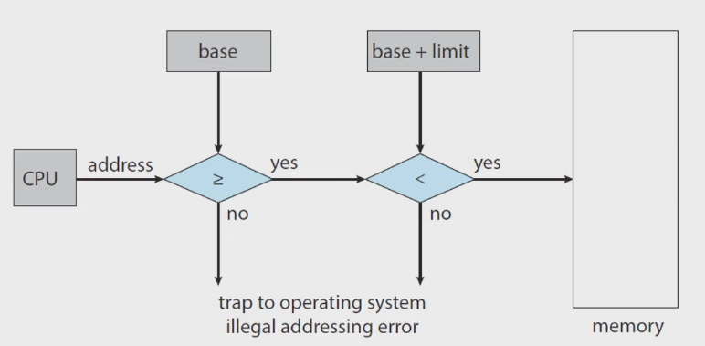 

- is accomplished by having the CPU hardware
    - compare every address generated in user mode with the registers

### Address Binding
- A program resides on a disk as a binary executable file
    - To run, the program must be brought into memory
    - The address of the process does not start at addresss 00000000
- Addresses in the source are generally _symbolic_
- A _compiler_ typically _binds_
    - _symbolic_ addresses to _relocatable_ addresses
- A _linker_ or _loader_ in turn _binds_
    - the _relocatable_ addresses to _absolute_ addresses
- 결국 심볼 - 주소 바인딩이 핵심인듯? 

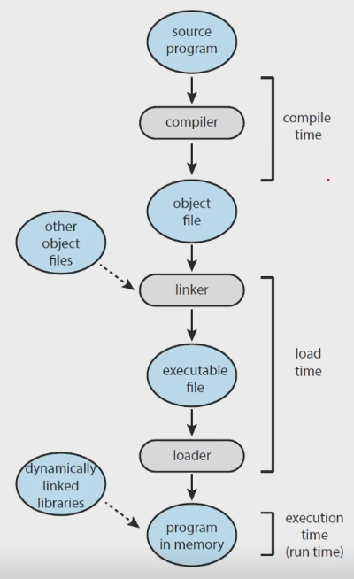 

### Logical vs. Physical Address Space
- _logical address_: an address generated by the CPU
- _physical address_: an address seen by the memory unit
    - that is, the one loaded into the memory-address register
- _logical address space_: the set of all logical addresses
    - generated by a user program
- _physical address space_: the set of all physical addresses
    - corresponding to these logical addresses

### MMU(Memory Management Unit)
- a h/w device that maps from logical address to physical address
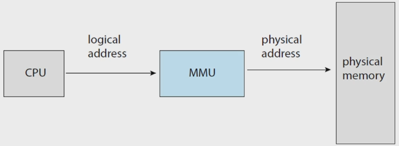 
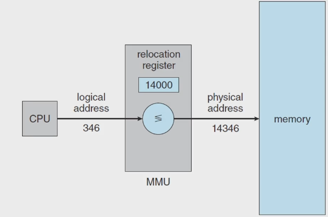 

- _relocation register_: a base register in MMU

### Dynamic Loading
- Is it necessary for the entire program and data
    - to be in physical memory?
    - 로딩할 때 파일 전체를 해야하나?? 만일 그러면 게임 하나 띄울때마다 시스템 다운됐을거임
- _dynamic loading_: obtains _better memory-space utilization_
    - a _routine_ is not loaded until it is called
- The advantage of dynamic loading is that
    - a routine is loaded _only when it is needed_
    - the _relocatable_ linking loader is called to load the _desired routine_
    - and to update the _program's address tables_ to reflect this change
### Dynamic Linking and Shared Libraries
- _DLLs_: Dynamically Linked Libraries
    - system libraries linked to user programs when the programs are run
    - 들어본적 없는데;
    - 어떤 라이브러리가 따로 로딩되어 있는 거임. 그냥 가져다 쓰는거네
- _static linking_: system libraries are treated like any other object module
    - and are combined by the _loader_ into the binary program code
- _dynamic linking_: is similar to _dynamic loading_,
    - here, thought, _linking_ is _postponed_ until execution time
- _shared library_: DLLs are also known as shared libraries
    - since only one instsance of the DLL in main memory
    - can be shared among multiple user processes
## Contiguous Memory Allocation
### Contiguous Memory Allocation
- 연속 메모리 할당
- 메모리를 할당을 해줘야함 프로세스한테
- We need to allocate main memory in the _most efficient way possible_
- The memory is usually divided into two partitions
    - one for the operating system
    - one for the user processes
- Several user processes reside in memory at the same time
- _How to allocate availbale memory_
    - to the processes that are waiting to be brought into memory?
- _Contiguous memory allocation_
    - each process is contained in a _single section of memory_
    - that is _contiguous_ to the section containing the next process
    - 어떤 섹션에 통짜로 올림
### Memory Protection
- _Prevent_ a process from _accessing_ memory that it does _not own_
    - by combining two ideas: _relocation register_ + _limit register_ 
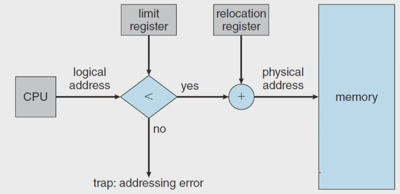 

### Memory Allocation
- Variable-Partition scheme: one of the simplest methods
    - assign processes to variably sized partitions in memory,
    - where each partition may contain exactly one process 
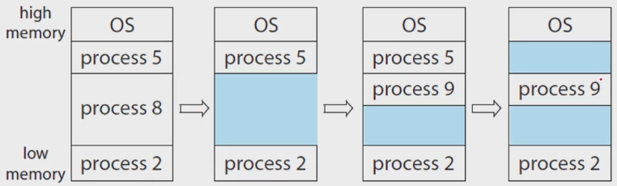 

- _hole_: a block of available memory

### The Prob. of _Dynamic Storage Allocation_
- How to satisfy a request of size $n$ from a list of _free holes_?
- Three types of solutions to this prob.
    - First-Fit: allocates the _first_ hold that is big enough
    - Best-Fit: allocates the _smallest_ hole that is big enough
    - Worst-Fit: allocates the _largest_ hole
    - 이것도 정처기에 나왔던 내용이네
### Fragmentaion
- _exteranl fragmentation_
    - the memory is _fragmented_ into a large number of small holes
    - There may be enough total memory space to satisfy a request
    - but, the available spaces are not contiguous
- _internal fragmentaion_
    - 똑같은 크기로 쪼개자
    - the memory allocated to a process may be _slightly larger_ that the requested memory
    - unused memory that is internal to partition
- 어차피 다 안쓰고 paging 쓰긴함 ㅋㅋ

# 페이징과 스와핑
## Paging
### Paging
- 앞에서 프로세스한테 메모리를 할당해줄라고 하는데, 제일 간단한건 contiguous 하게 주는거(통째로 줘버리는거) 근데 이건 문제가 좀 많음
- dynamic allocation을 하게되면 exteranl fragment 많이 발생
- a memory management scheme that permits
    - a process's physical address space to be _non-contiguous_
- overcome two problems of contiguous memory allocation
    - avoid _exteranl fragmentation_
    - avoid the _associated need for compaction_
- impl. through
    - cooperation between the operating system and the computer h/w
### Basic Method for Paging
- break _physical_ memory into _fixed-sized blocks_(_frames_)
- and break _logical_ memory into _blocks of the same size_(_pages_)
- Now, the _logical_ address space is
    - _totally separte_ from the _physical_ address space
- Every address generated by the CPU is divided into two parts
    - a _page number (p)_
    - a _page offset (d)_ 
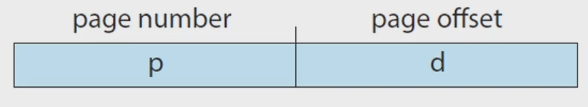 

### The page number
- is used as an index into a per-process _page table_ 
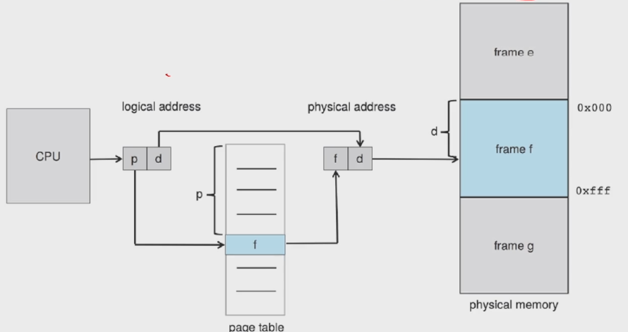 

### Outlines of the steps taken by CPU
- to translate a _logical address_ to a _physical address_
    1. Extract the page number $p$ and use it as an index into the page table
    2. Extract the corresponding frame number $f$ from the page table
    3. Replace the page number $p$ with the frame number $f$ 
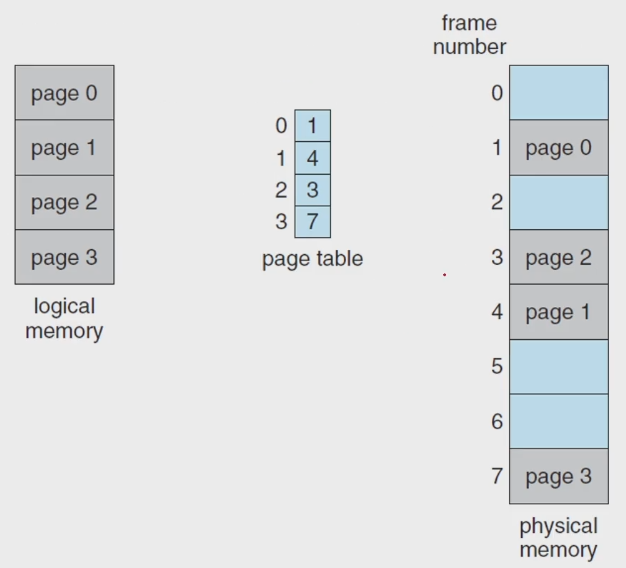 

        - 크기가 다 똑같으니까 external 이 발생 안함
        - 이 경우에서 4가 필요하면 internal이 발생

### The _page size_ (like the _frame size_)
- is defined by the h/w
- A power of 2: typically varying between 4KB and 1GB per page
- If the size of _logical address space_ is $2^m$, and a _page size_ is $2^n$
    - then the _high-order_ $m-n$ bits designate the _page number_
    - and the _low-order_ $n$ bits designate the _page offset_ 
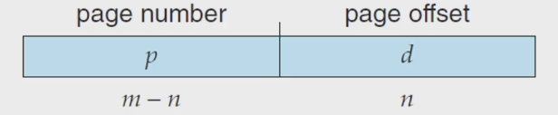 
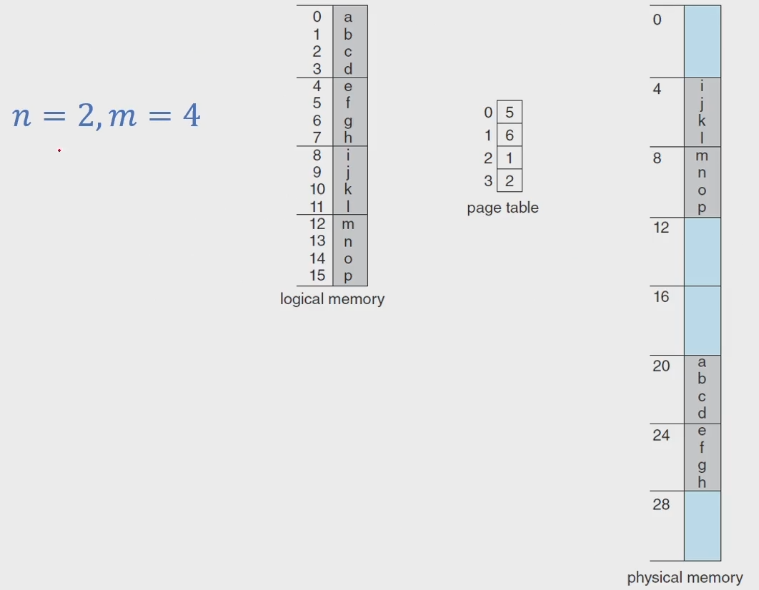 

### When a process arrives in the system to be executed
- its size expressed in pages is examined for memory allocation 
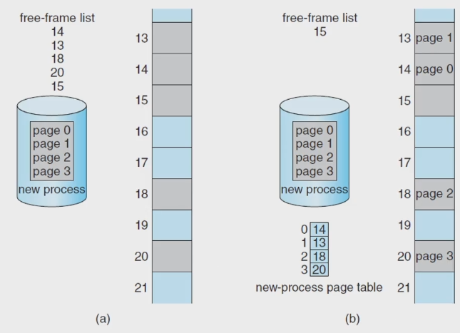 

### H/W Support
- When the CPU scheduler selects a process for execution
    - the _page table_ should be _reloaded_ for the context switch
- _A pointer to the page table_ should be
    - stored with the other register values in the _PCB_ of each process
- 페이지 테이블이 너무 커서 하드웨어적으로 관리하기 어려움
### PTBR(page-table base register)
- points to the page table
- and the page table is kept in main memory
- _Faster_ context switches, but still _slower_ memory access time
- Two memory access is needed
    - one for the page-table entry
    - one for the actual data

### Translation Look-aside Buffer(TLB)
- a special, small, fast-lookup h/w cache memory 
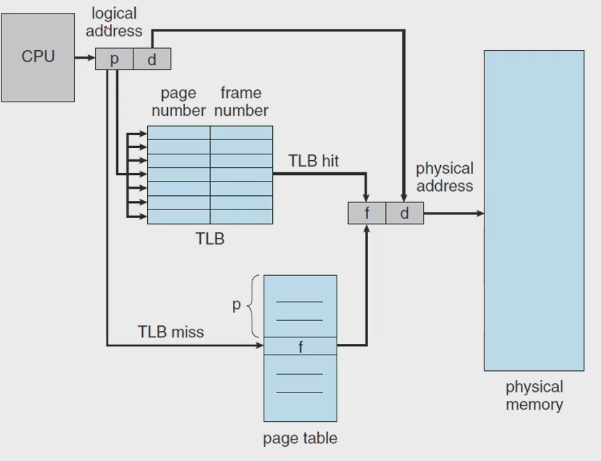 

### Effective Memory-Access Time
- _TLB hit_: if the page number of interest is _in_ the TLB
- _TLB miss_: if the page number of interest is _not in_ the TLB
- _hit ratio_: the perccentage of times that
    - the page number of interest is found in the TLB
- For example, in a system with 10 ns to access memory
    - $80%$ hit ratio: EAT = $0.80$ x $10 + 0.20$ x $20 = 12 ns$
    - $90%$ hit ratio: EAT = $0.99$ x $10 + 0.01$ x $20 = 10.1 ns$

### Memory Protection with Paging
- contiguous 방식은 그냥 범위 넘으면 오류로 판단 할 수 있었음
- is accomplished by protection bits associated with each frame
- _valid-invalid bit_: one additional bit
    - generally attaced to each entry in the page table
- When this bit is set to _valid_
    - the associated page is in the process's logical address space(_legal_)
- When this bit is set to _invalid_
    - the page is not in the process's logical address space(_illegal_)
- _Illegal addresses_ are _trapped_ by use of the valid-invalid bit 
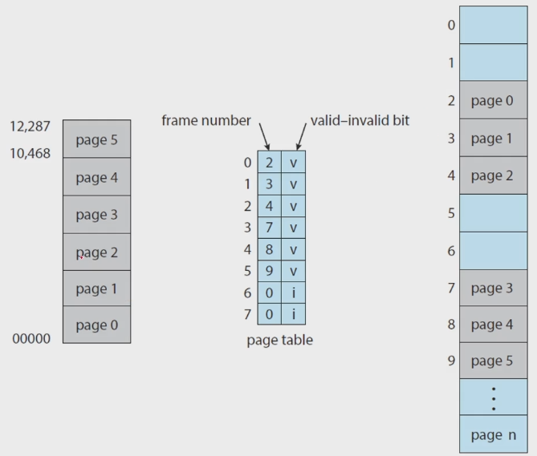 

### Shared Pages
- An advantage of _paging_ is the possibility of _sharing common code_
    - a consideration important in a multiprogramming env.
- Consider the standard C library libc
    - each process load its own copy of libc into tis address space
    - however, it ca be _shared_ if the code is _reentrant code_
- _Reentrant code_ is _non-self-modifying_ code
    - that is, it never chages during execution 
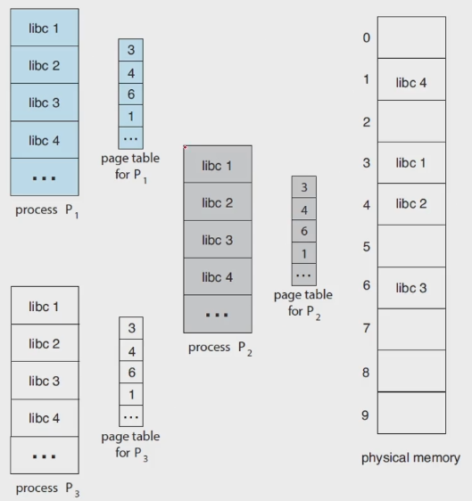 

- libc 라는 라는 주소공간을 물리적으로 복사하는 것이 아니라 논리적으로만 복사해서 사용

## Structure of the Page Table
### Structuring the Page Table
- A large logical address space
    - makes the _page table itself_ to become _excessively large_
- It needs some techniques for structuring the page table
    - _Hierarchical Paging_
    - _Hashed Page Table_
    - _Inverted Page Table_

### Hierarchical Paging 계층적 테이블
- breaks up the logical address space into multiple tables 
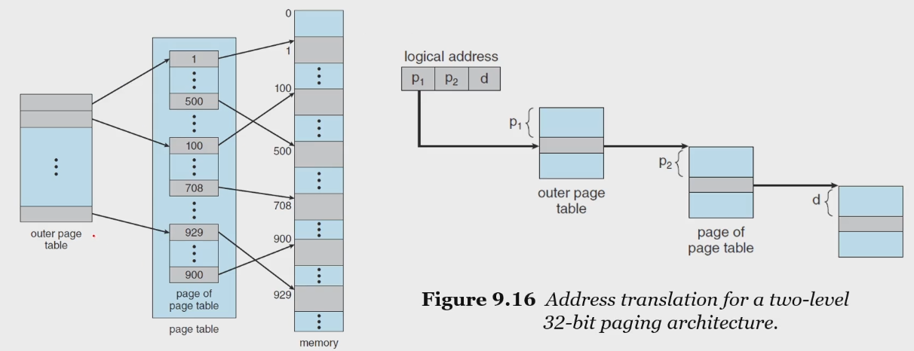 

### Hashed Page Tables
- for handling address space larger than 32 bits
- use a hashed table with the hash value being the virtual page number 
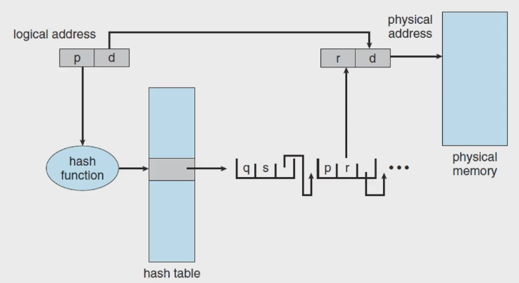 

### Inverted Page Tables
- Rather than having a page table, use an inverted page table
    - one entry for each real page
    - consisting of the virtual address
    - with information about the process
- 페이지 자체가 너무 클때 해결해 주는거 
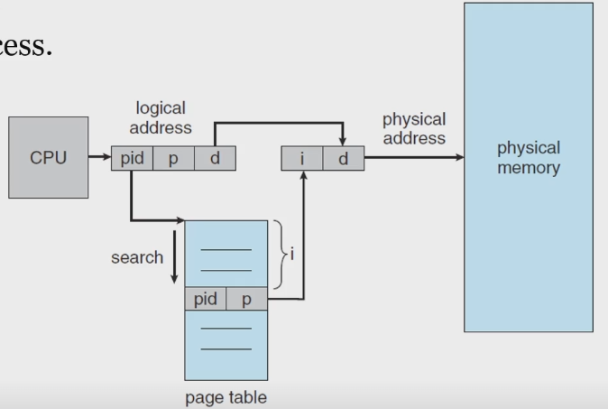 

## Swapping
### Swapping
- makes it possible for the _total physical address space_ of all processes
    - to _exceed_ the _real physical memory_ of the system
- thus _increasing_ the _degree of multiprogramming_ in a system
- Process instructions and data must be in memory to be executed
    - However, a process, or a portion of a process
    - can be _swapped_ temporally _out of memory_ to a backing store
    - and then _brought back_ into memory for continued execution
- 프로그램 사이즈가 너무 클때, 내가 만든게 5기가고 컴퓨터가 4기가 램이면 안될 것 같은데 된다
    - 필요한 부분만 잘라서 쓰기 때문

### Standard Swapping
- moves entire processes between main memory and a backing store
- The cost of swapping entire processes is too prohibitive 
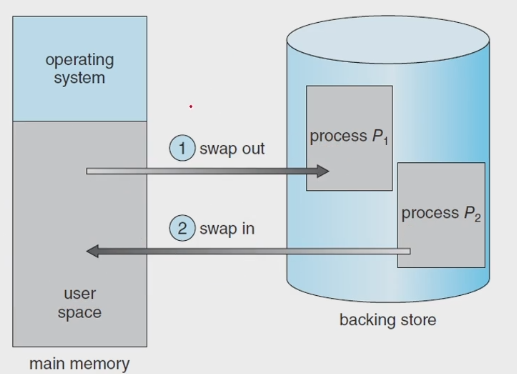 

### Swapping with Paging
- Pages of a process can be swapped instead of an entire process
- This strategy
    - still allows physical memory to be oversubscribed
    - but only a small number of pages will be involved in swapping
- Today, _paging_ refers to swapping with paging
    - _page out_ : moves a page from memory to backing store
    - _page in_ : moves a page from backing store to memory
- Paging works well in conjunction with the _virtual memory_ 
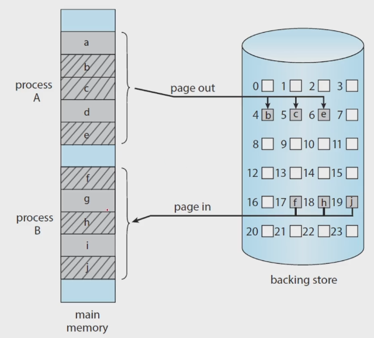 
