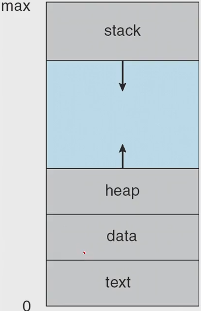
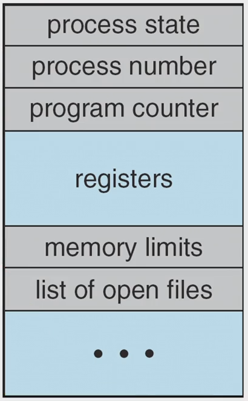
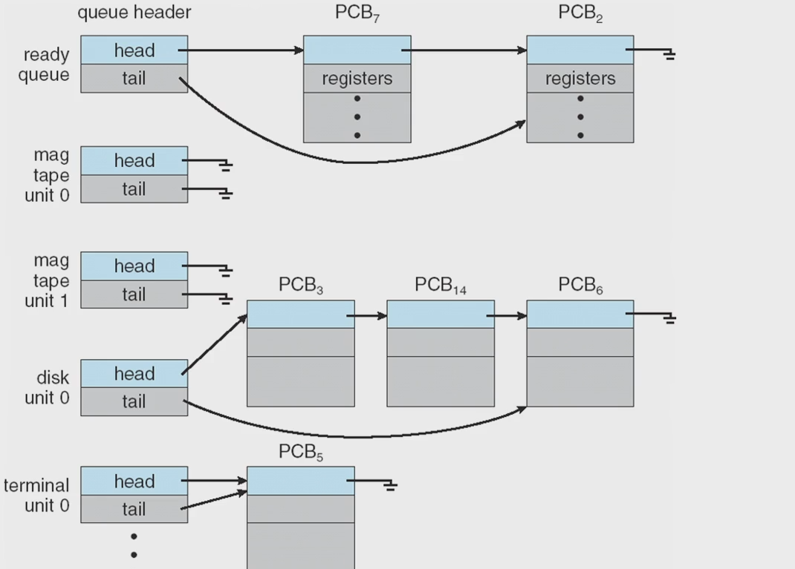
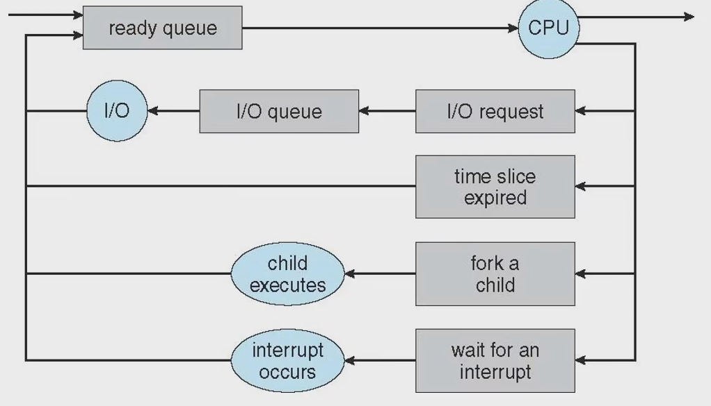
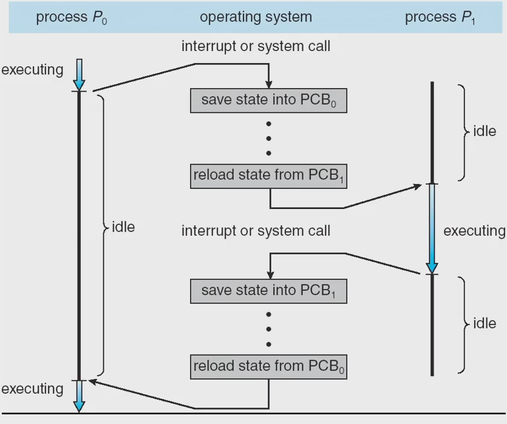
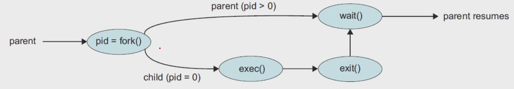

# process
- 정의 : program in execution. 실행중인 프로그램
- is the unit of work in an operating system.
- will need certain resources to accomplish its task.
    - CPU time
    - memory
    - files
    - I/O devices
## Process Concept
### Text section
- the executable code
### Data section
- global variables
### Heap section
- memory that is dynamically allocated during program run time
- malloc, etc.
### Stack section
- 함수호출을 할 때 쌓이는 곳
- 지역변수, function parameter, return addresses
### Layout of a process Memory
 

- 프로그램이 시작하는 지점이 0 번지, 로직적으로

## 생명주기
### New
- the process is being created
### Running
- Instructions are being executed
- cpu를 프로세스가 점령해서 process의 명령어를 로드해서 실행시키는 상태
### Waiting
- the process is waiting for some event occur
- such as an I/O completion or reception of a signal
### Ready
- waiting 후 ready queue에 가서 대기하는 상태
### Terminated
- the process has finished execution 
### Process state Diagram
 

- dispatch : ready 에서 running 으로 보내는 것
## ***PCB(Process Control Block)*** or TCB(Task Control Block)
### PCB
- PCB 는 많은 정보를 담고 있음
- process state
- program counter
    - 메모리에 있는 명령어를 패치해야 하는데, 이 때 program counter에서 가져옴
- CPU registers
    - program counter 도 register의 일종
- Cpu-scheduling information
- memory-management info
- accounting info
- I/O status info
- pcb structure 
 

## Process
- a program that performs a ***single thread of execution***
- the single thread of control allows the process to perform only one task at a time
- Modern operating systems have exteded the process concept
    - to allow a process to have multiple threads of execution
    - 여러개를 동시에 : multitasking
    - and thus to perform more than one task at a time
- 한 프로세스 내에서도 여러개의 프로그램이 실행 될 필요가 있음
- A ***thread*** is a lightweight process
    - o/s 가 여러개의 pcb 를 timesharing을 하듯이
    - thread를 여러개
    - multiprocessing 보단 multithreading
    - 특별한 경우만 multiprocess
## Process Scheduling
- The objective of multiprogramming is
    - to have some process running at all times
    - 동시에 하는 거랑 병렬처리 하는 것은 다른 것
    - so as to maximize CPU utilization
- The objective of time sharing is
    - to switch a CPU core among processes so frequently
    - that users can interact with each program while it is running
- Scheduling Queues
    - linked list 로 구현
    - As processes enter the system, they are put into a ready queue,
        - where they are ready and waiting to execute on a CPU's core
    - Processes that are waiting for a certain event to occur
        - are placed in a wait queue
    - Impelement
         
- Queueing Diagram
     
    - state diagram과 연결해서 생각
- Context Switch
    - The context of a process is represented in the PCB
        - PCB 정보를 문맥이라 보면 댐
    - When an interrupt occurs
        - the system saves the current context of the running process
        - so that, later, it can restore that context when it should be resumed
    - The context switch is a task that
        - switches the CPU core to another process
        - perfoms a state save of the current process
        - 현재 프로세스 문맥 저장
        - and a state restore of a diffrent process
        - 새로운 프로세스의 스테이트를, pcb를, 문맥을 복원
    - diagram
         
- An OS must provide a mechanism for
    - process creation
    - and process termination
- A process may create several new processes
    - the creating process : a parent process
    - a newly created process : a child process
- A tree of processes
    - using fork() 
         
- Two possibilities for execution
    - The parent continuese to execute concurrently with its children
    - The parent waits until some or all of its children have terminated
- Tow possibilities of address-space
    - the child process is a duplicate of the parent process
    - the child process has a new program loaded into it
     
- A process terminates
    - when it finishes executing its final statement
    - exit() system call : asks OS to delete it
        - allocated memories, open fiels, and I/O buffers, etc.
- Zombie and Orphan
    - zombie process : a process that has terminated
        - but whose parent has not yet called wait()
        - 부모는 남아 있지만 신경 쓰지 않는 것, wait를 호출 하지 않고 부모는 부모 일을 계속 하는 것
    - orphan process : a process that has a parent process
        - who did not invoke wait() and instead terminated
        - 부모가 없음
    - demon process, back ground process 를 만들 때 활용

# 프로세스 생성
# Operations on Processes
- ram에 load 되어 있는 상태가 process
- process의 state, resorce 와 cpu의 register의 정보를 합친 것이 PCB
- 현재 PCB 정보를 외부에 저장하고 새로운 PCB의 정보를 CPU에 load 하는 것이 context-swtich
- 문맥교환을 통해 concurrent 하게 제어. 동시성
## In UNIX-like O/S
- A new process is created by the fork() system call
- The child process consists of
    - a copy of the address space of the parent process
- Both processes continue execution
    - at the instruction after the fork() system call
- With one diff
    - the return code for the fork() is zeor for the child process,
    - the nonzero pid(OS kernel이 부여한) of the child is returned to the parent process
- After a fork() system call
    - the parent can continue its execution
    - if it has nothing else to do while the child runs
        - it can issue a wait() system call
        - to move itself off the ready queue until the termination of the child
- execlp, pid